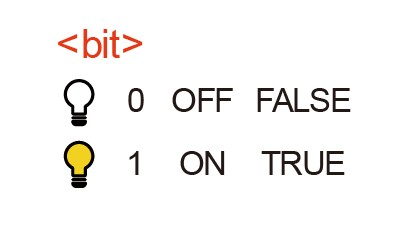
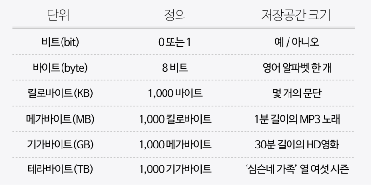
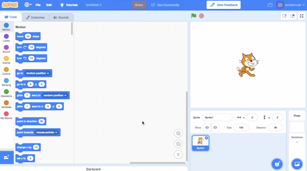
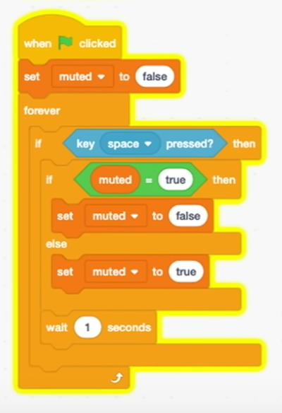

# 컴퓨터 과학

컴퓨터 과학이라는 단어만 들어도 두려움이 들지 않나요?

말란 교수님 조차도 컴퓨터 과학이라는 과목에 대한 두려움으로 2학년이 되어서야 들었으니 말이죠.

하지만 말란 교수님의 말씀처럼 이 강의를 듣기 전과 비교하여 자신이 얼마나 성장했는지가 중요합니다.

차근차근 강의를 따라오시다보면 두려움으로 가득찼던 컴퓨터 과학이라는 학문이

조금은 친숙하게 느껴질 수 있을 것입니다.
 
컴퓨터 과학은 문제 해결에 대한 학문입니다.

문제 해결은 입력(input)을 전달받아 출력(output)을 만들어내는 과정입니다.

그 중간에 있는 과정이 바로 컴퓨터 과학입니다. 

이러한 입력과 출력을 표현하기 위해선 우선 모두가 동의할 약속(표준)이 필요합니다.

따라서 컴퓨터 과학의 가장 첫 번째 개념은 어떻게 표현하는지에 대한 표현 방법입니다.

 

# 2진법

우리가 일상에서 사용하는 0, 1, 2, 3, 4, 5, 6, 7, 8, 9 총 10개의 기호로 표현하는 것이 10진법입니다.

하지만 컴퓨터에는 이렇게 많은 숫자가 없습니다. 오직 0과 1로만 데이터를 표현합니다.

이처럼 0과 1로만 표현하는 것을 2진법이라고 합니다.

컴퓨터는 신기하게도 오로지 0과 1만으로 숫자 뿐만 아니라 글자, 사진, 영상, 소리 등을 저장할 수 있습니다.

어떻게 이 것이 가능한 것일까요?

우선 123을 보겠습니다. 여러분들도 저와 마찬가지로 '백이십삼'으로 읽을 것입니다.

우리가 '백이십삼'으로 읽는 이유는 1을 백의자리, 2를 십의자리, 3을 일의자리로 보기 때문이죠.

이것을 표현하면 '1x100 + 2x10 + 3x1 = 123'이 됩니다.

우리 모두는 이런 과정을 아주 당연하게 여깁니다.

왜냐하면 우리 모두 이러한 표현에 대한 약속이 있기 때문입니다.

우리는 이 약속에서 자리수를 10의 거듭제곱으로 표현했습니다.

비슷하게 2진법에서는 두 개의 숫자만 있으므로 각 자리수가 2의 거듭제곱을 의미합니다.

그럼 이 방법으로 10진법의 3을 2진법으로 표현하면 어떻게 될까요?

바로 11입니다. 표를 보시면 2진법에서는 두 번째 자리는 2¹로 2입니다.

따라서 2진법에서 11은 2¹x1 + 1x1 = 3입니다.

마찬가지로 2진법에서 100은 2²x1 + 2¹x0 + 1x0 = 4입니다.

이와 같은 2진법은 전기를 통해 연산하는, 즉 전기를 켜고 끄는 방식으로 작동하는 컴퓨터에게 적합한 방법입니다.

컴퓨터에는 굉장히 많은 스위치(트렌지스터)가 있고 on/off 상태를 통해 0과 1을 표현합니다.

컴퓨터는 2진법에서 하나의 자릿수를 표현하는 단위를 비트(bit)라고 합니다.

 

# 비트

정보를 저장하고 연산을 수행하기 위해 컴퓨터는 비트(bit)라는 측정 단위를 씁니다. 비트는 이진 숫자라는 뜻을 가진 “binary digit”의 줄임말이며, 0과 1, 두 가지 값만 가질 수 있는 측정 단위입니다. 디지털 데이터를 여러 비트들로 나타냄으로써 두 가지 값만을 가지고도 많은 양의 정보를 저장할 수 있습니다. 또한 컴퓨터는 저장되어 있는 데이터를 수정하기 위해 비트에 수학적 연산을 수행할 수 있습니다.

 

# 비트열

하나의 비트는 0과 1, 이 두 가지의 값만 저장할 수 있습니다. 컴퓨터 내부에서 물리적 표현될 때는, 켜고 끌 수 있는 스위치라고 생각할 수 있겠습니다. (켜기=1, 끄기=0)

하지만 비트 한 개는 많은 양의 데이터를 나타내기에 턱없이 부족합니다. 그렇기 때문에 여러 숫자 조합을 컴퓨터에 나타내기 위해 비트열을 사용합니다. 바이트(byte)는 여덟 개의 비트가 모여 만들어진 것입니다. 하나의 바이트에 여덟 개의 비트가 있고, 비트 하나는 0과 1로 표현될 수 있기 때문에 2^8 = 256 개의 서로 다른 바이트가 존재할 수 있습니다.

바이트가 모이면 더 큰 단위가 될 수 있습니다. 킬로바이트는 1,000 바이트, 메가바이트는 1,000 킬로바이트(100만 바이트), 기가바이트는 1,000 메가바이트(10억 바이트)입니다. 테라바이트는 1,000 기가바이트(1조 바이트)이며, 심지어 페타바이트와 엑사바이트와 같은 더 큰 단위도 존재합니다.

 
다양한 데이터 표현하기

 
하나의 비트로는 어떠한 값이 참인지 거짓인지, 예를 들면, 노트북이나 휴대전화가 충전 중인지 아닌지에 대한 정보만 컴퓨터에 저장할 수 있습니다. 하나의 바이트(8 bit)로 알파벳 하나를 표시할 수 있습니다.

더 큰 데이터 단위는 좀 더 복잡한 유형의 데이터를 저장할 수 있습니다. 오른쪽 표의 일부 예제를 보면 알 수 있듯이, 1 KB는 몇 문단의 문자를 나타낼 수 있고, 1 MB는 1분가량의 노래 파일의 크기와 같고, 1 GB는 약 30분 길이의 HD 영화 정도의 크기입니다.

 

# 문자의 표현

지난 시간에 컴퓨터가 스위치를 ON/OFF하면서 숫자를 표현한다고 했습니다.
그럼 과연 문자는 어떻게 표현할까요?
바로 문자를 숫자로 표현 할 수 있도록 정해진 약속(표준)이 있습니다.
 
그 중 하나는 설명미국정보교환표준부호 ASCII(아스키코드/American Standard Code for Information Interchange) 입니다.

총 128개의 부호로 정의되어 있는데, 가령 알파벳 A는 10진수 기준으로 65, 알파벳 B는 66로 되어있습니다.

그럼 A를 지난 강의에서 배운 2진법으로 표현해볼까요?
우선 10진법 기준으로 65이므로 26x1 + 25x0 + 24x0 + 23x0 + 22x0 + 2x0 + 1x1 (64+1)로 표현할 수 있습니다.
따라서 A를 2진법로 표현하면 1000001 입니다.

이 외에도 Unicode라는 표준에서는 더 많은 비트를 사용하여 더 다양한 다른 문자들도 표현가능 하도록 지원하고 있습니다. ASCII로는 문자들을 표현하기에 충분하지 않았기 때문입니다.

Unicode는 😂(기쁨의 눈물) 이런 이모티콘 까지 표현할 수 있게 해주었습니다. 이 이모티콘은 10진법으로 128,514입니다. 2진법으로는 11111011000000010 입니다.

만약 여러분이 스마트폰으로 😂(기쁨의 눈물) 이모티콘을 친구의 스마트폰으로 보낸다면 11111011000000010 이라는 0과 1의 패턴을 보낸것입니다.

그럼 친구의 스마트폰의 안드로이드 혹은 iOS는 0과 1의 패턴을 받아 노란색 얼굴에 눈물을 흘리고 있는 사진으로 보여줍니다.

 

# 그림, 영상, 음악의 표현

문자와 같이 그림도 역시 숫자로 표현할 수 있습니다.

우리가 스크린을 통해 보는 그림을 자세히 살펴 보면 수많은 작은 점들이 빨간색, 초록색, 파란색을 띄고 있습니다.

이런 작은 점을 픽셀이라고 부릅니다. 각각의 픽셀은 세 가지 색을 서로 다른 비율로 조합하여 특정한 색을 갖게 됩니다.

예를 들어 빨간색 72, 초록색 72, 파란색 33을 섞게 되면 노란색이 되는 것과 같은 방식입니다.

이 숫자들을 표현하는 방식을 RGB(Red, Green, Blue)라고 합니다. 

즉, 노란색의 커다란 이미지는 72 73 33 으로 정의되는 무수히 많은 픽셀들의 RGB코드(숫자)로 표현할 수 있습니다.

영상 또한 수많은 그림을 빠르게 연속적으로 이어 붙여놓은 것이기 때문에 숫자로 표현이 가능합니다.

음악도 마찬가지로 각 음표를 숫자로 표현할 수 있습니다.

 

# 알고리즘

전 강의에서 숫자, 글자, 색깔 등을 컴퓨터가 이해할 수 있는 2진법으로 표현 것을 배웠습니다.
이 것은 입력(input)에 해당하는 것입니다.

이제는 출력(output)에 대해 이야기를 해볼까요?
그럼 어떻게 입력(input)에서 출력(output)을 얻을 수 있을까요?
컴퓨팅은 입력을 받아 그 입력을 처리한 후 출력하는 과정입니다.
알고리즘은 입력(input)에서 받은 자료를 출력(output)형태로 만드는 처리 과정을 뜻합니다.

즉, 알고리즘이란 입력값을 출력값의 형태로 바꾸기 위해 어떤 명령들이 수행되어야 하는지에 대한 규칙들의 순서적 나열입니다. (어려운 용어가 나오지만 억지로 이해하기 보다 우선 넘어가시고, 아래의 예시를 통해 이해를 해주세요.)

이러한 일련의 순서적 규칙들을 어떻게 나열하는지에 따라 알고리즘의 종류가 달라집니다.
같은 출력값이라도 알고리즘에 따라 출력을 하기까지의 시간이 다를 수 있습니다.

 

# 정확한 알고리즘

예를 들어, 전화번호부에서 Mike Smith를 찾는 일을 한다고 합시다.
전화번호부를 집어 들고 첫 페이지를 펼친 후 Mike Smith가 그 페이지에 있는지 찾습니다.
없으면 그 다음 페이지에서 찾습니다.
Mike Smith 를 찾을 때까지 혹은 전화번호부가 끝날 때까지 이것을 반복합니다.
하지만 언젠가는 Mike Smith 가 전화번호부에 있다면 이 알고리즘을 통해 Mike Smith 를 찾을 수 있을 것입니다.
알고리즘의 평가할 때는 정확성도 중요하지만, 효율성도 중요합니다.
효율성은 작업을 완료하기까지 얼마나 시간과 노력을 덜 들일 수 있는지에 대한 것입니다.
여러분들이 보시기에도 한 번에 한 페이지씩 보는 알고리즘은 정확하지만, 매우 오래걸리고 비효율적인 알고리즘일 것입니다.
한 번에 두 페이지를 넘기게끔 하여 알고리즘을 개선할 수 있습니다.
하지만 이 알고리즘을 그대로 사용한다면 Mike Smith가 있는 페이지가 그냥 넘어갈 수도 있으니 주의해야 할 것입니다.
이럴 때는 이전 페이지를 확인하면 되지만 이 알고리즘마저도 이 문제를 해결하기에 가장 효율적이지는 않습니다.

 

# 정확하고 효율적인 알고리즘

이번에는 더 직관적이고 효율적인 알고리즘을 적용하여 Mike Smith를 찾아봅시다.
먼저, 전화번호부 가운데를 폅니다. 만약 Mike Smith가 그 페이지에 있다면 우리 알고리즘은 끝납니다.
없다면, 전화번호부가 이름순으로 정렬되어 있으므로 우리는 Mike Smith가 지금 페이지보다 앞부분에 있는지 뒷부분에 있는지 알고 있습니다.
그러므로 책의 절반을 버릴 수 있게 되고 나머지 절반에 대해 똑같은 알고리즘을 수행합니다.
한 페이지가 남을 때까지 계속 수행합니다.
마지막에 남은 한 페이지에는 Mike Smith의 이름이 있거나 없거나 둘 중 하나일 겁니다.
이 알고리즘은 기존 알고리즘보다 더 효율적입니다.
만약 기존 전화번호부가 100페이지고, 100페이지가 또 추가되어 200페이지가 되었다고 생각해봅시다.
한장 한장 넘기는 첫 번째 알고리즘은 100번의 페이지를 더 넘겨야 하지만, 절반씩 줄어드는 두 번째 알고리즘은 단 1번의 절차만 더 수행하면 됩니다.
단 한 번의 동작으로 200페이지의 반인 100페이지가 사라지기 때문입니다.

앞서 말씀드린 '알고리즘이란 입력값을 출력값의 형태로 바꾸기 위해 어떤 명령들이 수행되어야 하는지에 대한 규칙들의 순서적 나열'이라는 정의를 다시 보겠습니다.

우리는 Mike Smith를 전화번호부에서 찾기 위해 어떤 명령들이 수행되어야 하는지에 대해 두 가지 알고리즘을 찾아봤습니다. 
첫 번째 알고리즘은 한 장을 넘긴 다음 또 한 장 넘기는 규칙들의 순서적 나열이었고,
두 번째 알고리즘은 반을 줄이고, 다음 또 반을 줄이는 규칙들의 순서적 나열이었습니다.

이제 앞서 나온 알고리즘의 정의에 대해 느낌이 오시나요?

 

# 의사코드

위와 같은 알고리즘은 아래와 같은 의사코드라는 방식으로 보다 명료하게 정리할 수 있습니다. 

의사코드는 필요한 행동이나 조건을 잘 설정하여 컴퓨터가 수행해야 하는 일을 절차적으로 파악할 수 있게 도와줍니다.

 

(중간중간 들여쓰기가 되어있는 부분은 종속 관계를 나타내는데 자세한 설명은 나중에 나옵니다.)

1.전화번호부를 집어 든다

2.전화번호부의 중간을 편다

3.페이지를 본다

4.만약 Mike Smith가 페이지에 있으면

5.    Mike Smith에게 전화한다.

6.그렇지 않고 만약 Mike Smith가 앞 페이지에 있으면

7.    앞 페이지의 절반을 편다

8.    3번째 줄부터 다시 실행한다

9.그렇지 않고 만약 Mike Smith가 뒷 페이지에 있으면

10.    뒷 페이지의 절반을 편다

11.    3번째 줄부터 다시 실행한다

12.그러지 않으면

13.    그만둔다

의사코드를 보면 여러분들도 한 번씩 들어봤을 C언어나 파이썬과 같은 언어에서도 볼 수 있는 여러가지 공통점이 있습니다.

노란색으로 강조된 부분들은 앞으로 함수(functions)로 불립니다.
함수는 컴퓨터에게 이 경우에는 사람에게 무엇을 할지 알려주는 동사와 같습니다.

다음으로 노란색으로 강조된 부분들은 조건이라고 부를 것입니다.
이 것은 여러 선택지 중 하나를 고르는 것입니다.

앞서 말한 결정을 내리기 위한 질문이 필요합니다. 이것을 불리언(Boolean)이라고 합니다.
답이 Yes(예) 또는 No(아니오) 혹은 True(참) 또는 False(거짓)으로 나오는 아니면 2진법에서 0또는 1로 나오는 질문을 뜻합니다.

마지막으로 노란색으로 강조된 부분은 루프(loop)라고 합니다.
이 것은 뭔가를 계속해서 반복하는 순환입니다.

 

# 스크래치

알고리즘을 구성하는 요소로는 함수, 조건, 불리언 표현, 루프 등이 있습니다. 스크래치라는 그래픽 프로그래밍 언어를 사용하면 블록을 옮겨 붙여서 알고리즘을 만들어 볼 수 있습니다.

 
 

화면 왼 쪽에는 함수나 변수 등을 나타내는 퍼즐 조각들이 있습니다. 이 블록들은 화면 중간으로 옮길 수 있습니다. 화면 오른쪽에는 알고리즘 결과나 보여지는 무대가 있습니다. 이 캐릭터의 요정이 “hello, world’ 라고 말 하거나 “이름이 뭐니?”라고 묻고, “David”이라고 답할 수 있도록 할 수 있습니다. 

 

# 스크래치 블록

블록의 종류에 따라서 프로그램이 수행하는 일의 종류가 달라집니다. 입력이 주어졌을 때 블랙 박스를 거쳐 출력이 되는 컴퓨터의 작동 원리를 생각해보면, 하나의 블록이 블랙 박스의 역할을 하는 것입니다. 가령 “말해라” 라는 블록에 “hello, world”라는 입력을 주게되면 그 결과로 고양이가 “hello, world”라고 말하게 되는 것이죠. 이러한 입력과 출력을 이어 붙여서 여러 작업을 순차적으로 수행할 수도 있습니다.

 

# 변수와 루프

변수를 사용하면 정보를 저장하고 다시 재사용할 수 있습니다. ‘counter’라는 변수를 사용하여 양이 숫자를 셀 수 있도록 해 봅시다.

 

초록색 깃발이 클릭되었을 때, counter 변수를 1로 설정합니다. 그리고 영원히 루프를 돌면서 counter 변수에 저장된 값을 1초동안 말하도록 합니다. 그 후 1초를 기다리고, counter의 값을 1 증가시킵니다.

 

# 변수와 조건문

 

조건문을 활용하면 더 복잡한 프로그램도 가능합니다. 여기서는 ‘참’ 또는 ‘거짓’ 값을 가지는 불리언 변수를 사용합니다. 초록색 깃발이 클릭되면, muted 변수를 ‘거짓’으로 설정합니다. 그리고 루프를 돌면서, 감지 블록을 통해 스페이스 키가 눌렸는지 체크합니다. 그렇다면, muted가 ‘참’인지 확인합니다. 만약 그렇다면, muted를 거짓으로 설정합니다. 만약 muted가 ‘참’이 아니라면, muted를 ‘참’으로 설정합니다. 그리고 1초를 기다립니다.