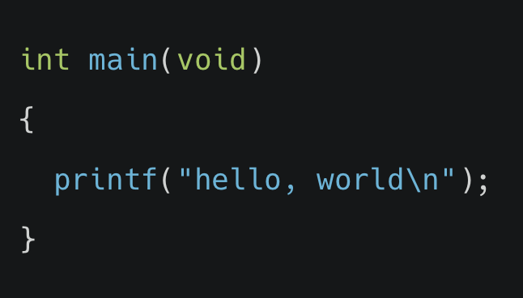
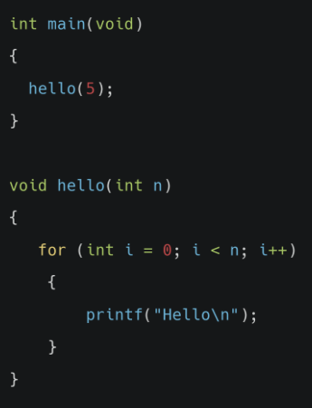

# C 기초

## 스크래치에서 아래 블록이 의미하는 것과 동일한 역할을 하는 함수를 C언어로 올바르게 작성한 것은 무엇일까요?

(1) int run(void)

(2) int start(void)

(3) int main(void)

(4) (int) main void

정답확인

(3) int main(void)

 

# 문자열

## 스크래치에서 아래 블록이 의미하는 것과 동일한 역할을 C언어로 올바르게 표현한건 무엇인가요?

(1) say(Hello!);

(2) print("Hello!")

(3) printf(Hello!);

(4) printf("Hello!");

정답확인

(4) printf("Hello!");

 

# 컴파일

## C언어로 작성된 hello.c 소스코드를 컴퓨터가 이해할 수 있는 머신코드로 컴파일 하기 위해 어떤 명령어를 프롬프트에 입력해야 할까요?

(1) $run hello.c

(2) $clang hello.c

(3) $start hello.c

(4) $compile hello.c

정답확인

(2) $clang hello.c

 

# 문자열

## 사용자 이름이 저장된 문자열 변수 name과 "Hello"를 연결해서 출력하려 합니다. 올바른 C언어 코드는 무엇인가요?

(1) prinf("Hello, name");

(2) printf("Hello, %f, name");

(3) printf("Hello, $s", name);

(4) printf("Hello, %i", name);

정답확인

(3) printf("Hello, %s", name);

 

# 조건문

## 'x가 y와 같다면'이라는 조건문을 C코드로 나타내면 어떻게 될까요?

(1) if x is equal to y

(2) if (x = y)

(3) if(x equal y)

(4) if(x==y)

정답확인

(4) if(x==y)

 

# 연산자

## 변수x가 입력되었을 때 x가 짝수인지 홀수인지 알아내는 프로그램을 구현하기 위해 사용하면 좋은 연사자는 다음 중 무엇인가요?

(1) +

(2) *

(3) %

(4) &&

정답확인

(3) %

 

# 라이브러리

## 아래와 같은 C코드가 있습니다. printf 함수 사용을 위해 꼭 추가되어야 하는 코드는 무엇인가요?

(1) include< stdio.h>

(2) #include stdio.h

(3) #include < stdio.h>

(4) include stdio.h

정답확인

(3) #include < stdio.h>

 

# 사용자 지정 함수

## 아래와 같이 hello()라는 사용자 함수를 작성한 후, 메인 함수에서 사용하려고 합니다. 파일 상단에 정의되어야하는 코드는 무엇일까요?

(1) void hello(void);

(2) void hello(int);

(3) int hello(void);

(4) int hello(int);

정답확인

(2) void hello(int);

 

# Q 루프

## 어떤 작업을 50번 반복 수행하는 루프를 구현하기 위한 C코드로 적절한 것을 무엇인가요?

(1) during(int i = 0; i < 50; i++)

(2) repeat(int i = 0; i < 50; i++)

(3) until(int i = 0; i < 50; i++)

(4) for(int i = 0; i < 50; i++)

정답확인

(4) for(int i = 0; i < 50; i++)

 

# 하드웨어의 한계

## 컴퓨터 하드웨어의 한계로 인해 발생하는 문제 중 하나로, 변수가 담을 수 있는 최대 허용 범위를 벗어난 값을 저장해 예상치 못한 결과가 나오는 현상을 무엇이라고 하나요?

(1) 메모리 부족

(2) 오버플로우

(3) 블루스크린

(4) 강제종료

정답확인

(2) 오버플로우

 