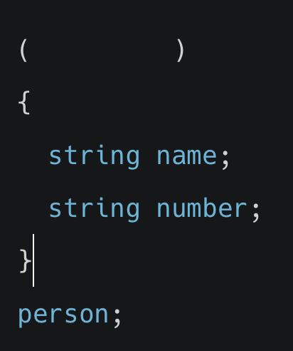

# 알고리즘

## 알고리즘의 성능 및 시간 복잡도를 표현하는 표기법 중 하나로, 최악의 경우일때(상한)를 나타내는 것을 다음 중 무엇인가요?

(1) O()

(2) Ω()

(3) θ()

(4) φ()

정답확인

(1) O()

 

 

# 자료형

## name과 number 두 개의 멤버를 갖는 person이라는 새로운 자료형을 구조체로 정의하고자 합니다. 아래 코드의 괄호 안에 들어갈 코드로 알맞은 것은 무엇인가요?

(1) typedef struct

(2) function struct

(3) construct

(4) function

정답확인

(1) typedef struct

 

 

# 알고리즘

## 전화번호부 책에서 '이펭수'를 찾는 작업을 선형 검색으로 수행하게 될 경우 Big-O 는 어떻게 될까요?

(1) O(1)

(2) O(log n)

(3) O(n)

(4) O(n^2)

정답확인

(3) O(n)

 

 

# 정렬

## 5 6 7 3 2 과 같은 숫자 리스트가 주어졌습니다. 오름차순 정렬을 위해 버블 정렬을 왼쪽 처음부터 오른쪽 끝까지 ‘한 번’ 수행했을 때의 리스트는 어떻게 될까요?

(1) 5 6 3 2 7

(2) 2 3 5 6 7

(3) 5 6 7 2 3

(4) 5 6 2 3 7

정답확인

(1) 5 6 3 2 7

 

# 선택 정렬

## 5 6 7 3 2 와 같은 숫자 리스트가 주어졌습니다. 오름차순 정렬을 위해 선택 정렬을 통해 교환을 ‘한 번’ 수행했을 때의 리스트는 어떻게 될까요?

(1) 2 3 5 6 7

(2) 5 6 7 2 3

(3) 2 6 7 3 5

(4) 2 5 6 7 3

정답확인

(3) 2 6 7 3 5

 

 

# 알고리즘

## 선택 정렬, 버블 정렬, 선형 검색, 이진 검색 4가지 알고리즘이 최선인 경우일 때의 실행시간이(하한) 빠른 순서대로 나열한 것은 무엇인가요? (단, 하한이 같은 경우 상한이 빠른 순으로 나열합니다)
 

(1) 선택 정렬 - 버블 정렬 - 선형 검색 - 이진 검색

(2) 버블 정렬 - 선택 정렬 - 선형 검색 - 이진 검색

(3) 선형 검색 - 이진 검색 - 선택 정렬 - 버블 정렬

(4) 이진 검색 - 선형 검색 - 버블 정렬 - 선택 정렬

정답확인

(4) 이진 검색 - 선형 검색 - 버블 정렬 - 선택 정렬

 

 

# 함수

## 아래 코드는 '#'으로 피라미드를 쌓는 코드입니다. draw()와 같이 함수 안에서 함수 자기 자신을 호출하는 방식을 무엇이라고 할까요?

 

(1) 반복(repeat)

(2) 정렬(sort)

(3) 재귀(recursive)

(4) 검색(search)

정답확인

(3) 재귀(recursive)

 

 

# 정렬

## 병합 정렬, 선택 정렬, 버블 정렬의 실행시간의 하한을 빠른 순서대로 정렬한 것은 무엇인가요?

 

(1) 선택 정렬 - 병합 정렬 - 버블 정렬

(2) 버블 정렬 - 병합 정렬 - 선택 정렬

(3) 버블 정렬 - 선택 정렬 - 병합 정렬

(4) 병합 정렬 - 선택 정렬 - 버블 정렬

정답확인

(2) 버블 정렬 - 병합 정렬 - 선택 정렬

 

 

# 정렬

## 알고리즘 실행 시간의 표기법

 

(1) O(log n) – O(n log n) – O(n) – O(n^2)

(2) O(log n) – O(1) – O(n) – O(n^2)

(3) O(1) – O(log n) – O(n) – O(n^2)

(4) O(1) – O(n log n) – O(n) – O(n^2)

정답확인

(3) O(1) – O(log n) – O(n) – O(n^2)

 