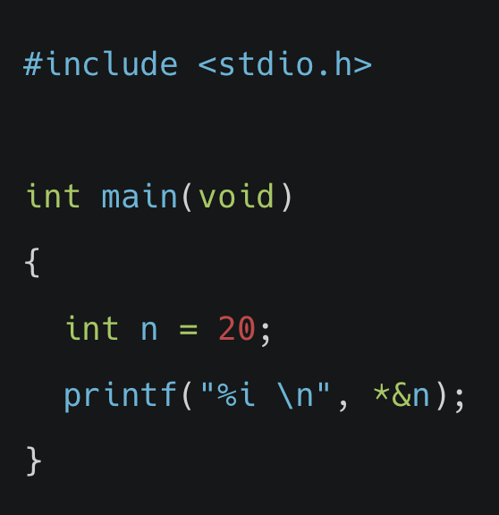
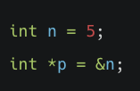
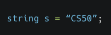
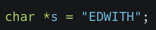
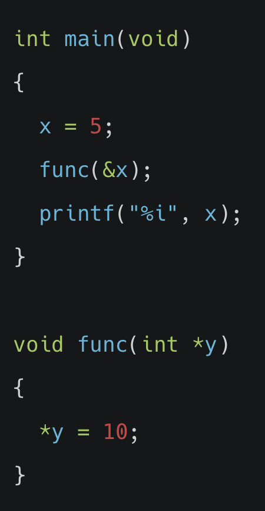
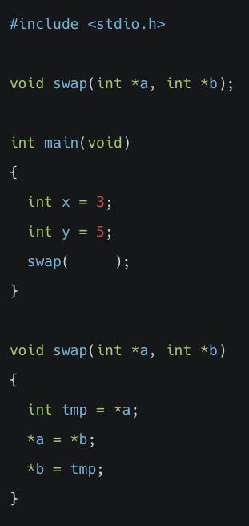

# 메모리 주소

## 아래 코드를 실행하면 어떤 결과가 출력될까요?

(1) 0xFF

(2) 0x20

(3) 20

(4) FF

정답확인

(3) 20

 

 

# 포인터

## 아래와 같이 변수 n과 p을 생성했습니다. 변수 n의 메모리 주소를 출력하는 올바른 코드는 다음 중 무엇인가요?

(1) printf("%p\n", *n);

(2) printf("%p\n", p);

(3) printf("%p\n", n);

(4) printf("%p\n", &p);

정답확인

(2) printf("%p\n", p);

 

 

# 문자열

## CS50 라이브러리의 string 자료형을 사용해 변수 s를 생성했습니다. 아래와 동일한 의미를 지니는 코드는 무엇인가요?

(1) string *s = &”CS50”

(2) string &s = “CS50”

(3) char &s = “CS50”

(4) char *s = “CS50”

정답확인

(4) char *s = “CS50”

 

 

# 문자열 비교

## 아래와 같이 변수 s를 생성했을때, 문자 ‘W’를 출력하는 코드는 무엇인가요?

(1) printf("%c\n", *(s+1));

(2) printf("%c\n", *(s+2));

(3) printf("%c\n", *(s+3));

(4) printf("%c\n", *(s+4));

정답확인

(2) printf("%c\n", *(s+2));

 

 

# 문자열 복사

## 아래와 같이 변수 s를 생성한 뒤, 새로운 변수 t에 “EDWITH” 문자를 복사하려고 합니다. malloc 함수를 이용해 변수 t를 생성할 때 총 몇 바이트의 메모리를 할당해야 할까요?

(1) 2바이트

(2) 4바이트

(3) 7바이트

(4) 8바이트

정답확인

(3) 7바이트

 

 

# 메모리 할당과 해제

## 할당된 메모리를 해제 하기 위해 사용하는 함수는 무엇인가요?

(1) malloc()

(2) unmemory()

(3) mfree()

(4) free()

정답확인

(4) free()

 

 

# 메모리 교환, 스택, 힙

## malloc() 함수를 통해 할당받은 메모리는 어디에 위치하게 될까요?

(1) 머신 코드(machine code)

(2) 글로벌(globals)

(3) 힙(heap)

(4) 스택(stack)

정답확인

(3) 힙(heap)

 

 

# 파일 쓰기 

## data.csv 파일에 값을 입력하는 프로그램을 작성하려고 합니다. 이때 필요한 함수가 아닌 것은 무엇인가요?

(1) fopen()

(2) fcreate()

(3) fprintf()

(4) fclose()

정답확인

(2) fcreate()

 

 

# 파일 읽기

## 아래와 같은 코드가 있을 때 출력되는 값은 얼마일까요?

(1) 2

(2) 5

(3) 10

(4) 20

정답확인

(3) 10

 

# 메모리 교환

## 아래 코드와 같이 swap 함수를 통해 메모리에 저장된 x와 y의 값을 교환하려고 합니다. 즉, swap 함수가 호출된 이후 x는 5, y는 3의 값을 가져야 합니다. main 함수에서 호출되는 swap 함수의 괄호에 포함되어야 할 코드로 적절한 것은 무엇인가요?

(1) x, y

(2) *x, *y

(3) &a, &b

(4) &x, &y

정답확인

(4) &x, &y

 