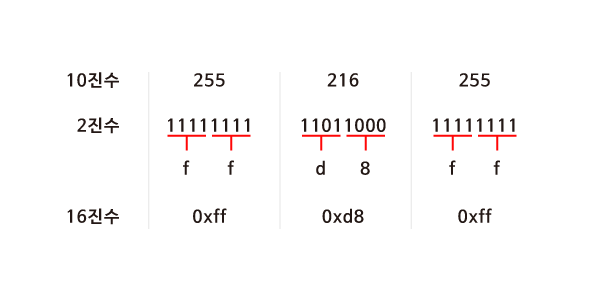
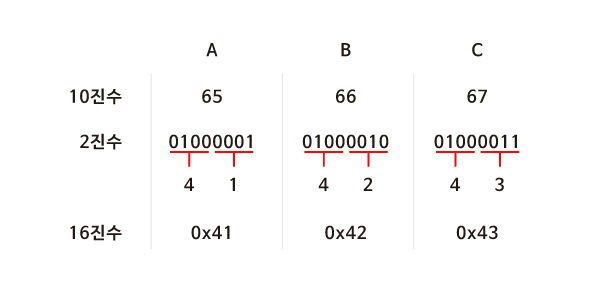
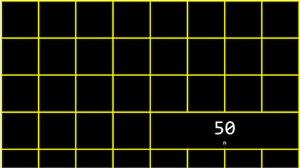

# 메모리 주소


16진수

컴퓨터과학에서는 숫자를 10진수나 2진수 대신 16진수(Hexadecimal)로 표현하는 경우가 많습니다. 컴퓨터에서 데이터를 처리하기 위해 16진수를 사용할 때 장점이 있기 때문입니다. 16진수와 일상생활에서 우리가 사용하는 10진수와 비교하면 그 차이를 알 수 있습니다. 16진수를 사용하면 10진수보다 2진수를 간단하게 나타낼 수 있습니다. 16진수로 값을 표현하는 방법을 이해하고 나면 16진수, 2진수, 10진수를 변환하는 프로그램을 만들어볼 수 있습니다.

<br>

## 10진수를 16진수로 바꾸어보기

JPG 이미지 파일은 항상 255 216 255 로 시작되고 이것은 10진수입니다. 하지만 실제 컴퓨터 내에서는 10진수를 사용하지 않습니다. 컴퓨터는 0과 1만을 이해할 수 있기 때문입니다.




그림 1
먼저 255 216 255를 2진수로 나타내보면 <그림 1>과 같습니다. 2진수로 모든 데이터를 표현하기에는 너무 길어지기 때문에 16진수로 바꾸어 보겠습니다. 2^42
4
 

이 16이기 때문에 4bits씩 두 덩어리로 나누어 보면 0000 부터 1111까지는 16진수로 표현할 수 있다는 것을 알 수 있습니다.

그렇다면 16진수에서 10부터 15까지는 어떻게 표기할까요? 10은 a, 11은 b, …, 15는 f를 대입하여 사용합니다. 4bits씩 16진수로 변환 후 0x를 붙혀 뒤에 오는 문자들이 16진수임을 알려줍니다.

<br>

## 16진수의 유용성

ASCII 코드에 의해 “A, B, C”는 10진수로 65, 66, 67에 해당합니다. 컴퓨터는 10진수를 이해할 수 없으므로 2진수로 표현해보면  "01000001 01000010 01000011＂이 됩니다. 컴퓨터가 처리할 수 있어야 하기 때문에 어쩔 수 없지만 그 길이가 너무 긴 것을 알 수 있습니다.

하지만 16진수로 표현하면 2진수로 표현했을 때 보다 훨씬 간단해집니다. 또한 컴퓨터는 8개의 비트가 모인 바이트 단위로 정보를 표현합니다. 2개의 16진수는 1byte의 2진수로 변환되기 때문에 정보를 표현하기 매우 유용합니다.


 

## 메모리 주소

정수형 변수 n에 50이라는 값을 저장하고 출력한다고 생각해 봅시다.

이 n 이라는 값은 int 타입이므로, 아래 그림과 같이 우리 컴퓨터의 메모리 어딘가에 4바이트 만큼의 자리를 차지하며 저장되어 있을 것입니다. 



<br>

C에서는 변수의 메모리상 주소를 받기 위해 ‘&’이라는 연산자를 사용할 수 있습니다.

```c
#include <stdio.h>

int main(void)
{
    int n = 50;
    printf("%p\n", &n);
}
```

예를 들어, 위와 같은 코드를 실행하면 ‘0x7ffe00b3adbc’와 같은 값을 얻을 수 있고, 이는 변수 n의  16진법으로 표현된 메모리의 주소입니다. 


반대로 ‘*’를 사용하면 그 메모리 주소에 있는 실제 값을 얻을 수 있습니다.

```c
#include <stdio.h>

int main(void)
{
    int n = 50;
    printf("%i\n", *&n);
}
```

위 코드는 먼저 n의 주소를 얻고, 또 다시 그 주소에 해당하는 값을 얻어와 출력한 것이므로 결국 ‘50’이라는 값이 출력되겠죠.

<br>

# 포인터


지난 강의에서 배웠던 ‘*’ 연산자는 어떤 메모리 주소에 있는 값을 받아오게 해줍니다.

이 연산자를 이용해서 포인터 역할을 하는 변수를 선언할 수도 있습니다.

```c
#include <stdio.h>

int main(void)
{
   int n = 50;
   int *p = &n;
   printf("%p\n", p);
   printf("%i\n", *p);
}
```

위 코드를 보면 정수형 변수 n에는 50이라는 값이 저장되어 있습니다.

그리고 *p라는 포인터 변수에 &n 이라는 값, 즉 변수 n의 주소를 저장합니다.

int *p 에서 p앞의 *는 이 변수가 포인터라는 의미이고, int 는 이 포인터가 int 타입의 변수를 가리킨다는 의미입니다.

따라서 첫 번째 printf문과 같이 포인터 p의 값, 즉 변수 n의 주소를 출력하거나, 두 번째 printft문과 같이 포인터 p가 가리키는 변수의 값, 즉 변수 n의 값을 출력할 수도 있습니다.

실제 컴퓨터 메모리에서 변수 p는 아래와 같이 저장될 수 있습니다.

 

하지만 아래 그림과 같이 실제로 p의 값, 즉 n의 주소값을 생각하지 않고, 추상적으로 단지 p가 n을 가리키고 있다는 것만 생각해도 됩니다.


이런 포인터를 기반으로 해서 앞으로 배울 다양한 데이터 구조를 정의하고 사용할 수 있습니다.

<br>

# 문자열

우리는 여태껏 문자열을 저장하기 위해 CS50 라이브러리에 포함된 string 자료형을 사용하였었습니다.

아래와 같이 s에 “EMMA”라는 값을 저장한다고 생각해 봅시다.

```
string s = “EMMA”;
```
문자열은 결국 문자의 배열이고, s[0], s[1], s[2], … 와 같이 하나의 문자가 배열의 한 부분을 나타냅니다.

가장 마지막의 \0은 0으로 이루어진 바이트로, 문자열의 끝을 표시하는 약속입니다.

 

여기서 변수 s는 결국 이러한 문자열을 가리키는 포인터가 됩니다.

더 상세히는 문자열의 가장 첫번째 문자, 즉 주소 0x123에 있는 s[0]를 가리키게 됩니다.

 

실제 CS50 라이브러리를 보면 string 자료형은 아래와 같이 정의되어 있습니다.

```c
typedef char *string
```

여기서 typedef는 새로운 자료형을, char *은 문자에 대한 포인터를, string은 자료형의 이름을 의미합니다.

따라서 아래 두 코드는 동일하게 동작할 것입니다.

<br>

1.string 자료형을 이용하여 “EMMA” 출력
```c
#include <cs50.h>
#include <stdio.h>

int main(void)
{
    string s = "EMMA";
    printf("%s\n", s);
}
```

2.char 포인터를 이용하여 “EMMA” 출력

```c
#include <stdio.h>

int main(void)
{
    char *s = "EMMA";
    printf("%s\n", s);
}
```
2번 코드의 char *s에서 s라는 변수는 문자에 대한 포인터가 되고, “EMMA”라는 문자열의 가장 첫 번째 값을 저장하기 때문이죠.

<br>

# 문자열 비교

```c
#include <stdio.h>

int main(void)
{
    char *s = "EMMA";
    printf("%p\n", s);
}
```
위 코드를 실행하면, s라는 포인터의 값, 즉 “EMMA”라는 문자열의 가장 첫 값인 “E”에 해당하는 메모리 주소를 출력하게 될 것입니다. 


그렇다면 아래 코드들은 무엇을 출력할까요?

```c
printf("%p\n", &s[0]);
printf("%p\n", &s[1]);
printf("%p\n", &s[2]);
printf("%p\n", &s[3]);
```

s가 가리키는 곳을 시작으로 “EMMA”라는 문자열로 이루어진 문자들의 배열이 있으니, 각각

s라는 문자열의 첫 번째 문자에 해당하는 주소값,

s라는 문자열의 두 번째 문자에 해당하는 주소값,

s라는 문자열의 세 번째 문자에 해당하는 주소값,

s라는 문자열의 네 번째 문자에 해당하는 주소값을 출력하게 되겠죠.

이를 좀 더 자세히 들여다보면 &s[0]는 “E”의 주소값을, &s[1]은 “M”의 주소값을,  &s[2]은 “M”의 주소값을,  &s[3]은 “A”의 주소값을 의미합니다.

문자열은 첫번째 문자를 시작으로 메모리상에서 바로 옆에 저장되어 있습니다.

다시 말해, 가장 첫 번째 문자에 해당하는 주소값을 하나씩 증가시키면 바로 옆에 있는 문자의 값을 출력할 수 있는 것이죠.

따라서 아래 코드는 E M M A를 순서대로 출력할 것입니다.

```c
printf("%c\n", *s);
printf("%c\n", *(s+1));
printf("%c\n", *(s+2));
printf("%c\n", *(s+3));
```

문자열을 비교할 때도 아래 코드와 같이 문자열이 저장된 변수를 바로 비교하게 되면 그 변수가 저장되어 있는 주소가 다르기 때문에 다르다는 결과가 나올 것입니다.

정확한 비교를 위해서는 실제 문자열이 저장되어 있는 곳으로 이동하여, 각 문자를 하나하나씩 비교해야 되겠죠.

```c
#include <cs50.h>
#include <stdio.h>

int main(void)
{
    // 사용자로부터 s와 t 두 개의 문자열 입력받아 저장
    string s = get_string("s: ");
    string t = get_string("t: ");

    // 두 문자열을 비교 (각 문자들을 비교)
    if (s == t)
    {
        printf("Same\n");
    }
    else
    {
        printf("Different\n");
    }
}
```

<br>

# 문자열 복사

문자열을 복사하기 위해 아래 코드를 실행하면 어떻게 될까요?

```c
#include <cs50.h>
#include <ctype.h>
#include <stdio.h>

int main(void)
{
    string s = get_string("s: ");
    string t = s;

    t[0] = toupper(t[0]);

    printf("s: %s\n", s);
    printf("t: %s\n", t);
}
```

사용자에게 입력값을 받아 string s에 저장하고, string t를 s로 정의합니다.

그리고 t의 첫 번째 문자를 toupper 함수를 이용하여 대문자로 바꾼다면 s와 t는 각각 어떻게 출력 될까요?

입력값으로 “emma”를 주게 된다면, 단순한 예상과는 다르게 s와 t 모두 “Emma”라고 출력이 됩니다.

그 이유는  s라는 변수에는 “emma”라는 문자열이 아닌 그 문자열이 있는 메모리의 주소가 저장되기 때문이죠.

string s 는 char *s 와 동일한 의미라는걸 떠올려보면 됩니다.

따라서 t도 s와 동일한 주소를 가리키고 있고, t를 통한 수정은 s에도 그대로 반영이 되게 되는 것입니다.


그렇다면 두 문자열을 실제로 메모리상에서 복사하려면 어떻게 해야 할까요?

아래 코드와 같이 메모리 할당 함수를 사용하면 됩니다

```c
#include <cs50.h>
#include <ctype.h>
#include <stdio.h>
#include <string.h>

int main(void)
{
    char *s = get_string("s: ");
    char *t = malloc(strlen(s) + 1);

    for (int i = 0, n = strlen(s); i < n + 1; i++)
    {
        t[i] = s[i];
    }

    t[0] = toupper(t[0]);

    printf("s: %s\n", s);
    printf("t: %s\n", t);
}
```

위의 코드와 다른 점은 malloc이라는 함수를 이용해서 t를 정의한다는 거죠.

malloc 이라는 함수는 정해진 크기 만큼 메모리를 할당하는 함수입니다.

즉 s 문자열의 길이에 널 종단 문자(\0)에 해당하는 1을 더한 만큼 메모리를 할당합니다.

그리고 루프를 돌면서 s 문자열 배열에 있는 문자 하나 하나를 t 배열에 복사해주면 됩니다.

이 코드를 컴파일 후 실행시키고 입력값으로 “emma”를 주면 우리가 예상한 대로 s는 “emma”가, t는 “Emma”가 출력되게 됩니다.

성공적으로 복사가 된 것을 확인할 수 있습니다.

<br>

# 메모리 할당과 해제

malloc 함수를 이용하여 메모리를 할당한 후에는 free라는 함수를 이용하여 메모리를 해제해줘야 합니다.

그렇지 않은 경우 메모리에 저장한 값은 쓰레기 값으로 남게 되어 메모리 용량의 낭비가 발생하게 되기 때문이죠.

이러한 현상을 ‘메모리 누수’라고 일컫습니다.


valgrind 라는 프로그램을 사용하면 우리가 작성한 코드에서 메모리와 관련된 문제가 있는지를 쉽게 확인할 수 있습니다. 

```
help50 valgrind ./filename
```
와 같은 명령어를 사용하면 filename 파일에 대한 valgrind의 검사 내용을 쉽게 확인할 수 있습니다.


아래와 같은 코드가 있다고 생각해봅시다.

```c
#include <stdlib.h>

void f(void)
{
    int *x = malloc(10 * sizeof(int));
    x[10] = 0;
}

int main(void)
{
    f();
    return 0;
}
```

f 함수를 살펴보면 먼저 포인터 x에는 int형의 사이즈(4바이트)에 10배에 해당하는 크기의 메모리, 즉 40바이트를 할당합니다.

그리고 x의 10번째 값으로 0을 할당합니다.

그리고 main 함수에서 f를 실행하게 되는데, 이 코드를 valgrind 로 검사해보면 버퍼 오버플로우와 메모리 누수 두 가지 에러를 확인할 수 있습니다.

먼저 버퍼 오버플로우는 x[10] = 0; 코드로 인해 발생합니다.

우리는 10개의 int형의 배열을 만들었는데 배열의 인덱스가 0부터 시작한다는 점을 감안하면 인덱스 10은 11번째 인덱스에 접근하겠다는 의미이고, 이는 정의되지 않은 것이기 때문에 버퍼 오버플로우가 발생하는 것이죠.

따라서 이 오류는 0에서 9 사이의 인덱스를 사용하면 해결할 수 있습니다.

또한 메모리 누수는 x라는 포인터를 통해 할당한 메모리를 해제하기 위해 free(x) 라는 코드를 추가해줌으로써 해결할 수 있습니다.

<br>

# 메모리 교환, 스택, 힙

아래와 같은 코드가 있습니다. 함수 swap은 정수 a와 b를 입력받아 그 값을 바꾸는 일을 수행합니다.

main 함수에서는 x에 1, y에 2를 입력하고 swap 함수를 통해 그 두 값을 바꾸려고 하고 있습니다.

과연 의도대로 잘 바뀌어서 출력이 될까요?

```c
#include <stdio.h>

void swap(int a, int b);

int main(void)
{
    int x = 1;
    int y = 2;

    printf("x is %i, y is %i\n", x, y);
    swap(x, y);
    printf("x is %i, y is %i\n", x, y);
}

void swap(int a, int b)
{
    int tmp = a;
    a = b;
    b = tmp;
}
```

위 코드를 컴파일하고 출력해보면 우리 의도와는 다르게 swap 함수를 거친 후에도 x와 y의 값이 바뀌지 않은채 그대로 출력됨을 알 수 있습니다.

사실 swap 함수는 교환 작업을 제대로 수행하고 있는데요, 문제는 교환하는 대상이 x, y 그 자체가 아닌 함수 내에서 새롭게 정의된 a, b라는 것이었습니다.

a와 b는 각각 x와 y의 값을 복제하여 가지게 됩니다. 서로 다른 메모리 주소에 저장되는 것이죠.


아래 그림에서와 같이 메모리 안에는 데이터 저장되는 구역이 나뉘어져 있습니다.

머신 코드 영역에는 우리 프로그램이 실행될 때 그 프로그램이 컴파일된 바이너리가 저장됩니다.

글로벌 영역에는 프로그램 안에서 저장된 전역 변수가 저장됩니다.

힙 영역에는 malloc으로 할당된 메모리의 데이터가 저장됩니다. 그리고 스택에는 프로그램 내의 함수와 관련된 것들이 저장됩니다.


이를 바탕으로 다시 생각해보면, 위의 코드에서 a, b, x, y, tmp 모두 스택 영역에 저장되지만 a와 x, b와 y는 그 안에서도 서로 다른 위치에 저장된 변수입니다.

따라서 a와 b를 바꾸는 것은 x와 y를 바꾸는 것에 아무런 영향도 미치지 않는 것이죠. 

따라서 아래 그림 및 코드와 같이 a와 b를 각각 x와 y를 가리키는 포인터로 지정함으로써 이 문제를 쉽게 해결할 수 있습니다.


```c
#include <stdio.h>

void swap(int *a, int *b);

int main(void)
{
    int x = 1;
    int y = 2;

    printf("x is %i, y is %i\n", x, y);
    swap(&x, &y);
    printf("x is %i, y is %i\n", x, y);
}

void swap(int *a, int *b)
{
    int tmp = *a;
    *a = *b;
    *b = tmp;
}
```

<br>

# 파일 쓰기

지난 강의에서 아래 그림과 같은 메모리 구조를 간략하게 배웠었습니다.

다시 복습하면, 머신 코드 영역에는 우리 프로그램이 실행될 때 그 프로그램이 컴파일된 바이너리가 저장됩니다.

글로벌 영역에는 프로그램 안에서 저장된 전역 변수가 저장됩니다.

힙 영역에는 malloc으로 할당된 메모리의 데이터가 저장됩니다. 그리고 스택에는 프로그램 내의 함수와 관련된 것들이 저장됩니다.


힙 영역에서는 malloc 에 의해 메모리가 더 할당될수록, 점점 사용하는 메모리의 범위가 아래로 늘어납니다.

마찬가지로 스택 영역에서도 함수가 더 많이 호출 될수록 사용하는 메모리의 범위가 점점 위로 늘어납니다.

이렇게 점점 늘어나다 보면 제한된 메모리 용량 하에서는 기존의 값을 침범하는 상황도 발생할 것입니다.

이를 힙 오버플로우 또는 스택 오버플로우라고 일컫습니다.

<br>

## 사용자에게 입력 받기

스택은 우리가 여태껏 많이 써왔던 get_int나 get_string 과 같은 함수에서도 사용됩니다.

만약 이런 함수들을 직접 구현한다면 아래와 같은 코드가 될 것입니다.


[get_int 코드]
```c
#include <stdio.h>

int main(void)
{
    int x;
    printf("x: ");
    scanf("%i", &x);
    printf("x: %i\n", x);
}
```

[get_string 코드]
```c
#include <stdio.h>

int main(void)
{
    char s[5];
    printf("s: ");
    scanf("%s", s);
    printf("s: %s\n", s);
}
```

위 코드들에서 scanf라는 함수는 사용자로부터 형식 지정자에 해당되는 값을 입력받아 저장하는 함수입니다.

get_int 코드에서 int x를 정의한 후에 scanf에 s가 아닌 &s로 그 주소를 입력해주는 부분을 유의하기 바랍니다.

scanf 함수의 변수가 실제로 스택 영역 안에 s가 저장된 주소로 찾아가서 사용자가 입력한 값을 저장하도록 하기 위함입니다.

반면 get_string 코드에서는 scanf에 그대로 s를 입력해줬습니다.

그 이유는 s를 크기가 5인 문자열, 즉 크기가 5인 char 자료형의 배열로 정의하였기 때문입니다.

clang 컴파일러는 문자 배열의 이름을 포인터처럼 다룹니다. 즉 scanf에 s라는 배열의 첫 바이트 주소를 넘겨주는 것이죠.

<br>

## 파일 쓰기

이제 사용자로부터 입력을 받아 파일에 저장하는 프로그램도 작성할 수 있습니다

```c
#include <cs50.h>
#include <stdio.h>
#include <string.h>

int main(void)
{
    FILE *file = fopen("phonebook.csv", "a");
    char *name = get_string("Name: ");
    char *number = get_string("Number: ");
    fprintf(file, "%s,%s\n", name, number);
    fclose(file);
}
```

fopen이라는 함수를 이용하면 파일을 FILE이라는 자료형으로 불러올 수 있습니다.

fopen 함수의 첫번째 인자는 파일의 이름, 두번째 인자는 모드로 r은 읽기, w는 쓰기, a는 덧붙이기를 의미합니다.

사용자에게 name과 number라는 문자열을 입력 받고, 이를 fprintf 함수를 이용하여 printf에서처럼 파일에 직접 내용을 출력할 수 있습니다.

작업이 끝난 후에는 fclose함수로 파일에 대한 작업을 종료해줘야 합니다.

<br>

# 파일 읽기

이전 강의에서 파일에 쓰는 프로그램을 작성 했다면,  이번 강의에서는 파일의 내용을 읽어서 파일의 형식이 JPEG 이미지인지를 검사하는 프로그램을 작성해보겠습니다. 

```c
#include <stdio.h>

int main(int argc, char *argv[])
{
    if (argc != 2)
    {
        return 1;
    }

    FILE *file = fopen(argv[1], "r");

    if (file == NULL)
    {
        return 1;
    }
 
   unsigned char bytes[3];
    fread(bytes, 3, 1, file);

    if (bytes[0] == 0xff && bytes[1] == 0xd8 && bytes[2] == 0xff)
    {
        printf("Maybe\n");
    }
    else
    {
        printf("No\n");
    }
    fclose(file);
}
```

위 코드에서 main 함수를 보면 사용자로부터 입력을 받는 것을 알 수 있습니다.

여기서는 파일의 이름을 입력으로 받을 예정입니다. 

만약 argc가 2가 아니라면, 파일명이 입력되지 않았거나 파일명 외의 다른 인자가 입력되었기 때문에 1(오류)을 리턴하고 프로그램을 종료합니다. 

만약 argc가 2라면 프로그램이 그대로 진행됩니다.

입력받은 파일명(argv[1])을 ‘읽기(r)’ 모드로 불러옵니다.

만약 파일이 제대로 열리지 않으면 fopen 함수는 NULL을 리턴하기 때문에 이를 검사해서 file을 제대로 쓸 수 있는지를 검사하고, 아니라면 역시 1(오류)를 리턴하고 프로그램을 종료합니다.

만약 파일이 잘 열렸다면, 프로그램이 계속 진행됩니다.

그 후 크기가 3인 문자 배열을 만들고, fread 함수를 이용해서 파일에서 첫 3바이트를 읽어옵니다.

fread 함수의 각 인자는 (배열, 읽을 바이트 수, 읽을 횟수, 읽을 파일)을 의미합니다.

그리고 마지막으로 읽어들인 각 바이트가 각각 0xFF, 0xD8, 0xFF 인지를 확인합니다.

이는 JPEG 형식의 파일을 정의할 때 만든 약속으로, JPEG 파일의 시작점에 꼭 포함되어 있어야 합니다.

따라서 이를 검사하면 JPEG 파일인지를 확인할 수 있습니다.

