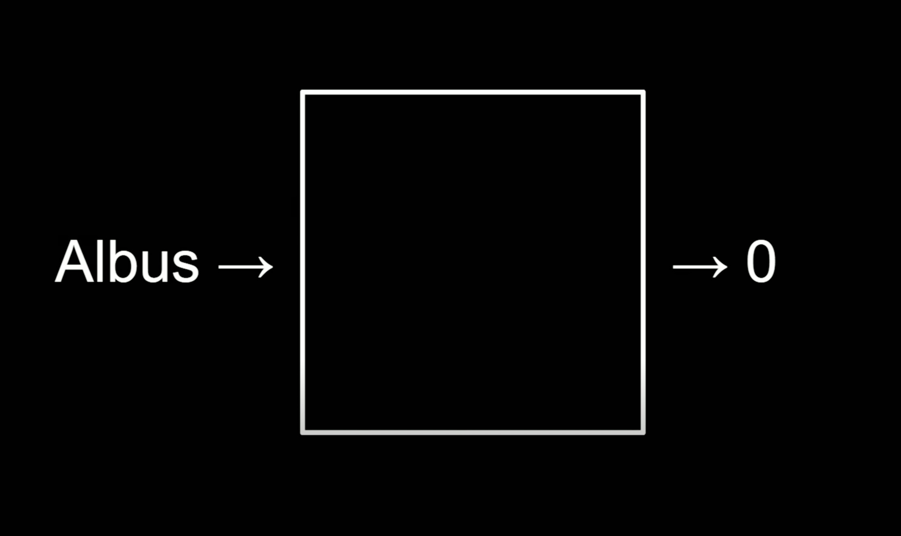
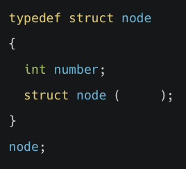

# 배열의 크기 조정하기
## int 자료형 2개로 이뤄진 배열 list를 int 자료형 5개를 담을 수 있는 배열로 확장하고 싶습니다. 이를 위해 임시 포인터 *tmp를 선언하는 올바른 realloc() 코드는 무엇인가요?

(1) int *tmp = realloc(list, 2 * sizeof(int));

(2) int *tmp = realloc(5 * sizeof(int), list);

(3) int *tmp = realloc(list, 5 * sizeof(int));

(4) int *tmp = realloc(5, list);

정답확인

(3) int *tmp = realloc(list, 5 * sizeof(int));

 

 

# 연결 리스트: 도입
## 같은 크기를 가지는 배열과 리스트가 있습니다. 첫번째 값이 아닌 위치의 값에 접근하려고 할 때 소요되는 시간에 대한 설명으로 옳은 것은 무엇인가요?

(1) 배열이 리스트보다 더 빠르다

(2) 리스트가 배열보다 더 빠르다

(3) 배열과 리스트 모두 동일하다

(4) 알 수 없다

정답확인

(1) 배열이 리스트보다 더 빠르다

 

 

# 연결 리스트: 코딩
## node라는 구조체 안에 number 멤버가 정의되어 있습니다. node *n; 변수가 선언되어 있을 때, (*n).number 와 동일한 의미의 코드는 다음 중 무엇인가요?

(1) n.number

(2) n->number

(3) *n.number

(4) n(number)

정답확인

(2) n->number

 

 

# 연결 리스트: 시연
## 연결 리스트에서 값을 검색하는데 걸리는 시간을 Big-O로 올바르게 나타낸 것은 무엇인가요?

(1) O(1)

(2) O(log n)

(3) O(n)

(4) O(n log n)

정답확인

(3) O(n)

 

 

# 연결 리스트: 트리
## 트리의 시작점이 되는 가장 최상위 노드를 일컫는 용어는 무엇인가요?

(1) 베이스 노드(base node)

(2) 루트 노트(root node)

(3) 기본 노드(default node)

(4) 시작 노드(start node)

정답확인

(2) 루트 노트(root node)

 

 

# 해시 테이블 
## 아래와 같이 영문자를 인덱스로 변환해 해시 테이블(Hash table)을 작성하려고 합니다. 어떤 문자가 어떤 값이 될지 매핑하는 함수를 무엇이라고 하나요?

(1) 해시 함수

(2) 결정 함수

(3) 바구니 함수

(4) 연결 함수

정답확인

(1) 해시 함수

 

 

# 트라이
## 길이가 10인 영어 문자열이 있습니다. 강의에서 살펴본 영어 문자열 트라이에 저장하는 경우 몇 개의 노드를 이어줘야 할까요?

(1) 1개

(2) 2개

(3) 5개

(4) 10개

정답확인

(4) 10개

 

 

# 스택, 큐, 딕셔너리
## 값을 넣고 뺄 때 ‘선입 선출’ 또는 ‘FIFO(First In First Out)’의 방식을 따르는 자료 구조는 무엇인가요?

(1) 스택(stack)

(2) 큐(queue)

(3) 딕셔너리(dictionary)

(4) 트리(tree)

정답확인

(2) 큐(queue)

 

 

# 연결 리스트 구현
## 연결 리스트를 구현하기 위해 노드를 구조체로 정의하려 합니다. 노드에 입력될 숫자 number와 다음 노드를 가리키는 포인터 next 를 정의하기 위해 괄호 안에 들어갈 코드로 적절한 것은 무엇인가요?

(1) next

(2) *next

(3) &next

(4) _next

정답확인

(2) *next

 

 

# 다양한 자료 구조와 검색 시간
## 프로그램에 이름과 전화번호를 저장하는 자료구조를 구현하려고 합니다. 이때 반드시 고려해야할 점이 아닌 것은?

(1) 시간 복잡도

(2) 공간 복잡도

(3) 메모리 주소 표기법

(4) 데이터의 양

정답확인

(3) 메모리 주소 표기법

 