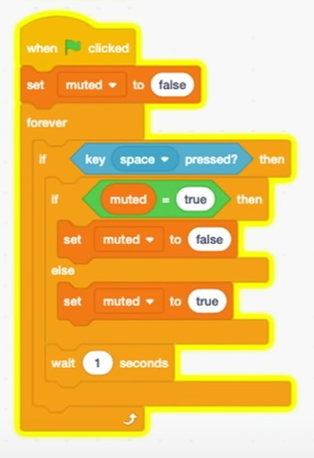

## 1. 이진법

#### 숫자 10을 2진법으로 표현하기 위해서 최소 몇 개의 비트가 필요할까요? <p>

<p>
<ol> 
<li>4비트</li>
<li>7비트</li>
<li>8비트</li>
<li>100비트</li>
</ol>

<details>
<summary>정답확인</summary>
(1) 4비트
</details>
<br>


## 2. 정보의 표현

#### 링크(https://ko.wikipedia.org/wiki/ASCII) 하단의 아스키 코드를 사용하여 [edwith](소문자)을 10진수로 표현해 보세요.

<ol>
<li>101 100 119 105 116 104</li>
<li>069 068 087 073 084 072</li>
<li>069 100 119 073 084 072</li>
<li>101 068 087 105 084 104</li>
</ol>


<details>
<summary>정답확인</summary>
(1) 101 100 119 105 116 104
</details>
<br>

## 3. 알고리즘

#### 총 512페이지의 전화번호부에서 '이펭수'는 64페이지에 있습니다. 책의 절반씩을 찾아보는 두 번째 알고리즘을 사용한다면, '이펭수'를 찾기 위해 페이지를 몇 번 찾아봐야 할까요?

<ol>
<li>1번</li>
<li>2번</li>
<li>3번</li>
<li>4번</li>
</ol>

<details>
<summary>정답확인</summary>
(3) 3번
</details>
<br>

## 4. 2진법과 10진법(1)

#### 10진법으로 표현된 '14'를 2진법ㅂ으로 표현하면 어덯게 될까요?

<ol>
<li>1110</li>
<li>1001</li>
<li>1000</li>
<li>1100</li>
</ol>


<details>
<summary>정답확인</summary>
(1) 1110
</details>
<br>

## 5. 2진법과 10진법(2)

#### 2진법으로 표현된[1011]을 10진법으로 표현하면 어떻게 될까요?

<ol>
<li>10</li>
<li>11</li>
<li>12</li>
<li>13</li>
</ol>

<details>
<summary>정답확인</summary>
(2) 11
</details>
<br>

## 6. 정보 표현의 기본 창치

#### 다음 문장에서 괄호 안에 들어갈 말로 적절한 것은 무엇인가요?
컴퓨터에는 (  ) 라고 불리는 굉장히 많은 스위치가 on/off 상태를 통해 0과 1을 표현합니다

<ol>
<li>램프</li>
<li>컨버터</li>
<li>트랜지스터</li>
<li>점퍼</li>
</ol>


<details>
<summary>정답확인</summary>
(3) 트랜지스터
</details>
<br>

## 7. 알고리즘의 표현

#### 컴퓨터가 수행할 작업을 프로그램 언어가 아니라 사람이 사용하는 언어로 알고리즘의 논리적 절차를 작성한 코드를 무엇이라고 하나요?

<ol>
<li>머신코드</li>
<li>휴먼코드</li>
<li>순서코드</li>
<li>의사코드</li>
</ol>

<details>
<summary>정답확인</summary>
(4) 의사코드
</details>
<br>

## 8. 다음 중 스크래치에서 블록을 통해 구현할 수 없는 알고리즘 요소는 무엇인가요? 

<ol>
<li>함수</li>
<li>컴파일</li>
<li>조건</li>
<li>루프</li>
</ol>


<details>
<summary>정답확인</summary>
(2) 컴파일
</details>
<br>

## 9. 스크래치의 변수와 조건문
#### 초록색 깃발을 눌러 아래 스크래치 프로그램을 실행을 시킨 후, muted가 false인 상태에서 스페이스 키를 누르면 muted의 값이 어떻게 변할까요?



<ol>
<li>false</li>
<li>null</li>
<li>true</li>
<li>space</li>
</ol>


<details>
<summary>정답확인</summary>
(3) true
</details>
<br>

### 10. 전화번호부 검색 의사 코드
#### 가나다 순으로 정렬된 전화번호부에서 '이펭수'를 찾으려 합니다. 이때 먼저 전화번호부의 가운데를 펴고 '이펭수'를 찾은 후, 이름이 없다면 앞 페이지나 뒷 페이지의 절반에 대해 똑같은 작업을 계속 반복하고자 합니다. 이를 묘사한 아래 의사 코드에서 10번 줄 빈 칸에 들어갈 말로 올바른 것은 무엇인가요?
<br>


```
1 전화번호부를 집어 든다<p>
2 전화번호부의 중간을 편다<p>
3 페이지를 본다<p>
4 만약 '이펭수'가 페이지에 있으면<p>
5     '이펭수'에게 전화한다<p>
6 그렇지 않고 만약 '이펭수'이 앞 페이지에 있으면<p>
7     앞 페이지의 절반을 편다<p>
8     3번째 줄부터 다시 실행한다<p>
9 그렇지 않고 만약 '이펭수'가 뒷 페이지에 있으면<p>
10    (           )<p>
11     3번째 줄부터 다시 실행한다<p>
12 그렇지 않으면<p>
13     그만둔다<p>
```

<ol>
<li>앞 페이지의 절반을 편다</li>
<li>뒷 페이지의 절반을 편다</li>
<li>뒷 페이지의 끝을 편다</li>
<li>뒷 페이지의 처음을 편다</li>
</ol>

<details>
<summary>정답확인</summary>
(2) 뒷 페이지의 절반을 편다
</details>
<br>