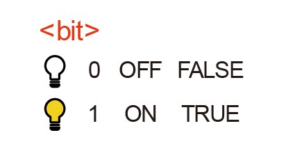
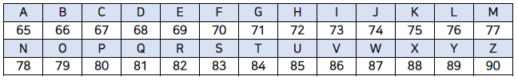
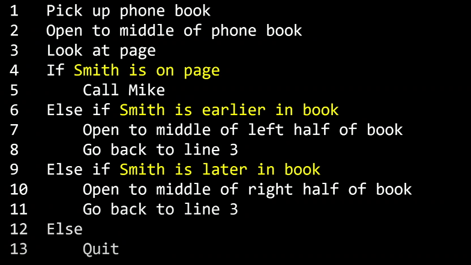
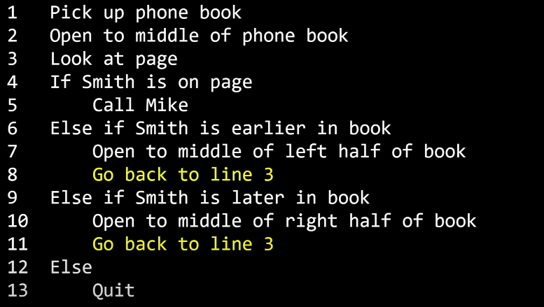

# 1) 2진법

> What ultimately matters in this course is not so much where you end up relative to your classmates but where you end up relative to yourself when you began

타인과의 비교에 시선을 두지 말고 과거의 나와 비교하여 성장하는 모습에 시선을 두자. 늘 하곤 하지만 쉽지만은 않은 다짐이다.
<br><br>

> 배경

    우리가 일상적으로 사용하는 컴퓨터는 어떤 원리로 작동될까? 

    우리가 컴퓨터를 사용하여 해결하는 여러 일들은 어떻게 가능한걸까? 

    컴퓨터 과학이란 무엇이고, 컴퓨터가 작동하게 하기 위해 어떤 약속들이 필요한지 살펴보자.
<br><br>

> 목표

    - 컴퓨터 과학이 무엇인지 정의
    - 컴퓨터가 정보를 표현하는 방법에 대해 설명
<br><br>

> 키워드

    - 컴퓨터 과학
    - 2진법
    - 비트
    - 바이트

<br>
<br>

## 컴퓨터의 동작원리

> 컴퓨터 과학이란?

문제 해결에 대한 학문. 문제를 해결하는 과정

문제를 해결한다? 

입력을 전달받아서 출력을 만들어내는 과정. 그 둘 사이의 블랙박스 역할
<br><br>

> 컴퓨터가 정보를 표현하는 방법 : 2진법, 비트, 바이트

사람의 경우 - 신체부위중 손을 이용하여 1~5 혹은 10까지 센다.

    Unary Notation  ex) 사람 수를 세기 위해 손가락을 '접거나' '폄'

컴퓨터의 경우 - 0과 1만으로 정보를 표현(글자, 사진, 영상, 소리 등등)

→ 물리적인 개념으로 봤을때 컴퓨터 안에 있는 트랜지스터가 켜지고 꺼지면서 이렇게 표현해줌

이와 같은 2진법은 전기를 통해 연산하는, 즉 전기를 켜고 끄는 방식으로 작동하는 컴퓨터에게 적합한 방법입니다.

컴퓨터에는 굉장히 많은 스위치(트렌지스터)가 있고 **on/off 상태를 통해 0과 1을 표현**합니다.

컴퓨터는 2진법에서 하나의 자릿수를 표현하는 단위를 **비트(bit)**라고 합니다.
<br><br>

- **비트**

정보를 저장하고 연산을 수행하기 위해 컴퓨터는 **비트(bit)**라는 측정 단위를 씁니다. 비트는 **이진 숫자**라는 뜻을 가진 “binary digit”의 줄임말이며, **0과 1, 두 가지 값만 가질 수 있는 측정 단위**입니다. 디지털 데이터를 여러 비트들로 나타냄으로써 두 가지 값만을 가지고도 많은 양의 정보를 저장할 수 있습니다. 또한 컴퓨터는 저장되어 있는 데이터를 수정하기 위해 비트에 수학적 연산을 수행할 수 있습니다.

- 바이트 (=**비트열)**

하나의 비트는 **0과 1**, 이 두 가지의 값만 저장할 수 있습니다. 컴퓨터 내부에서 물리적 표현될 때는, 켜고 끌 수 있는 스위치라고 생각할 수 있겠습니다. **(켜기=1, 끄기=0)**

하지만 비트 한 개는 많은 양의 데이터를 나타내기에 턱없이 부족합니다. 그렇기 때문에 여러 숫자 조합을 컴퓨터에 나타내기 위해 비트열을 사용합니다. **바이트(byte)**는 **여덟 개의 비트가 모여 만들어진 것**입니다. 하나의 바이트에 여덟 개의 비트가 있고, 비트 하나는 0과 1로 표현될 수 있기 때문에 **2^8** **= 256 개**의 서로 다른 바이트가 존재할 수 있습니다.

바이트가 모이면 더 큰 단위가 될 수 있습니다. 킬로바이트는 1,000 바이트, 메가바이트는 1,000 킬로바이트(100만 바이트), 기가바이트는 1,000 메가바이트(10억 바이트)입니다. 테라바이트는 1,000 기가바이트(1조 바이트)이며, 심지어 페타바이트와 엑사바이트와 같은 더 큰 단위도 존재합니다.

|비트(bit)|바이트(byte)|
|:------:|:---------:|
|||


다양한 데이터의 표현


하나의 비트로는 어떠한 값이 참인지 거짓인지, 예를 들면, 노트북이나 휴대전화가 충전 중인지 아닌지에 대한 정보만 컴퓨터에 저장할 수 있다. 하나의 바이트(8 bit)로 알파벳 하나를 표시할 수 있다.

더 큰 데이터 단위는 좀 더 복잡한 유형의 데이터를 저장할 수 있다. 오른쪽 표의 일부 예제를 보면 알 수 있듯이, 1 KB는 몇 문단의 문자를 나타낼 수 있고, 1 MB는 1분가량의 노래 파일의 크기와 같고, 1 GB는 약 30분 길이의 HD 영화 정도의 크기이다.
<br><br>

> 참고자료

- 컴퓨팅 사고 강의자료 - [https://www.boostcourse.org/downloadFile/fileDownload?attachmentId=495036&autoClose=true](https://www.boostcourse.org/downloadFile/fileDownload?attachmentId=495036&autoClose=true)
- 2진법 학습자료 - [https://www.boostcourse.org/downloadFile/fileDownload?attachmentId=495034&autoClose=true](https://www.boostcourse.org/downloadFile/fileDownload?attachmentId=495034&autoClose=true)
- 비트와 바이트 학습자료 - [https://www.boostcourse.org/downloadFile/fileDownload?attachmentId=493838&autoClose=true](https://www.boostcourse.org/downloadFile/fileDownload?attachmentId=493838&autoClose=true)
<br><br>

# 2) 정보의 표현

> 배경

    우리는 컴퓨터를 통해 다양한 정보를 처리한다. 

    간단한 숫자부터 시작해서, 문자, 사진, 영상, 음악까지. 정보를 표현하는 형태는 매우 많다. 

    컴퓨터는 어떻게 이런 다양한 정보를 처리할 수 있을까?
<br><br>

> 목표

    컴퓨터가 문자, 사진, 영상, 음악 등 다양한 정보를 처리하는 방식을 설명
<br><br>

> 키워드

    - ASCII
    - 유니코드
    - RGB
<br><br>

> 컴퓨터가 다양한 정보를 처리하여 표현하는 방식

    일상을 사는 우리는 문자와 숫자, 사진, 영상, 음악 등을 각각 독립적인 정보라고 생각한다.

    하지만 0과 1로만 모든 것을 나타내야 하는 컴퓨터에게 이 정보들은 역시나 0과 1이라는 숫자로 표현되어야 한다.

    정해진 약속(=표준)

***문자 ⇒ 숫자***

- ASCII Code

    설명미국정보교환표준부호. American Standard Code for Information Interchange

    

- Unicode

    ASCII로는 문자들을 표현하기에 충분하지 않았던 한계 → 더 많은 비트를 사용하여 더 다양한 다른 문자들도 표현가능 하도록 지원

    ex) 😂 : 10진수 **`128,514`**, 2진수 **`11111011000000010`**

***그림 ⇒ 숫자***

- Pixel

        각각의 픽셀은 세 가지 색을 서로 다른 비율로 조합하여 특정한 색을 갖게 됨

        이 숫자들을 표현하는 방식을 RGB(Red, Green, Blue)

        ex) 노란색 : 72 73 33

***영상 ⇒ 숫자***

    수많은 그림을 빠르게 연속적으로 이어 붙여놓은 것 → 숫자로 표현 가능

***음악 ⇒ 숫자***

    각 음표를 숫자로 표현 가능

> 참고자료

- ASCII 학습자료 - [https://www.boostcourse.org/downloadFile/fileDownload?attachmentId=493840&autoClose=true](https://www.boostcourse.org/downloadFile/fileDownload?attachmentId=493840&autoClose=true)
  
<br><br>

# 3) 알고리즘

> 배경

    우리는 이제 컴퓨터에 정보를 입력하는 방식을 배웠다. 그렇다면 이 정보를 컴퓨터는 어떻게 가공하여 출력하는 걸까? 

    우리가 일상 생활에서 다양한 문제를 처리하는 방식 처럼, 컴퓨터 또한 순서대로 필요한 동작을 하며 문제를 처리한다. 

    이를 알고리즘이라고 하는데, 알고리즘은 어떻게 정의할 수 있고, 그 정확성과 효율성은 어떨까?
<br><br>

> 목표

    1. 우리가 일상 생활에서 하는 일들을 컴퓨터가 이해할 수 있는 알고리즘으로 표현
    2. 효율적인 알고리즘에 대해 설명
<br><br>

> 키워드

     - 알고리즘
     - 의사코드
<br><br>

> 알고리즘이란?

    컴퓨터에 입력된 정보를 컴퓨터가 출력을 위해 가공하는 방법
    입력값을 출력값의 형태로 바꾸기 위해 어떤 명령들이 수행되어야 하는지에 대한 규칙들의 순서적 나열

알고리즘 평가 척도 : **정확성**, **효율성**
<br><br>

> Pseudocode(의사코드)

위와 같은 알고리즘은 아래와 같은 **의사코드**라는 방식으로 보다 명료하게 정리할 수 있다.

의사코드는 필요한 행동이나 조건을 잘 설정하여 컴퓨터가 수행해야 하는 일을 절차적으로 파악할 수 있게 도와준다.


```c
1. 전화번호부를 집어 든다
2. 전화번호부의 중간을 편다
3. 페이지를 본다
4. 만약 Mike Smith가 페이지에 있으면
5. Mike Smith에게 전화한다.
6. 그렇지 않고 만약 Mike Smith가 앞 페이지에 있으면
7. 앞 페이지의 절반을 편다
8. 3번째 줄부터 다시 실행한다
9. 그렇지 않고 만약 Mike Smith가 뒷 페이지에 있으면
10. 뒷 페이지의 절반을 편다
11. 3번째 줄부터 다시 실행한다
12. 그러지 않으면
13. 그만둔다
```

<br><br>
| 함수(function) | 조건(Condition)          | 불리언(Boolean)                 |  루프|
| :------------: | :-----------: | :-------------------:|:----:|
| 컴퓨터에게 각 경우에 사람에게 무엇을 할 질 알려주는 동사의 역할     | 여러 선택지 중 하나를 고르는 것          | 결정을 내리기 위한 질문 | 뭔가를 계속해서 반복하는 순환    |
|     |       |               |     |


> 참고자료

- 알고리즘 - [https://youtu.be/6hfOvs8pY1k](https://youtu.be/6hfOvs8pY1k)

<br><br>

# 4) 스크래치: 기초

> 배경

    알고리즘을 만들기 위해 여러가지 프로그래밍 언어를 사용할 수 있다. 쉬운 방법중 하나는 스크래치와 같은 그래픽 프로그래밍 언어를 사용하는 것이다. 

    블록을 옮기고 이어 붙여서 우리가 원하는 작업을 수행하도록 할 수 있다.
<br><br>

> 목표

  - 스크래치를 이용하여 간단한 알고리즘을 구현
<br><br>

> 키워드

  - 스크래치
  - 블록

<br><br>

> Scratch

    알고리즘 구성을 위해 여러가지 프로그래밍 언어를 사용할 수 있는데, 그중 엔트리레벨의 언어가 Scratch

<br><br>

> **스크래치 블록**

    블록의 종류에 따라서 프로그램이 수행하는 일의 종류가 달라진다. 

    입력이 주어졌을 때 블랙 박스를 거쳐 출력이 되는 컴퓨터의 작동 원리를 생각해보면, 하나의 블록이 블랙 박스의 역할을 하는 것이다. 

    ex) “말해라” 라는 블록에 “hello, world”라는 입력을 주게되면 그 결과로 고양이가 “hello, world”라고 말하게 된다. 이러한 입력과 출력을 이어 붙여서 여러 작업을 순차적으로 수행할 수도 있다.

# 5) 스크래치: 심화