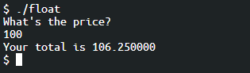

- 용어정리

        parenthesis : 소활호, ()

        curly braces : 중괄호, {}

        single quote : 따옴표, ''

        double quotes : 쌍따옴표. ""

## C언어
<br>

> 배울 내용

    - 함수
    - 조건
    - Boolean
    - Loop


    소스코드 : 프로그래밍 언어(C, Python, Java, C++)를 가지고 우리가 직접 작성한 코드. 사람이 알아볼 수 있는 정도

    머신코드 : 컴퓨터가 알아들을 수 있는 0과 1로 이루어진 코드

    컴파일러 : 소스코드로부터 머신코드로 번역을 수행하는 알고리즘 or 소프트웨어

**`clang`** : 코드를 컴파일하는 프로그램의 이름

**`clang hello.c`** : clang이라는 컴파일러로 hello.c라는 코드를 컴파일하라 → 결과로 a.out 파일이 생성

**`clang -o <원하는 출력파일이름> hello.c`** : clang 문서를 보면 다음과 같이 -o 옵션을 통해 원하는 이름의 출력파일로 내보낼 수도 있다.

**`./a.out`** : 현재 디렉토리에 있는 a.out이라는 프로그램을 실행하게 해줌

이후에 코드에 수정한 내용이 들어간다면 컴파일러를 통해 컴파일과정을 다시 수행해주어야 한다.

Command에서 ls를 입력하면 해당 디렉토리에 있는 파일목록이 뜨는데, 이때 *가 붙어있는 파일들을 머신코드, 즉 컴퓨터가 이해할 수 있는 머신코드라는 표시이다.(붙어있지 않는 코드는 소스코드)

#### 다양한 리눅스 명령어
- rm
- mkdir
- rmdir
<br><br>

> 참고자료

CS50 SandBox - [http://sandbox.cs50.io/](http://sandbox.cs50.io/)

C언어 강의자료 - [https://www.boostcourse.org/downloadFile/fileDownload?attachmentId=496575&autoClose=true](https://www.boostcourse.org/downloadFile/fileDownload?attachmentId=496575&autoClose=true)

C언어 학습자료 - [https://www.boostcourse.org/downloadFile/fileDownload?attachmentId=496602&autoClose=true](https://www.boostcourse.org/downloadFile/fileDownload?attachmentId=496602&autoClose=true)

<br><br>
## 문자열
<br>

> 키워드

    - 형식지정자(placeholder)
    - string
    - make
<br>

> 형식 지정자

```c
string answer = get_string("What's youe name?\n");
```

C는 오래된 언어이기 때문에 변수가 저장하는 데이터의 종류를 아주 정확하게 명시해줘야 한다.

따라서 저장하고자 하는 값의 종류가 문자열(String)이라는 것을 알려줘야 하는데, 이를 형식지정자(Placeholder)라고 한다.

<br><br>

> 할당연산자

= 기호 

- 할당연산자
- "오른 쪽에 있는 것을 왼쪽에 지정한다."
- ←와 비슷하다고 생각해주는게 좋다.

처음 볼때에는 하나하나 구성요소를 쪼개서 오른쪽에서 왼쪽으로, 바깥에서부터 안쪽으로 살펴보면 파악이 쉽다.

<br><br>

> String

- 쌍따옴표 안에 들어간 0개 이상의 문자의 연속(배열)
- 사실 C에서 String이라는 data type은 존재하지 않는다.
- CS50강의에서는 배우기 쉽도록 cs50.h라는 헤더파일을 통해 string과 get_string이라는 기능을 제공


첫번째 줄에서 string answer로 지정을 하게 되면, 컴퓨터 메모리의 어딘가에 사용자 이름이 저장되게 된다.

이때 유의할 점은 printf("hello, answer");이 아니라는 점

이 코드를 실행한다면 answer이 출력이 되어 hello, answer이 그대로 결과로 출력

우리는 answer이라는 변수에 들어있는 이름을 출력을 해야하기 때문에 `%`를 사용해준다.

이 때도 어떤 종류의 인자를 받는지 말해줘야 한다.

우리는 이름이라는 문자열을 받기때문에 `string`에서의 `s`를 `%`뒤에 붙여서 인자를 받아준다.

그래서 최종적으로는 `printf("hello, %s\n", answer);`이 되는 것

가장 위에 포함된 cs50.h 파일 안에 string이라는 문자열 형식과 get_string 이라는 함수에 대한 코드가 포함되어 있습니다. 이 파일을 포함해야만 전체 코드를 컴파일 하고 실행할 수 있습니다.

```c
#include <cs50.h>

#include <stdio.h>

 

int main(void)

{

string animal = get_string("What's your favorite animals?\n");

printf("My favorite animal is %s," animal);

}
```

```c
clang -o string string.c -lcs50
```

clang 컴파일러를 통해 string.c라는 소스코드를 string이라는 머신코드로 출력, 이때 cs50파일을 연결(link)

```c
make string
```

make라는 명령어는 유닉스, 리눅스를 사용하는 PC에 포함되어있는 일반적인 툴

해당 명령어를 입력하면 string.c라는 소스코드를 찾아 string이라는 머신코드로 변환해준다.

## 조건문과 루프

<br><br>

> 키워드

    - int
    - if
    - while
    - for

syntatic sugar

- count = count+1

- count += 1

- count ++
<br><br>

> int


ex) counter라는 변수에 **숫자**를 저장하고 싶은 경우

int 는 변수가 정수(integer)라는 것을 알려주는 것<br>
counter는 변수의 이름, 0은 그 값에 0을 저장(초기화)하는 것<br>
등호(=)는 같다는 의미가 아닌, 오른쪽에 있는 값을 왼쪽에 할당한다는 의미

세미콜론은 조건문 뒤에는 붙이지 않아도 되고, 함수 뒤에는 반드시 붙여준다.
<br><br>

> 일치 연산자(Equality Operator)

등호(=)를 하나만 쓰는 할당 연산자와는 달리, 등호 두개(==)를 이어씀으로써 같다라는 표현을 함
<br><br>

> while 루프


- 무한히 실행을 원한다면?

while루프의 조건문 안에는 답이 true이거나 1로 나올 수 있는 질문을 던져줘야 한다 ⇒ true를 넣어주면 된다.


- 특정 횟수만큼 작업을 수행하고 싶다면?

단하게 정수를 나타내는 **i**를 사용(변수명은 맘대로 적어도 상관X)

다시 while문으로 돌아가서 이번에는 **i<50**이라는 조건을 추가

우리는 처음에 i를 0이라고 정해주었고 while는 계속해서 i가 50보다 작은지를 물어볼 것

따라서 이 코드가 정상적으로 작동하려면 i를 증가시켜야. (i = i + 1, i += 1, i++ 모두 같은 결과를 냅니다.)

진행 순서
```
i는 0으로 설정 
-> i는 50보다 작은가? 
-> 작다 
-> hello world를 출력한다 
-> i를 1증가시킨다 
-> i가 50보다 작은가?
-> (반복) 
-> i가 50보다 작은가? 
-> 작지 않다 
-> 종료
```
<br><br>

> for 루프


- for 루프 안의 표현(변수 초기화;계속해서 묻고자 하는 boolean 표현; 변수를 어떻게 설정한것인지에 대한 표현) = (변수 초기화; 변수 조건; 변수 증가)

위의 예제의 경우 - 가장 먼저 정수 값을 가지는 i라는 변수를 0으로 초기화하고, i가 50인지 매번 검사를 하고, 이를 만족하면 { } 안의 내용을 수행한 후에, i를 1씩 증가시킨다는 의미입니다.
<br><br>

> 참고자료

조건문 학습자료 - [https://www.boostcourse.org/downloadFile/fileDownload?attachmentId=497515&autoClose=true](https://www.boostcourse.org/downloadFile/fileDownload?attachmentId=497515&autoClose=true)

<br><br>

## 자료형, 형식지정자, 연산자
<br>

> 키워드

    - char
    - long
    - float
    - double
    - %
    - &&
    - ||
<br><br>

> 자료형(Data Type)

- bool: 불리언 표현, (예) True, False, 1, 0, yes, no
- char: 문자 하나 (예) 'a', 'Z', '?'
- string: 문자열
- int: 특정 크기 또는 특정 비트까지의 정수 (예) 5, 28, -3, 0
- long: (int보다)더 큰 크기의 정수
- float: 부동소수점을 갖는 실수 (예) 3.14, 0.0, -28.56
- double: 부동소수점을 포함한 더 큰 실수

** int는 대략 40억까지 셀 수 있다. 그 범위를 넘어간다면 long을 사용하도록 한다.
<br><br>

> CS50 라이브러리 내의 get 함수

- get_char
- get_double
- get_float
- get_int
- get_long
- get_string
<br><br>

> 형식지정자

지난 강의에서 문자열(string)인 answer 변수의 인자를 **%s**로 불러왔듯,

이번에는 여러가지 데이터 타입 마다 사용되는 형식 지정자를 알아보도록 하겠습니다.

- **%c** : char
- **%f** : float, double

```c
# include <cs50.h>
# include <stdio.h>

int main(void)
{
    float price = get_float("What's the price?\n");
    printf("Your total is %f\n", price*1.0625);
}
```



- **%i** : int
- **%li** : long
- **%s** : string
<br><br>

> 기타연산자 및 주석

- +: 더하기
- : 빼기
- : 곱하기
- /: 나누기
- %: 나머지
- &&: 그리고
- ||: 또는
- //: 주석

이 코드가 무슨일을 하는지 설명하는 것. 코드가 굉장히 길어질경우 주석을 통해 이해의 속도를 높일 수 있다.

<br>

  ## 참고) #include<cs50.h> 는 무엇인가요?
  <br>

CS50 수업을 위해 만들어진 **라이브러리** 입니다. 라이브러리는 여러 **함수**들을 모아둔 것이라고 볼 수 있습니다. CS50 수업에서는 여러분들께서 좀 더 쉽게 코딩을 짤 수 있게 **CS50 라이브러리** 안에 여러 함수(get_int, get_double, get_float 등등)를 만들어 두었습니다.

반면에 C에는 **표준 라이브러리**도 있습니다. 우리가 처음부터 사용한 #inclue<stdio.h>가 표준 라이브러리 중 하나 입니다. 가장 많이 쓰고 가장 보편적으로 사용하는 라이브러리입니다. 그 밖에도 <math.h>, <time.h> 등 자신이 코딩하는데 필요한 함수들을 그때 그때 라이브러리를 불러와서 다른 사람들이 만들어둔 함수를 사용할 수 있습니다. 이 강좌 이후에 직접 코딩을 해보고 좀 더 공부를 하다 보면 배우실 수 있을 것입니다.

그렇다면 sandbox.cs50.io가 아닌 Visual Studio 같은 곳에서 CS50 라이브러리를 **바로 사용**이 가능할까요? 답은 사용할 수 없습니다. 표준 라이브러리는 기본적으로 설치가 되어 있기 때문에 사용이 가능하지만 앞서 말씀드렸듯이 CS50 라이브러리는 수업을 위해 만들어진 라이브러리 입니다. 그래서 sandbox.cs50.io 처럼 미리 설치가 된 곳이 아니면 따로 설치를 하여야만 사용이 가능합니다. 설치하는 방법은 현재 수준에서 필요한 것이 아니기 때문에 아래 첨부된 CS50 라이브러리 문서를 참고해 주세요.

추가로 CS50 라이브러리의 get_int, get_float 등의 함수로 좀 더 쉽게 입력을 받아 보았는데요, 일반적으로 사용되는 입력을 받는 함수도 아래의 참고자료를 통해 학습하실 수 있게 준비해 두었으니 참고하시면 좋을 것 같습니다.
<br><br>

> 참고자료

C 표준 라이브러리(위키백과, 우리 모두의 백과사전) - [https://ko.wikipedia.org/wiki/C_표준_라이브러리](https://ko.wikipedia.org/wiki/C_%ED%91%9C%EC%A4%80_%EB%9D%BC%EC%9D%B4%EB%B8%8C%EB%9F%AC%EB%A6%AC)

CS50 라이브러리 문서 - [https://cs50.readthedocs.io/libraries/cs50/c/](https://cs50.readthedocs.io/libraries/cs50/c/)

입력과 출력2(C언어 기초 _ opentutorials.org) - [https://opentutorials.org/module/3921/23575](https://opentutorials.org/module/3921/23575)

<br>
<br>

## 사용자 정의 함수

프로그래밍을 하다 보면 가끔 반복적으로 작성해야 하는 코드가 있습니다. 이런 코드를 여러번 쓰지 않고 함수 형태로 저장해두면 코드를 간결하고 이해하기 쉽게 만들 수 있습니다. 

사용자 정의 함수를 사용 하는 방법을 배워봅니다. 더불어서 하나의 루프로 수행하기 힘든 작업을 중첩 루프를 이용하여 해결하는 방법도 배워 보겠습니다.
<br><br>

> 키워드

    - 사용자 정의 함수
    - 중첩 루프
<br>

> 사용자 정의 함수

C는 단순히 코드를 위에서 아래로 내려가면서 실행하기때문에 사용자정의 함수를 뒤에서 선언했다면 main 함수 이전에 반드시 선언을 해주어야 해당 함수가 정의되어있음을 인지할 수 있다.

* 단순 printf() 반복
```c
#include <stdio.h>

int main(void)
{
    printf("cough\n");
    printf("cough\n");
    printf("cough\n");
}
```
* for문을 활용해서 printf() 반복
```c
#include <stdio.h>

int main(void)
{
    for (int i = 0; i < 3; i++)
    {
        printf("cough\n")
    }
}
```

* cough()라는 함수로 분리(사용자 정의 함수)
```c
#include <stdio.h>

void cough(void)
{
    printf("cough\n")
}

int main(void)
{
    for (int i = 0; i < 3; i++)
    {
        cough();
    }
}
```

* 사용자정의함수 아래쪽에 배치
```c
#include <stdio.h>

void cough(void);

int main(void)
{
    for (int i = 0; i < 3; i++)
    {
        cough();
    }
}

void cough(void)
{
    printf("cough\n");
}
```

* 사용자 정의 함수 input으로 변수로 할당
```c
#include <stdio.h>

void cough(int n);

int main(void)
{
    cough(3);
}

void cough(int n)
{
    for (int i = 0; i < n; i++)
    {
        printf("cough\n");
    }
}
```

함수를 선언할때 가장 왼쪽에 쓰는 data type은 출력결과물에 대한 자료형을 지정해주는 것이고, 함수명 오른쪽의 괄호 안에 들어가는 자료형은 input에 대한 자료형이다.

<br><br>

## 중첩루프

* 게임 화면에서 다음과 같이 2차원의 형태를 만드는 경우


```c
#include <cs50.h>
#include <stdio.h>

int main(void)
{
    int n;

    do
    {
        n = get_int("Size: ");
    }
    while (n < 1);

    for (int i = 0; i < n; i++)
    {
        for (int j = 0; j < n; j++)
        {
            printf("#");
        }
        printf("\n");
    }
}
```

- 코드 설명

        → 먼저 int n; 으로 정수 값을 갖는 변수 n을 정의

        → do{ …}while()을 이용해서 while( )의 조건이 만족할때 까지 get_int 함수로 사용자가 입력값을 받아 n에 저장

        do{ }while()을 사용하면 조건과 상관없이 최소한 한 번은 { }안의 내용을 실행할 수 있음

        → for 루프를 두 번 중첩해서 돌면서 “#”을 출력

        첫 번째 루프에서는 변수 i를 기준으로 n번 반복하고, (내부 루프가 끝날 때마다 줄바꿈을 수행)

        그 안의 내부 루프에서는 변수 j를 기준으로 n번 반복. 내부 루프에서는 “#”을 출력

        → 최종적으로는 가로가 n개, 세로가 n개인 “#”이 출력

<br><br>

## 하드웨어의 한계

<br>

> RAM(Random Access Memory)

물리적 저장 장치. 우리가 작성한 프로그램은 구동중에(파일이 열려있는 동안) RAM에 저장이 된다.

유한한 크기의 비트만 저장할 수 있기때문에 때때로 부정확한 결과
<br><br>

> 연산에서의 한계 _ 부동 소수점 부정확성

```c
#include <cs50.h>
#include <stdio.h>

int main(void)
{
    // 사용자에게 x 값 받기
    float x = get_float("x: ");

    // 사용자에게 y 값 받기
    float y = get_float("y: ");

    // 나눗셈 후 출력
    printf("x / y = %.50f\n", x / y);
}

//결과값
//x: 1
//y: 10
//x / y = 0.10000000149011611938476562500000000000000000000000
```

정확한 결과는 0.1이어야 한다. 하지만, float의 저장가능한 비트의 수가 유한하기 때문에 다소 부정확한 결과를 내게 된다.
<br><br>

> 정수 오버플로우 _ 저장할 수 있는 범위 한계 (ex. )

```c
#include <stdio.h>
#include <unistd.h>

int main(void)
{
    for (int i = 1; ; i *= 2)
    {
        printf("%i\n", i);
        sleep(1);
    }
}

...
1073741824
overflow.c:6:25: runtime error: signed integer overflow: 1073741824 * 2 cannot be represented in type 'int'
-2147483648
0
0
...
```

int형태로 저장하기때문에 2를 계속 곱하다가 int타입이 저장할 수 있는 수의 범위를 넘어가는 경우 에러를 출력한다.

    오버플로우 관련 실제 사례

    - Y2K

    1999년에 큰 이슈가 되었던 Y2K 문제는 연도를 마지막 두 자리수로 저장했던 관습 때문에 새해가 오면 ‘99’에서 ‘00’으로 정수 오버플로우가 발생하고, 새해가 2000년이 아닌 1900년으로 인식된다는 문제였습니다.
    그리고 세계는 수백만 달러를 투자해서 프로그래머들에게 더 많은 메모리를 활용해서 이를 해결하도록 하였습니다.
    이는 통찰력 부족으로 발생한 아주 현실적이고 값비싼 문제였습니다.

    - 보잉 787

    구동 후 248일이 지나면 모든 전력을 잃는 문제가 있었습니다.
    왜냐하면 강제로 안전 모드로 진입하였기 때문입니다.
    이는 소프트웨어의 변수가 248일이 지난 뒤에 오버플로우가되어 발생하였기 때문이었습니다.
    248일을 1/100초로 계산하면 대략 2의 32제곱이 나옵니다.
    보잉을 설계할때 사용한 변수보다 너무 커졌던 것입니다.
    이를 해결하기 위해 주기적으로 재가동을 하여 변수를 다시 0으로 리셋했습니다.
    따라서 다루고자 하는 데이터 값의 범위를 유의하며 프로그램을 작성하는 것이 중요합니다.