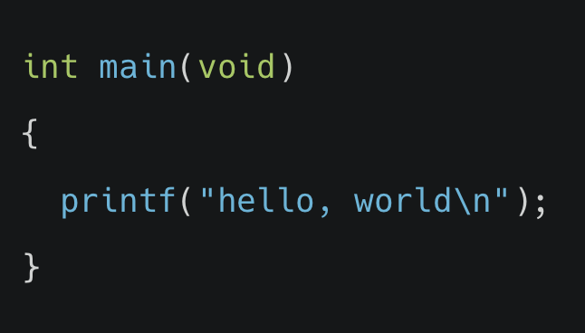
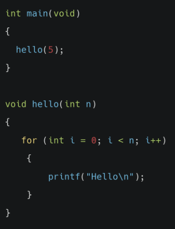

## 1. C 기초

#### 스크래치에서 아래 블록이 의미하는 것과 동일한 역할을 하는 함수를 C언어로 올바르게 작성한 것은 무엇일까요?

<ol>
    <li>int run(void)</li>
    <li>int start(void)</li>
    <li>int main(void)</li>
    <li>(int) main void</li>
</ol>

정답확인

(3) int main(void)

 
 

## 2. 문자열

#### 스크래치에서 아래 블록이 의미하는 것과 동일한 역할을 C언어로 올바르게 표현한건 무엇인가요?

<ol>
    <li>say(Hello!);</li>
    <li>print("Hello!")</li>
    <li>printf(Hello!);</li>
    <li>printf("Hello!");</li>
</ol>

정답확인

(4) printf("Hello!");

 
 

## 3. 컴파일

#### C언어로 작성된 hello.c 소스코드를 컴퓨터가 이해할 수 있는 머신코드로 컴파일 하기 위해 어떤 명령어를 프롬프트에 입력해야 할까요?

<ol>
    <li>$run hello.c</li>
    <li>$clang hello.c</li>
    <li>$start hello.c</li>
    <li>$compile hello.c</li>
</ol>
 

정답확인

(2) $clang hello.c

 
 

## 4. 문자열

#### 사용자 이름이 저장된 문자열 변수 name과 "Hello"를 연결해서 출력하려 합니다. 올바른 C언어 코드는 무엇인가요?

<ol>
    <li>prinf("Hello, name");</li>
    <li>printf("Hello, %f, name");</li>
    <li>printf("Hello, $s", name);</li>
    <li>printf("Hello, %i", name);</li>
</ol>

정답확인

(3) printf("Hello, %s", name);

 
 

## 5. 조건문

#### 'x가 y와 같다면'이라는 조건문을 C코드로 나타내면 어떻게 될까요?

<ol>
    <li>if x is equal to y</li>
    <li>if (x = y)</li>
    <li>if(x equal y)</li>
    <li>if(x==y)</li>
</ol>
 

정답확인

(4) if(x==y)

 
 

## 6. 연산자

#### 변수x가 입력되었을 때 x가 짝수인지 홀수인지 알아내는 프로그램을 구현하기 위해 사용하면 좋은 연사자는 다음 중 무엇인가요?

<ol>
    <li>+</li>
    <li>*</li>
    <li>%</li>
    <li>&&</li>
</ol>

정답확인

(3) %

 
 

## 7. 라이브러리

#### 아래와 같은 C코드가 있습니다. printf 함수 사용을 위해 꼭 추가되어야 하는 코드는 무엇인가요?

<ol>
    <li>include< stdio.h></li>
    <li>#include stdio.h</li>
    <li>#include < stdio.h></li>
    <li>include stdio.h</li>
</ol>

정답확인

(3) #include < stdio.h>

 
 

## 8. 사용자 지정 함수

#### 아래와 같이 hello()라는 사용자 함수를 작성한 후, 메인 함수에서 사용하려고 합니다. 파일 상단에 정의되어야하는 코드는 무엇일까요?

<ol>
    <li>void hello(void);</li>
    <li>void hello(int);</li>
    <li>int hello(void);</li>
    <li>int hello(int);</li>
</ol>

정답확인

(2) void hello(int);

 
 

## 9. 루프

#### 어떤 작업을 50번 반복 수행하는 루프를 구현하기 위한 C코드로 적절한 것을 무엇인가요?

<ol>
    <li>during(int i = 0; i < 50; i++)</li>
    <li>repeat(int i = 0; i < 50; i++)</li>
    <li>until(int i = 0; i < 50; i++)</li>
    <li>for(int i = 0; i < 50; i++)</li>
</ol>

 

정답확인

(4) for(int i = 0; i < 50; i++)

 
 

## 10. 하드웨어의 한계

#### 컴퓨터 하드웨어의 한계로 인해 발생하는 문제 중 하나로, 변수가 담을 수 있는 최대 허용 범위를 벗어난 값을 저장해 예상치 못한 결과가 나오는 현상을 무엇이라고 하나요?

<ol>
    <li>메모리 부족</li>
    <li>오버플로우</li>
    <li>블루스크린</li>
    <li>강제종료</li>
</ol>

정답확인

(2) 오버플로우

