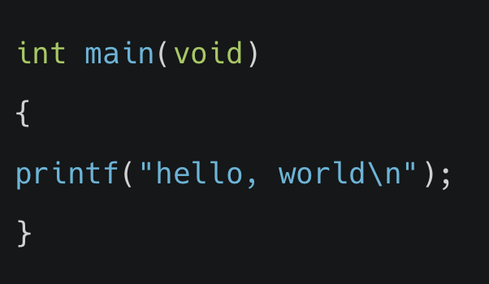

## 1. 컴파일링

#### 컴파일링의 네 단계에 해당하지 않는 것은 무엇인가요?
<br>
<ol>
    <li>어셈블링(assembling)</li>
    <li>링킹(linking)</li>
    <li>전처리(preprocessing)</li>
    <li>디버깅(debugging)</li>
</ol>

<details>
<summary>정답확인</summary>
(4) 디버깅(debugging)
</details>

<br>
<br>

## 2. 디버깅

#### 소스코드 내에 존재하는 오류를 해결하기 위한 작업을 무엇이라고 하나요?
<br>
<ol>
    <li>리졸빙(resolving)</li>
    <li>디버깅(debugging)</li>
    <li>컴파일링(compiling)</li>
    <li>체킹(checking)</li>
</ol>


<details>
<summary>정답확인</summary>
(2) 디버깅(debugging)
</details>

<br>
<br>

## 3. 스타일 가이드

#### 아래 코드는 기능상으로 문제가 없지만 C언어 스타일 가이드에는 부합하지 않습니다. 어떻게 변경하면 스탕리 가이드에 부합한 코드가 될까요?
<br>



<ol>
    <li>여는 중괄호({)와 같은 줄에 printf 함수를 작성한다.</li>
    <li>int main(void) 바로 옆에서 여는 중괄호({)를 시작한다.</li>
    <li>printf 함수와 세미콜론(;) 사이에 공백을 추가한다.</li>
    <li>printf 함수를 들여쓰기해서 중괄호{} 사이에 포함되었음을 표현한다.</li>
</ol>


<details>
<summary>정답확인</summary>
(4) printf 함수를 들여쓰기해서 중괄호{} 사이에 포함되었음을 표현한다.
</details>

<br>
<br>

## 4. 배열

#### char 자료형을 5개 담을 수 있는 [edwith]라는 이름의 배열을 선언하는 코드는 무엇인가요?
<br>
<ol>
    <li>char edwith[4];</li>
    <li>char edwith[5];</li>
    <li>chars edwith[5];</li>
    <li>char edwith*5;</li>
</ol>


<details>
<summary>정답확인</summary>
(2) char edwith[5];
</details>

<br>
<br>

## 5. 배열

#### int scores[10]; 이라는 배열이 선언되어 있습니다. 이 배열의 처음부터 끝 인덱스까지 순환하는 for 루프는 무엇인가요?
<br>
<ol>
    <li>for (int i = 1; i < 10; i++) {... scores[i] ...}</li>
    <li>for (int i = 0; i < 10; i++) {... scores[i] ...}</li>
    <li>for (int i = 1; i < 11; i++) {... scores[i] ...}</li>
    <li>for (int i = 0; i < 11; i++) {... scores[i] ...}</li>
</ol>


<details>
<summary>정답확인</summary>
(2) for (int i = 0; i < 10; i++) {... scores[i] ...}
</details>

<br>
<br>

## 6. 배열

```c
string names[2];
names[0] = "MONSTER";
names[1] = "MOM";
```

#### 위와 같은 코드가 주어졌을 때 아래 보기 중 그 값이 다른 것은 무엇일까요?
<br>
<ol>
    <li>names[0][0]</li>
    <li>names[1][0]</li>
    <li>names[0][2]</li>
    <li>names[1][2]</li>
</ol>


<details>
<summary>정답확인</summary>
(3) names[0][2]
</details>

<br>
<br>

## 7. 배열

#### 아래와 같은 main 함수를 지니는 edwith.c 코드소스를 작성하고 컴파일했습니다. `$ ./edwith hello world`를 실행하였을 때 argc의 값은 무엇일까요?


<ol>
    <li>1</li>
    <li>2</li>
    <li>3</li>
    <li>4</li>
</ol>


<details>
<summary>정답확인</summary>
(3) 3
</details>

<br>
<br>

## 8. 컴파일링 자동화

#### C 소스파일의 링크, 컴파일, 빌드 작업을 자동화해주는 툴은 다음 중 무엇인가요?

<ol>
    <li>clang</li>
    <li>autocompile</li>
    <li>make</li>
    <li>link</li>
</ol>


<details>
<summary>정답확인</summary>
(3) make
</details>

<br>
<br>

## 9. 코드 내의 오류 

#### 소스코드를 작성할 때 우리가 의식적으로 또는 무의식적으로 저지른 실수나 오류를 통상적으로 일컫는 단어는 무엇인가요?

<ol>
    <li>미스테이크(mistake)</li>
    <li>버그(bug)</li>
    <li>앱노멀(abnormal)</li>
    <li>폴트(fault)</li>
</ol>


<details>
<summary>정답확인</summary>
(2) 버그(bug)
</details>

<br>
<br>

## 10. 문자열의 저장 방식

#### 다음 중 문자열(string)이 메모리에 저장되는 방식에 대한 설명으로 틀린 것은 무엇인가요?

<ol>
    <li>문자열(string)은 문자(char)의 배열로 저장된다</li>
    <li>문자열(string)의 각 문자(char)는 메모리상에 연이어서 저장된다</li>
    <li>문자열(string)은 포함된 문자(char) 개수 만큼의 메모리 자리를 차지한다</li>
    <li>문자열(string)의 끝에는 널(NUL) 종단 문자가 포함된다</li>
</ol>


<details>
<summary>정답확인</summary>
(3) 문자열(string)은 포함된 문자(char) 개수 만큼의 메모리 자리를 차지한다
</details>
<br>