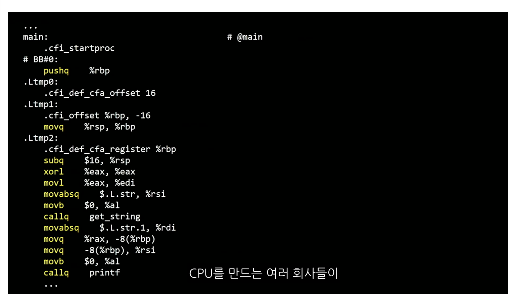
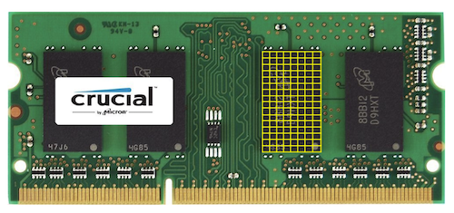
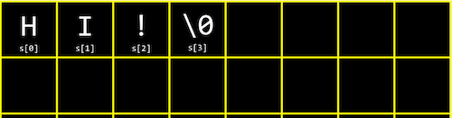

## 컴파일링

> 배경

우리가 작성한 C 코드를 실행하기 위해서는 컴파일링을 해줘야 한다.<br>
C문법으로 작성된 텍스트 형식의 파일은 컴파일링시 구체적으로 어떤 단계를 거쳐서 컴퓨터가 해석 가능한 파일로 변환될까?

<br>

> 목표

컴파일링의 네 단계를 설명

<br>

> 키워드

    - 전처리
    - 컴파일링
    - 어셈블링
    - 링킹

`make` 나 `clang` 명령어를 입력할때 일어나는 일 4단계 : <br>

    전처리→컴파일→어셈블→링크

<br>

> 전처리(Preprocessing)

```c
#include <cs50.h>
#include <stdio.h>
```

```c
...
string get_string(string prompt);
int printf(string format, ...);
...
```

전처리기에 의해 수행

\# 으로 시작되는 C 소스 코드는 전처리기에게 실질적인 컴파일이 이루어지기 전에 무언가를 실행하라고 알려준다.

    ex) 
    #include는 전처리기에게 다른 파일의 내용을 포함시키라고 알려준다.
    프로그램의 소스 코드에 #include 와 같은 줄을 포함하면, 
    -> 전처리기는 새로운 파일을 생성
    이 파일은 여전히 C 소스 코드 형태이며 stdio.h 파일의 내용이 #include 부분에 포함된다.

<br>

> 컴파일링(compiling)



노란색 - 명령어 부분

전처리기가 전처리한 소스 코드를 생성하고 나면 그 다음 단계는 컴파일. 컴파일러라고 불리는 프로그램은 C 코드를 어셈블리어라는 저수준 프로그래밍 언어로 컴파일한다.

어셈블리는 C보다 연산의 종류가 훨씬 적지만, 여러 연산들이 함께 사용되면 C에서 할 수 있는 모든 것들을 수행할 수 있다. C 코드를 어셈블리 코드로 변환시켜줌으로써 컴파일러는 컴퓨터가 이해할 수 있는 언어와 최대한 가까운 프로그램으로 만들어 준다. 컴파일이라는 용어는 소스 코드에서 오브젝트 코드로 변환하는 전체 과정을 통틀어 일컫기도 하지만, 구체적으로 전처리한 소스 코드를 어셈블리 코드로 변환시키는 단계를 말하기도 한다.

**`make`**나 **`clang`** 명령어를 사용할때 일어나는 일 4가지<br>
      - preprocessing<br>
      - compiling<br>
      - assembling<br>
      - linking<br>

<br>

> 어셈블링(assembling)

어셈블리 코드를 입력받아 머신코드로 출력하는 과정

소스 코드가 어셈블리 코드로 변환되면, 다음 단계인 어셈블 단계로 어셈블리 코드를 오브젝트 코드로 변환시키는 것<br> 
컴퓨터의 중앙처리장치가 프로그램을 어떻게 수행해야 하는지 알 수 있는 명령어 형태인 연속된 0과 1들로 바꿔주는 작업<br>
이 변환작업은 어셈블러라는 프로그램이 수행<br>
소스 코드에서 오브젝트 코드로 컴파일 되어야 할 파일이 딱 한 개라면, 컴파일 작업은 여기서 끝이 난다. 그러나 그렇지 않은 경우에는 링크라 불리는 단계가 추가된다.

<br>

> 링킹(linking)

만약 프로그램이 (math.h나 cs50.h와 같은 라이브러리를 포함해) 여러 개의 파일로 이루어져 있어 하나의 오브젝트 파일로 합쳐져야 한다면 링크라는 컴파일의 마지막 단계가 필요하다.<br> 
링커는 여러 개의 다른 오브젝트 코드 파일을 실행 가능한 하나의 오브젝트 코드 파일로 합쳐준다. 
ex) 컴파일을 하는 동안에 CS50 라이브러리를 링크하면 오브젝트 코드는 GetInt()나 GetString() 같은 함수를 어떻게 실행할 지 알 수 있게 됨

<br>

> 참고자료

배열 강의자료 - [https://www.boostcourse.org/downloadFile/fileDownload?attachmentId=525401&autoClose=true](https://www.boostcourse.org/downloadFile/fileDownload?attachmentId=525401&autoClose=true)

컴파일링 학습자료 - [https://www.boostcourse.org/downloadFile/fileDownload?attachmentId=532643&autoClose=true](https://www.boostcourse.org/downloadFile/fileDownload?attachmentId=532643&autoClose=true)

## 디버깅

<br>

> 배경

    우리가 소스코드를 작성하다보면, 때때로 우리 의도와는 다른 오류나 결과를 맞닥뜨리게 된다. 이를 “버그”라고 하는데요, 버그를 효과적으로 찾고 해결하는 방법에 대해 알아보자.

<br>

> 목표

    디버깅 하는 여러 방법을 설명 가능

<br>

> 키워드

    - 디버깅
    - help50
    - debug50

<br>

> 버그 & 디버깅

버그(bug) : 코드에 들어있는 오류. 버그로 인해 프로그램의 실행에 실패하거나 프로그래머가 원하는 대로 동작하지 않게 됨.

디버깅(debugging) : 코드에 있는 버그를 식별하고 고치는 과정. 디버거라는 프로그램을 사용하여 디버깅

디버깅의 기본

    프로그램은 일반적으로 인간보다 훨씬 빠르게 연산을 수행한다. 
    그래서 프로그램을 실행시켜보는 것만으로는 무엇이 잘못됐는지 찾아내기 어렵다.
    디버거는 프로그램을 특정 행에서 멈출 수 있게 해주기 때문에 버그를 찾는데 도움이 된다. 프로그래머는 멈춰진 그 지점(=중지점)에서 무슨 일이 일어나는지 볼 수 있다. 
    또한 프로그래머가 프로그램을 한번에 한 행씩 실행할 수 있게 해준다.
    이로써 프로그래머는 프로그램이 내리는 모든 결정들을 단계별로 따라갈 수 있게 된다.

> help50

CS50가 제공하는 도구들 중 하나

make 앞에 help50 을 붙여서 실행하면 다시 컴파일시 생기는 오류를 해석해준다.

> debug50

CS50 IDE를 사용하면 debug50 프로그램 사용 가능

소스 코드에 직접 브레이크포인트를 지정하고 소스파일을 컴파일한 후에 <br>
`debug50 파일명` 으로 실행하면, 오른쪽 패널을 통해 변수의 값을 확인하거나 브레이크포인트부터 한 줄씩 코드를 실행해 볼 수 있다..

디버깅 종료 : `Ctrl + c`

> 참고자료

디버깅 학습자료 - [https://www.boostcourse.org/downloadFile/fileDownload?attachmentId=532660&autoClose=true](https://www.boostcourse.org/downloadFile/fileDownload?attachmentId=532660&autoClose=true)

<br><br>

## 코드의 디자인
<br>

> 배경

    규모가 큰 프로그램을 작성할 때는 보통 한 사람이 아닌 여러 사람들이 함께 작업을 진행하게 된다. 
    이 때는 내가 기여한 부분이 프로그램에 오류를 발생시키지 않도록 주의를 기울여야 한다. 
    또한 코드의 내용 뿐만 아니라 그 형식도 신경써야 한다. 
    같은 내용이라 하더라도 어떻게 표현하느냐에 따라 코드를 이해하고 수정하는 속도가 달라질 수 있기 때문이다. 
    코드의 정확성과 디자인을 어떻게 잘 관리할 수 있을지 배워보자.

<br>

> 목표

    코드의 정확성과 디자인을 관리하는 방법을 설명 가능

<br>

> 키워드

    - check50
    - sytle50
    - 고무 오리

<br>

> check50

과제를 잘 수행했는데 자동으로 검사할 수 있는 프로그램

cs50에서 제공하는 몇가지 테스트코드를 통해 검사한다.

물론 이 프로그램은 cs50 강의를 위해서만 작성되었지만, 실제로 많은 사람들이 함께 작업하는 환경에서 이와 같은 자동 검사 프로그램은 많은 도움이 된다.

여러 사람들이 각자 한 부분을 맡아 코드를 작성할 때 각자가 수정한 코드가 전체 프로그램의 정확성을 해치지 않는지 쉽게 확인할 수 있기 때문

<br>

> style50

style50 프로그램을 이용하면 코드가 심미적으로 잘 작성되어 있는지 자체의 기준을 가지고 검사 가능

공백의 수나 줄바꿈과 같은 것들은 코드의 실행에 직접적으로 영향을 주지는 않지만 코드를 작성하는 사람들이 코드를 읽고 이해하는데 영향을 준다.

가령 아래와 같이 for 루프를 작성할 때도 사람에 따라 여러 방식으로 작성할 수 있다.

- 방법1
```c
for (int i = 0; i <= 10; i++)
    {
        printf("#\n");
    }
```
- 방법2
```c
for (int i = 0; i <= 10; i++){
    printf("#\n");
}
```
- 방법3
```c
for (int i = 0; i <= 10; i++){ printf("#\n"); }
```

위의 세개 코드는  표현방식이 각각 다르지만 같은 내용을 다룬 코드이다.

많은 회사들은 사내에서 코드를 작성할 때 특정한 스타일 가이드를 따르도록 한다(**Convention**).

여러 사람들이 코드를 작성하기 때문에 서로 불필요한 오해를 없애고, 코드를 이해하는 데 드는 비용을 최소화하기 때문.

<br>

> 고무오리

때로는 코드에 포함된 오류를 해결할 때 앞서 소개한 help50, debug50, check50과 같은 프로그램들이 존재하지 않거나, 있다 하더라도 디버깅에 큰 도움이 안 될 수 도 있다.

이 때는 먼저 한숨 돌리고 직접 곰곰히 생각해보는 수 밖에 없다.

한가지 유명한 방법으로 **고무 오리**와 같이 무언가 대상이 되는 물체를 앞에 두고, 내가 작성한 코드를 한 줄 한 줄 말로 설명해주는 과정을 거쳐볼 수 있다.

이를 통해 미처 놓치고 있었던 논리적 오류를 찾아낼 수도 있다.

<br><br>

## 배열(1)

<br>

> 배경

    우리가 특정 자료형의 변수를 선언하면 이는 메모리상 어딘가에 특정 크기만큼의 자리를 차지하게 뵌다. 만약 비슷한 종류의 값을 모아서 저장하고 싶다면 어떻게 해야 할까? 메모리상에서 여러 값을 연이어서 저장하고 사용하는 방법과 그 이점을 알아보자.

<br>

> 목표

    배열을 정의하고 사용하는 방법을 설명할 수 있습니다

<br>

> 키워드

    - 메모리
    - 배열

<br>

> 메모리



C에는 아래와 같은 여러 자료형이 있고, 각각의 자료형은 서로 다른 크기의 메모리를 차지합니다.

- bool: 불리언, 1바이트
- char: 문자, 1바이트
- int: 정수, 4바이트
- float: 실수, 4바이트
- long: (더 큰) 정수, 8바이트
- double: (더 큰) 실수, 8바이트
- string: 문자열, ?바이트

컴퓨터 안에는 아래 사진과 같은 **RAM** 이라고 하는 물리적 칩이 메모리 역할을 합니다.

쉽게 생각하면 아래 사진에서 여러 개의 노란색 사각형이 메모리를 의미하고, 작은 사각형 하나가 **1바이트**를 의미한다고 볼 수 있습니다.

예를 들어 char 타입의 변수를 하나 생성하고, 그 값을 입력한다고 하면 위 사진에서 한 사각형 안에 그 변수의 값이 저장되는 것이죠.

<br>

> 배열

```c
#include <cs50.h>
#include <stdio.h>

int main(void)
{
    // Scores
    int score1 = 72;
    int score2 = 73;
    int score3 = 33;

    // Print average
    printf("Average: %i\n", (score1 + score2 + score3) / 3);
}
```

만약 점수의 개수가 더 많아진다면 이 프로그램은 많은 부분을 수정해줘야 한다.

이 때 활용할 수 있는 것이 배열의 개념.

배열은 같은 자료형의 데이터를 메모리상에 연이어서 저장하고 이를 하나의 변수로 관리하기 위해 사용된다

위 코드는 배열을 이용하여 아래와 같이 바꿀 수 있다.

```c
#include <cs50.h>
#include <stdio.h>

int main(void)
{
    // Scores
    int scores[3];
    scores[0] = 72;
    scores[1] = 73;
    scores[2] = 33;

    // Print average
    printf("Average: %i\n", (scores[0] + scores[1] + scores[2]) / 3);
}
```

`**int scores[3];**` 이라는 코드는 int 자료형을 가지는 크기 3의 배열을 scores 라는 이름으로 생성하겠다는 의미입니다.

배열의 인덱스는 0부터 시작하기 때문에, scores의 인덱스는 0, 1, 2 세 개가 있습니다.

이 인덱스를 변수명 뒤 대괄호 **`[ ]`** 사이에 입력하여 배열의 원하는 위치에 원하는 값을 저장하고 불러올 수 있습니다.

하지만 위와 같은 코드는 여전히 점수의 개수가 바뀌는 상황에서 제약이 많습니다.

다음 강의에서는 배열을 보다 동적으로 선언하고 저장하는 방법을 알아보겠습니다.

<br><br>

## 배열(2)

<br>

> 배경

    우리가 특정 자료형의 변수를 선언하면 이는 메모리상 어딘가에 특정 크기만큼의 자리를 차지하게 된다. 만약 비슷한 종류의 값을 모아서 저장하고 싶다면 어떻게 해야 할까? 메모리상에서 여러 값을 연이어서 저장하고 사용하는 방법과 그 이점을 알아보자.

<br>

> 목표

    배열을 정의하고 사용하는 방법을 설명할 수 있다.

<br>

> 키워드

    - 배열
    - 전역 변수

<br>

> 전역변수(global variable)

코드 전반에 걸쳐 어떤 변수에 특정 값을 지정할때 그 값을 (실수로라도) 바꾸고 싶지 않을 경우 - 전역변수로 설정

const int N = 3;

const : 상수(constant). 변하지 않는 수. **함수 바깥의 상단에 위치시키고, 변수는 대문자로 표기한다(CONVENTION)**

평균을 구하는 코드

* 단순반복된 코드
```c
#include <cs50.h>
#include <stdio.h>

const int N = 3;

int main(void)
{
    // 점수 배열 선언 및 값 저장
    int scores[N];
    scores[0] = 72;
    scores[1] = 73;
    scores[2] = 33;

    // 평균 점수 출력
    printf("Average: %i\n", (scores[0] + scores[1] + scores[2]) / N);
}
```

* 반복문을 활용한 코드
```c
#include <cs50.h>
#include <stdio.h>

float average(int length, int array[]);

int main(void)
{
    // 사용자로부터 점수의 갯수 입력
    int n = get_int("Scores:  ");

    // 점수 배열 선언 및 사용자로부터 값 입력
    int scores[n];
    for (int i = 0; i < n; i++)
    {
        scores[i] = get_int("Score %i: ", i + 1);
    }

    // 평균 출력
    printf("Average: %.1f\n", average(n, scores));
}

//평균을 계산하는 함수
float average(int length, int array[])
{
    int sum = 0;
    for (int i = 0; i < length; i++)
    {
        sum += array[i];
    }
    return (float) sum / (float) length;
}
```

***동적선언*** 이란? <br>
코드에 이미 박제되어서 바꿀 수 없는 정적 선언과는 반대로, 사용자의 입력에 따라 그 값을 달리할 수 있는 방법

<br><br>

## 문자열과 배열

<br>


> 배경

    우리는 여태껏 문자열을 저장하기 위해 string 자료형을 사용했다. ‘문자열’이라는 단어는 다시 말해 문자가 ‘나열되어 있다’ 또는 ‘배열되어 있다’ 라는의미로 추측할 수 있다. 이런 관점에서 봤을 때 string 자료형은 C에서 정확히 어떻게 정의되어 있을까? 
    배열이라는 개념이 문자열과 어떻게 연결되는지 알아보도록 하자.

<br>

> 목표

    문자열이 C에서 정의되는 방식과 메모리에 저장되는 방식을 설명

<br>

> 키워드

    - 문자
    - 문자열

<br>

> 문자열

그동안 cs50 라이브러리(cs50.h)를 통해 사용했던 문자열(string)이라는 자료형태<br>->  사실 문자(char) 자료형의 데이터 배열 (char string[]의 형태)

ex)

코드로 표현

```c
string s = "HI!";
```

메모리차원의 표현



**‘`\0`’**
    - 문자열의 끝을 나타내는 널 종단 문자
    - 단순히 모든 비트가 0인 1바이트 (`00000000`)

ex) 문자열 형식의 배열에 여러 이름을 저장

```c
string names[4];

names[0] = "EMMA";
names[1] = "RODRIGO";
names[2] = "BRIAN";
names[3] = "DAVID";

printf("%s\n", names[0]);
printf("%c%c%c%c\n", names[0][0], names[0][1], names[0][2], names[0][3]);
```

<br>

> 참고자료

배열과 문자열 학습자료 - [https://www.boostcourse.org/downloadFile/fileDownload?attachmentId=532680&autoClose=true](https://www.boostcourse.org/downloadFile/fileDownload?attachmentId=532680&autoClose=true)

<br>

## 문자열의 활용

<br>

> 배경

    여태까지의 강의에서 문자열의 기본적인 개념들을 학습했다. 이번 강의에서는 문자열을 좀 더 깊이 활용하는 방법을 배워보자. 
    문자열 안에 포함되어 있는 문자를 검색하기 위해서는 어떻게 해야 할까? 
    또 특정 문자를 다른 문자로 바꾸기 위해서는 어떻게 해야 할까? 
    이런 질문들에 답해보도록 하자.

<br>

> 목표

    문자열을 탐색하고 일부 문자를 수정하는 코드를 구현할 수 있습니다.

<br>

> 키워드

    - strlen
    - toupper

<br>

> strlen

<string.h> 라이브러리에 들어있는 함수

ex) for 루프를 통해 문자열의 인덱스를 하나씩 증가시켜 해당 문자 출력하기 → 문자열의 끝을 파악하는 방법

1) Null 종단 문자(\0)와 일치하는지에 대한 조건문

```c
#include <cs50.h>
#include <stdio.h>
#include <string.h>

int main(void)
{
    string s = get_string("Input: ");
    printf("Output:\n");
    for (int i = 0, n !='\0'; i < n; i++)
    {
        printf("%c\n", s[i]);
    }
}
```

2) strlen()함수 사용

```c
#include <cs50.h>
#include <stdio.h>
#include <string.h>

int main(void)
{
    string s = get_string("Input: ");
    printf("Output:\n");
    for (int i = 0; i < strlen(s); i++)
    {
        printf("%c\n", s[i]);
    }
}

//이 코드는 디자인적으로 좋지 않은 코드이다. for 문 내에서 조건문을 실행할때마다 strlen() 함수를 호출하기때문에 메모리사용면에서 비효율적이다.
```

```c
#include <cs50.h>
#include <stdio.h>
#include <string.h>

int main(void)
{
    string s = get_string("Input: ");
    printf("Output:\n");
    for (int i = 0, n = strlen(s); i < n; i++)
    {
        printf("%c\n", s[i]);
    }
}
```

```c
#include <cs50.h>
#include <stdio.h>
#include <string.h>

int main(void)
{
    string s = get_string("Input: ");
    printf("Output:\n");
		int n = strlen(s);
    for (int i = 0; i < n; i++)
    {
        printf("%c\n", s[i]);
    }
}
```

<br>

> toupper

ex) 사용자로부터 문자열을 입력받아 대문자로 바꿔주는 프로그램

1) <cs50.h>,<stdio.h>,<string.h>로 구현

```c
#include <cs50.h>
#include <stdio.h>
#include <string.h>

int main(void)
{
    string s = get_string("Before: ");
    printf("After:  ");
    for (int i = 0, n = strlen(s); i < n; i++)
    {
        if (s[i] >= 'a' && s[i] <= 'z')
        {
            printf("%c", s[i] - 32);
        }
        else
        {
            printf("%c", s[i]);
        }
    }
    printf("\n");
}
```

2) <cs50.h>,<stdio.h>,<string.h> + <ctype.h>의 **`toupper()`** 함수

```c
#include <cs50.h>
#include <ctype.h>
#include <stdio.h>
#include <string.h>

int main(void)
{
    string s = get_string("Before: ");
    printf("After:  ");
    for (int i = 0, n = strlen(s); i < n; i++)
    {
        printf("%c", toupper(s[i]));
    }
    printf("\n");
}
```

<br><br>

## 명령행 인자

<br>

> 배경

    make나 clang과 같은 프로그램을 실행할 때 컴파일하고자 하는 코드 외에도 컴파일 후 저장하고자 하는 파일명과 같이 추가적인 정보를 함께 줄 수도 있다. 이런 정보들을 명령행 인자 라고 부른다. 
    우리가 작성하는 프로그램에서도 명령행 인자를 받을 수 있도록 설계할 수 있다.

<br>

> **목표**

     명령행 인자를 받는 프로그램을 C로 작성할 수 있습니다.

<br>

> 키워드

      - 명령행 인자
      - argv
      - argc

그동안 다뤄왔던 main 함수의 전형적인 형태 : **`int main(void) {}`**

argc와 argv를 넣는 방법을 정의해보자.

argc = argument count. main함수가 받게 될 입력의 개수 int 타입의 변수

argv = argument vector. 그 입력이 포함되어있는 배열. string 타입의 배열

argv[0]은 기본적으로 프로그램의 이름으로 저장이 되고, 하나의 입력이 더 주어진다면 argv[1]에 저장이 될 것.

ex) 

```c
#include <cs50.h>
#include <stdio.h>

int main(int argc, string argv[])
{
    if (argc == 2)
    {
        printf("hello, %s\n", argv[1]);
    }
    else
    {
        printf("hello, world\n");
    }
}

// .argc -> "hello, world"
// argc = 1, argv[0] = .argc
// **.argc David** -> "hello, David"
// argc = 2, argv[0] = .argc, argv[1] = David
```