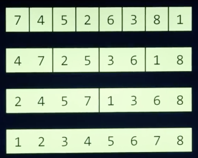
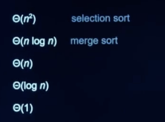

## 1) 검색 알고리즘

<br>

> 배경

    여태까지 배운 내용을 활용하여 검색이나 정렬과 같은 문제를 푸는 알고리즘 학습한다.


> 목표

    주어진 배열 속에서 특정 값을 찾는 방법을 설명

> 키워드

    - 선형 검색
    - 이진 검색

배열 : 한 자료형의 여러 값들이 메모리상에 모여있는 구조

컴퓨터는 이 값들에 접근할때 배열의 인덱스 하나하나 접근한다.

배열 내의 특정 값 탐색을 원할 경우 : 배열 정렬여부에 따라 선형검색(정렬X), 이진검색(정렬X) 등을 할 수 있다.

<br>
<br>


> 선형검색(Linear Search)

배열의 인덱스를 처음부터 끝까지 하나씩 증가시키면서 방문하여 그 값이 속하는지를 검사

```
For i from 0 to n–1

    If i'th element is 50

        Return true

Return false
```

<br>


> 이진검색(Binary Search)

만약 배열이 정렬되어 있다면, 배열 중간 인덱스부터 시작하여 찾고자 하는 값과 비교하며 
그보다 작은(작은 값이 저장되어 있는) 인덱스 또는 큰 (큰 값이 저장되어 있는) 인덱스로 이동을 반복

```
If no items

    Return false

If middle item is 50

    Return true

Else if 50 < middle item

    Search left half

Else if 50 > middle item

    Search right half
```

> 참고자료

- 알고리즘 강의자료 - [https://www.boostcourse.org/downloadFile/fileDownload?attachmentId=525432&autoClose=true](https://www.boostcourse.org/downloadFile/fileDownload?attachmentId=525432&autoClose=true)

<br>
<br>


## 2) 알고리즘 표기법

> 배경

    우리가 프로그램을 작성한 후에 실행하면 작업이 완료될때까지 어느정도 시간이 소요된다. 아주 간단한 프로그램인 경우에는 실행 시간을 걱정할 필요가 없지만, 처리하는 데이터가 많아지고 처리하는 작업이 복잡해질수록 실행 시간은 매우 중요해진다. 특정 알고리즘을 작성하였을 때 그 실행 시간을 표기하는 방법 학습한다.

> 목표

    알고리즘의 실행 시간의 상한과 하한을 표기

> 키워드

  - Big O
  - Big Ω


> Big O

알고리즘 실행 시간의 상한을 나타낸 것

O는 “on the order of”의 약자. “~만큼의 정도로 커지는”

- `O(n)` - 선형 검색
- `O(log n)` - 이진 검색

> Big Ω

알고리즘 실행 시간의 하한을 나타내는 것

- `Ω(n)` - 배열 안에 존재하는 값의 개수 세기
- `Ω(1)` - 선형 검색, 이진 검색

## 3) 선형검색

> 배경

    찾고 동일한 위치의 다른 배열의 속성값을 출력하는 방법을 배워본다. 또, 이를 더 간단하고 확장성있게 구현하는 방법을 배워본다.

> 학습목표

    주어진 배열 또는 구조체에서 선형 검색

> 핵심단어

    - 선형 검색
    - 구조체

> 선형검색(Linear Search)

찾고자 하는 자료를 검색하는 데 사용

원하는 원소가 발견될 때까지 처음부터 마지막 자료까지 차례대로 검색한다.

찾고자 하는 자료를 찾을 때까지 모든 자료를 확인해야 한다.

O(N),  Ω(1)

적용하는 상황 - 자료가 정렬되어 있지 않거나 그 어떤 정보도 없어 하나씩 찾아야 하는 경우

```c
#include <cs50.h>
#include <stdio.h>

int main(void)
{
    // numbers 배열 정의 및 값 입력
    int numbers[] = {4, 8, 15, 16, 23, 42};

    // 값 50 검색
    for (int i = 0; i < 6; i++)
    {
        if (numbers[i] == 50)
        {
            printf("Found\n");
            return 0;
        }
    }
    printf("Not found\n");
    return 1;
}
```

<br>

> 정렬

정렬은 시간이 오래 걸리고 공간을 더 차지한다.

하지만 이 추가적인 과정을 진행하면 여러 번 리스트를 검색해야 하거나 매우 큰 리스트를 검색해야 할 경우 시간을 단축할 수 있다.

<br>

> 구조체(Structure)

ex. 전화번호부에서 특정 이름에 해당하는 전화번호 찾기

```c
#include <cs50.h>
#include <stdio.h>
#include <string.h>

int main(void)
{
    string names[] = {"EMMA", "RODRIGO", "BRIAN", "DAVID"};
    string numbers[] = {"617–555–0100", "617–555–0101", "617–555–0102", "617–555–0103"};

    for (int i = 0; i < 4; i++)
    {
        if (strcmp(names[i], "EMMA") == 0)
        {
            printf("Found %s\n", numbers[i]);
            return 0;
        }
    }
    printf("Not found\n");
    return 1;
}
```

한계 : names 배열과 numbers 배열에서 서로 같은 인덱스를 가져야만 한다.

개선 : Encapsulation. 새로운 자료형으로 구조체(Structure)를 정의, 이름과 번호를 속성값으로 묶어준다.

```c
#include <cs50.h>
#include <stdio.h>
#include <string.h>

typedef struct
{
    string name;
    string number;
}
person; // person이라는 구조체를 자료형으로 정의

int main(void)
{
    person people[4];

    people[0].name = "EMMA";
    people[0].number = "617–555–0100";
    people[1].name = "RODRIGO";
    people[1].number = "617–555–0101";
    people[2].name = "BRIAN";
    people[2].number = "617–555–0102";
    people[3].name = "DAVID";
    people[3].number = "617–555–0103";

    // EMMA 검색
    for (int i = 0; i < 4; i++)
    {
        if (strcmp(people[i].name, "EMMA") == 0)
        {
            printf("Found %s\n", people[i].number);
            return 0;
        }
    }
    printf("Not found\n");
    return 1;
}
```

> 참고자료

- 선형검색 학습자료 - [https://www.boostcourse.org/downloadFile/fileDownload?attachmentId=532710&autoClose=true](https://www.boostcourse.org/downloadFile/fileDownload?attachmentId=532710&autoClose=true)

<br>
<br>

## 4) 버블정렬

> 배경

    어떤 배열이 주어졌을 대, 그 배열이 미리 정렬되어 있다면 훨씬 빠른 속도로 검색이 가능하다.
    정렬하기 위한 여러 방법중 버블 정렬에 대해 알아본다.

> 학습목표

    버블정렬의 원리, 실행시간을 설명하고 구현

> 키워드

      - 버블 정렬

> 버블정렬

정렬 알고리즘 중 하나

마치 거품이(비교 및 교환이) 터지면서 위로 올라오는 (배열의 옆으로 이동하는) 방식

두개의 인접한 자료값을 비교하면서 위치를 교환하는 방식의 정렬

단 두개의 요소만 정렬해주는 좁은 범위의 정렬에 집중

간단하지만 단 하나의 요소를 정렬하기 위해 너무 많이 교환하는 낭비가 발생

```
Repeat n–1 times

    For i from 0 to n–2

        If i'th and i+1'th elements out of order

            Swap them
```

중첩 루프를 돌아야 하고, n개의 값이 주어졌을 때 각 루프는 각각 n-1번, n-2번 반복

⇒ (n-1)*(n-2) = n^2-3n+2 번의 비교 및 교환이 필요하다.

위와 같은 코드로 작성한 버블 정렬 실행 시간의 상한은 `O(n^2)`

정렬이 되어 있는지 여부에 관계 없이 루프를 돌며 비교를 해야 한다.

위와 같은 코드로 작성한 버블 정렬의 실행 시간의 하한도 여전히 `Ω(n^2)`

> 참고자료

- 버블정렬 학습자료 - [https://www.boostcourse.org/downloadFile/fileDownload?attachmentId=532711&autoClose=true](https://www.boostcourse.org/downloadFile/fileDownload?attachmentId=532711&autoClose=true)

<br>
<br>


## 5) 선택정렬

> 배경

    버블 정렬은 직관적이지만 O(n^2)의 시간이 소요되었다. 다른 정렬 알고리즘인 선택정렬을 학습한다.

> 목표

    선택 정렬의 원리, 실행 시간을 설명하고 구현

> 키워드

    - 선택 정렬

<br>


> 선택 정렬

정렬을 위한 알고리즘 중 선택정렬을 배열 안의 자료 중 가장 작은 수(혹은 가장 큰 수)를 찾아 첫 번째 위치(혹은 가장 마지막 위치)의 수와 교환해주는 방식의 정렬

교환 횟수를 최소화하는 반면 각 자료를 비교하는 횟수는 증가

```
For i from 0 to n–1

    Find smallest item between i'th item and last item

    Swap smallest item with i'th item
```

**두 번의 루프**를 돌아야 합니다.

바깥 루프 - 숫자들을 처음부터 순서대로 방문 

안쪽 루프 - 가장 작은 값을 탐색

소요 시간의 상한 : `O(n^2)`

소요 시간의 하한 : `Ω(n^2)`

→ 소요시간에 있어서는 버블 정렬과 동일합니다.

> 참고자료

- 선택정렬 학습자료 - [https://www.boostcourse.org/downloadFile/fileDownload?attachmentId=532713&autoClose=true](https://www.boostcourse.org/downloadFile/fileDownload?attachmentId=532713&autoClose=true)

<br>
<br>


## 6) 정렬 알고리즘의 실행시간

> 배경

    정렬 알고리즘, 검색 알고리즘을 학습하며 실행시간의 상한과 하한을 학습했다. 이번에는 각 알고리즘의 실행시간을 비교하고, 좀 더 단축시키는 방법을 학습한다.

> 목표

    여러 정렬 알고리즘과 검색 알고리즘의 실행 시간을 Big O와 Big Ω로 정의

> 키워드

  - Big O
  - Big Ω

<br>

> 버블정렬의 의사코드 개선

```
Repeat n–1 times

    For i from 0 to n–2

        If i'th and i+1'th elements out of order

            Swap them
```

정렬여부와 관계없이 일단 반복 수행

```
Repeat until no swaps

    For i from 0 to n–2

        If i'th and i+1'th elements out of order

            Swap them
```

정렬여부에 따라 바깥루프 수행

- Ω(n^2): 선택 정렬
- Ω(n log n)
- **Ω(n): 버블 정렬**
- Ω(log n)
- Ω(1): 선형 검색, 이진 검색

<br>
<br>

## 재귀

> 배경

    알고리즘을 구현하기 위해 코드를 작성하다 보면 동일한 작업을 반복해야 할 때
    작업을 함수로 구현하면 코드를 보다 효율적으로 만들 수 있음을 학습했다.
    함수 내에서도 동일한 작업이 반복되는 경우는 어떨까? 이번 강의에서는 함수를 함수 내에서 재사용하는 방법, 즉 재귀적으로 호출하는 방법을 학습한다.

> 목표

    함수를 재귀적으로 사용하는 코드를 작성

> 키워드

    - 재귀

<br>

> 재귀

피라미드 모양의 # 출력을 위한 코드

이중 for문

```c
#include <cs50.h>
#include <stdio.h>

void draw(int h);

int main(void)
{
    // 사용자로부터 피라미드의 높이를 입력 받아 저장
    int height = get_int("Height: ");

    // 피라미드 그리기
    draw(height);
}

void draw(int h)
{
    // 높이가 h인 피라미드 그리기
    for (int i = 1; i <= h; i++)
    {
        for (int j = 1; j <= i; j++)
        {
            printf("#");
        }
        printf("\n");
    }
}
```

함수 정의하여 재귀호출

```c
#include <cs50.h>
#include <stdio.h>

void draw(int h);

int main(void)
{
    int height = get_int("Height: ");

    draw(height);
}

void draw(int h)
{
    // 높이가 0이라면 (그릴 필요가 없다면)
    if (h == 0)
    {
        return;
    }

    // 높이가 h-1인 피라미드 그리기
    draw(h - 1);

    // 피라미드에서 폭이 h인 한 층 그리기
    for (int i = 0; i < h; i++)
    {
        printf("#");
    }
    printf("\n");
}
```

중첩루프를 사용한 방법에서 재귀구조를 사용한 방법으로 바꿀 경우 장점

→  복잡도면에서 O(n^2)에서 O(n)으로의 개선 효과가 있다.

> 참고자료

- 재귀 학습자료 - [https://www.boostcourse.org/downloadFile/fileDownload?attachmentId=532717&autoClose=true](https://www.boostcourse.org/downloadFile/fileDownload?attachmentId=532717&autoClose=true)

<br>
<br>

## 7) 병합정렬

> 배경

    앞서 배운 정렬 알고리즘(버블 정렬, 선택 정렬)은 직관적이지만 실행 시간의 상한이 다소 높았다. 

    반복되는 작업이 많았기 때문인데, 재귀를 활용하면 정렬 알고리즘을 더 효율적으로 만들어보자.

> 목표

    재귀를 활용한 병합 정렬을 구현

> 키워드

    - 병합 정렬

<br>

> 병합 정렬(합병 정렬)

원소가 한 개가 될 때까지 계속해서 반으로 나누다가 다시 합쳐나가며 정렬을 하는 방식

이 과정은 재귀적으로 구현되기 때문에 나중에 재귀를 학습하면 더 이해하기 쉽다.



병합 정렬 실행 시간의 상한은 `O(n log n)` 입니다.

숫자들을 반으로 나누는 데는 O(log n)의 시간이 들고, 각 반으로 나눈 부분들을 다시 정렬해서 병합하는 데 각각 O(n)의 시간이 걸리기 때문입니다.

실행 시간의 하한도 역시 `Ω(n log n)` 입니다. 숫자들이 이미 정렬되었는지 여부에 관계 없이 나누고 병합하는 과정이 필요하기 때문입니다.

<br>

> Ɵ (theta)

선택 정렬이나 병합 정렬과 같이, ***O와 Ω가 동일하다면 이 경우에 한해서*** Ɵ로 표현을 해준다.



> 참고자료

- 병합정렬(합병정렬) 학습자료 - [https://www.boostcourse.org/downloadFile/fileDownload?attachmentId=532719&autoClose=true](https://www.boostcourse.org/downloadFile/fileDownload?attachmentId=532719&autoClose=true)