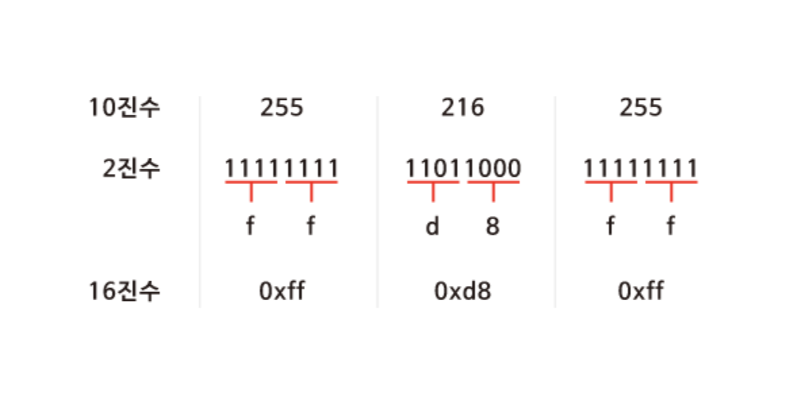

## **[1) 메모리 주소](https://www.boostcourse.org/cs112/lecture/119027?isDesc=false)**

> 배경

    우리가 C로 작성한 변수들은 실제로 컴퓨터 메모리에 어떻게 저장될까? 메모리 주소를 나타내는 방법과 그 주소를 알아내는 방법, 그 주소에 찾아가는 방법을 배워본다.

> 목표

    16진법 읽기, 쓰기
    메모리 주소에 접근, 값을 받아오는 코드를 C로 작성

> 키워드

    - 16진법
    - 메모리 주소
<br>

> 16진수(Hexadecimal)

컴퓨터과학에서 숫자를 표현하는 가장 일반적인 방법

0x를 붙혀 뒤에 오는 문자들이 16진수임을 알려준다.(이를 통해 10진수와 구별 가능)

컴퓨터는 8개의 비트가 모인 바이트 단위로 정보를 표현 → 2개의 16진수는 1byte의 2진수로 변환되기 때문에 정보를 표현하기 매우 유용

ex)

JPG 이미지파일 형식



일반 숫자


<br>

> 메모리주소

C에서는 특정 연산자를 통해 메모리 주소를 불러올 수 있다.

&(Ampersand) : 변수의 메모리 상 주소를 받아내는 연산자

*(Asterik) : 메모리 주소에 있는 실제값을 받아내는 연산자. 이 때, 자료형에 대해서는 사용자가 임의로라도 지정해줘야 한다.

ex) 정수형 변수 50이라는 값을 저장, 출력하기


```c
#include <stdio.h>

int main(void)
{
    int n = 50;
    printf("%p\n", &n);
}

//0x7ffe00b3adbc
```

```c
#include <stdio.h>

int main(void)
{
    int n = 50;
    printf("%i\n", *&n);
}

//50
```

> 참고자료

- 메모리 강의자료 - [https://www.boostcourse.org/downloadFile/fileDownload?attachmentId=525433&autoClose=true](https://www.boostcourse.org/downloadFile/fileDownload?attachmentId=525433&autoClose=true)

<br>
<br>

## **[2) 포인터](https://www.boostcourse.org/cs112/lecture/119028?isDesc=false)**

> 배경

    메모리 주소를 직접 관리하기는 쉽지 않을 수 있다. C에는 포인터 라는 개념을 통해서 변수의 주소를 쉽게 저장하고 접근할 수 있게 해준다. 포인터가 무엇인지, 어떻게 사용하는지에 대해 학습한다.

> 목표

    포인터 변수를 정의하고 사용

> 키워드

    - 포인터

<br>

> 포인터

'*' 연산자 : 어떤 메모리주소에 있는 값을 받아오게 해줌.

포인터 역할을 하는 변수를 선언할 수도 있음

```c
#include <stdio.h>

int main(void)
{
   int n = 50;
   int *p = &n;
   printf("%p\n", p);
   printf("%i\n", *p);
}

//50
//0x7ffe00b3adbc
```

정수형 변수 ndpsms 50이라는 값을 저장

*p라는 포인터 변수에 &n이라는 값(변수 n의 주소)을 저장

int *p 앞에서 p 앞의 * : '이 변수가 포인터'라는 의미

int : 이 포인터가 int 타입의 변수를 가리킨다는 의미


- 크기

    최신 컴퓨터는 8bytes = 64bits 크기(long 타입과 같은 크기)로 포인터가 할당된다.

<br><br>

## **[3) 문자열](https://www.boostcourse.org/cs112/lecture/119029?isDesc=false)**

> 배경

    “EMMA”와 같은 문자열을 저장하기 위해서 string 이라는 자료형을 사용했었다. 하지만 이는 실제로 C에서 존재하지 않는 자료형이다. 문자열이 실제로 메모리상에 어떻게 저장되어 있는지, 문자열을 손쉽게 저장하고 접근하기 위한 방법을 배워본다.

> 목표

    문자열 형태의 새로운 자료형인 string이 어떻게 정의되었는지 설명

> 키워드

    - 포인터
    - 문자열

<br><br>

> 포인터

그동안의 CS50 강의에서는 문자열에 대한 개념적 이해를 위해 포인터를 통한 추상화를 하여 string이라는 새로운 자료형을 정의해서 이용했었다. 이에 대한 cs50.h 라이브러리 정의 코드는 다음과 같다.

```c
typedef char *string;
```

<br>

> 문자열


string 자료형을 이용하여 "EMMA" 출력

```c
#include <cs50.h>
#include <stdio.h>

int main(void)
{
    string s = "EMMA";
    printf("%s\n", s);
}
```

char 포인터를 이용하여 “EMMA” 출력

```c
#include <stdio.h>

int main(void)
{
    char *s = "EMMA";
    printf("%s\n", s);
}
```

s : 문자에 대한 포인터. "EMMA"문자열의 가장 첫번째 값을 저장

<br><br>

## **[4) 문자열 비교](https://www.boostcourse.org/cs112/lecture/119030?isDesc=false)**

> 배경

    두 문자열이 같은 내용을 담고 있는지 어떻게 비교할 수 있을까? 우리가 배운 문자열 자료형을 사용해서 바로 직접적으로 비교가 가능할까? 문자열이 저장되어 있는 방식을 자세히 들여다보면서 비교방법을 익힌다.

> 목표

    문자열이 저장되어 있는 방식에 근거해서 문자열을 비교하는 방법에 대해 설명

> 키워드

    - 문자열

> 문자열

```c
#include <stdio.h>

int main(void)
{
    char *s = "EMMA";
    printf("%p\n", &s[0]);
		printf("%p\n", &s[1]);
		printf("%p\n", &s[2]);
		printf("%p\n", &s[3]);
}
```

문자열은 첫번째 문자를 시작으로 메모리상에서 바로 옆에 저장된다.

```c
#include <stdio.h>

int main(void)
{
    char *s = "EMMA";
    printf("%c\n", *s);
		printf("%c\n", *(s+1));
		printf("%c\n", *(s+2));
		printf("%c\n", *(s+3));
}
```

가장 첫 번째 문자에 해당하는 **주소값을 하나씩 증가시키면** 바로 옆에 있는 문자의 값을 출력할 수 있다.

```c
#include <cs50.h>#include <stdio.h>int main(void)
{
    // 사용자로부터 s와 t 두 개의 문자열 입력받아 저장
    string s = get_string("s: ");
    string t = get_string("t: ");

    // 두 문자열을 비교 (각 문자들을 비교)
    if (s == t)
    {
        printf("Same\n");
    }
    else
    {
        printf("Different\n");
    }
}
```

문자열 값 비교를 할 때에도 위와같이 코드를 구성한다면 같은 EMMA를 입력하더라도 변수가 저장되어있는 주소가 서로 다르기때문에 다르다는 결과가 나온다.

<br><br>

## **[5) 문자열 복사](https://www.boostcourse.org/cs112/lecture/119031?isDesc=false)**

> 배경

    문자열이 메모리에 저장되어 있는 방식에 대해 배웠다. 그렇다면 이미 저장되어 있는 문자열을 다른 곳에 복사하려면 어떻게 해야 할까?

> 목표

    문자열을 복사

> 키워드

    - malloc

<br>

> malloc 함수

정해진 크기 만큼 메모리를 할당하는 함수

ex) 문자열을 복사하여 복사한 문자열만 변형을 하고싶은 경우

```c
#include <cs50.h>
#include <ctype.h>
#include <stdio.h>

int main(void)
{
    string s = get_string("s: ");
    string t = s;

    t[0] = toupper(t[0]);

    printf("s: %s\n", s);
    printf("t: %s\n", t);
}
```


**s**라는 변수에는 “emma”라는 문자열이 아닌 그 문자열이 있는 **메모리의 주소가 저장**.

(**string s** = **char *s)**

따라서 t도 s와 동일한 주소를 가리키고 있고, t를 통한 수정은 s에도 그대로 반영이 됨

string.h 라이브러리의 malloc()함수 사용

```c
#include <cs50.h>
#include <ctype.h>
#include <stdio.h>
#include <string.h>

int main(void)
{
    char *s = get_string("s: ");
    char *t = malloc(strlen(s) + 1);

    for (int i = 0, n = strlen(s); i < n + 1; i++)
    {
        t[i] = s[i];
    }

    t[0] = toupper(t[0]);

    printf("s: %s\n", s);
    printf("t: %s\n", t);
}
```

s 문자열의 길이에 `Null 종단 문자(\0)`에 해당하는 `1`을 더한 만큼 메모리를 할당

그리고 루프를 돌면서 s 문자열 배열에 있는 문자 하나 하나를 t 배열에 복사

이 코드를 컴파일 후 실행시키고 입력값으로 “emma”를 주면 우리가 예상한 대로 s는 “emma”가, t는 “Emma”가 출력

<br><br>

## **[6) 메모리 할당과 해제](https://www.boostcourse.org/cs112/lecture/119032?isDesc=false)**

> 배경

    메모리를 할당한 후에 저장한 값이 필요가 없어지고 나서는 어떻게 해야 할까? 유한한 메모리를 효과적으로 관리하기 위해서 우리가 프로그램을 작성하며 할당한 많은 메모리들을 어떻게 관리해야 하는지에 대해 배워본다.

> 목표

    메모리를 할당, 해제

> 키워드

    - free
    - valgrind

<br>

> free()

- 메모리 누수(memory leak)

malloc 함수를 이용하여 메모리를 할당한 후에는 **free**라는 함수를 이용하여 메모리를 해제해줘야 합니다.

그렇지 않은 경우 메모리에 저장한 값은 **쓰레기 값**으로 남게 되어 메모리 용량의 낭비가 발생하게 되기 때문

```c
#include <stdlib.h>

void f(void)
{
    int *x = malloc(10 * sizeof(int));
    x[10] = 0;
}

int main(void)
{
    f();
    return 0;
}
```

f 함수

- 포인터 x에는 int형의 사이즈(4바이트)에 10배에 해당하는 크기의 메모리, 즉 40바이트를 할당
- x의 10번째 값으로 0을 할당합니다.

그리고 main 함수에서 f를 실행하게 되는데, 

`valgrind` 통해 검사 ⇒ 

`버퍼 오버플로우`와 `메모리 누수` 두 가지 에러

➀ `버퍼 오버플로우`  
x[10] = 0; 코드로 인해 발생
인덱스 10은 10개의 int형의 배열을 만들었는데 배열의 인덱스 바깥의 범위 → 이는 정의되지 않은 것이기 때문에 버퍼 오버플로우가 발생

⇒ 이 오류는 0에서 9 사이의 인덱스를 사용하면 해결할 수 있습니다.

➁ `메모리 누수`

x라는 포인터를 통해 할당한 메모리를 해제하기 위해 free(x) 라는 코드를 추가해줌으로써 해결

<br>

> valgrind

Linux에서 valgrind라는 명령어를 통해 메모리 누수에 대한 정보를 파악할 수 있다.

```c
valgrind ./filename

help50 valgrind ./filename
```


<br><br>

## **[7) 메모리 교환, 스택, 힙](https://www.boostcourse.org/cs112/lecture/119033?isDesc=false)**

> 배경

    각각 사이다와 콜라가 들어있는 컵 두 개를 떠올려보자. 만약 사이다와 콜라를 각각 다른 컵으로 바꿔 담고 싶으면 어떻게 해야 할까? 교환을 도와줄 수 있는 새로운 컵이 잠시 필요하다. 그렇다면 메모리에 저장된 값들을 교환할 때도 이와 비슷하게 할 수 있을까?

> 목표

    메모리에 저장된 두 값을 교환하는 코드를 작성

> 키워드

    - 스택
    - 힙
    - 포인터

ex) swap이 제대로 이뤄지지 않은 경우 - 복사된 값들이 바뀌게 된 것이고 원래의 값에는 변함이 없다.

```c
#include <stdio.h>

void swap(int a, int b);

int main(void)
{
    int x = 1;
    int y = 2;

    printf("x is %i, y is %i\n", x, y);
    swap(x, y);
    printf("x is %i, y is %i\n", x, y);
}

void swap(int a, int b)
{
    int tmp = a;
    a = b;
    b = tmp;
}
```


<br>

> 힙

우리가 clang이라는 명령어로 컴파일을 실행하면 → machine code 생성

머신코드 영역 - 컴파일된 바이너리코드(머신코드) 저장됨

글로벌 영역 - 프로그램 안에서 선언된 전역변수가 저장됨

힙 영역 - malloc으로 할당된 메모리의 데이터가 저장됨

스택 영역 - 프로그램 내의 함수와 관련된 것들이 저장됨(메소드, 지역변수 등)

<br>

> 스택

```c
#include <stdio.h>

void swap(int *a, int *b);

int main(void)
{
    int x = 1;
    int y = 2;

    printf("x is %i, y is %i\n", x, y);
    swap(&x, &y);
    printf("x is %i, y is %i\n", x, y);
}

void swap(int *a, int *b)
{
    int tmp = *a;
    *a = *b;
    *b = tmp;
}
```


<br><br>

## **[8) 파일 쓰기](https://www.boostcourse.org/cs112/lecture/119034?isDesc=false)**

> 배경

    get_int나 get_string처럼 사용자에게 입력을 받는 함수는 어떻게 구현되어 있었을까? 앞서 배운 메모리 교환, 스택의 정의를 잘 복습한 후에 두 함수를 직접 구현해보고, 더 나아가서 파일에 출력해보는 방법도 알아본다.

> 목표

    사용자로부터 값을 입력받아 파일에 출력하는 프로그램을 작성

> 키워드

    - scanf
    - fopen
    - fprintf
    - fclose

<br>

> scanf()

cs50.h 라이브러리에 있는 get_int() 코드

```c
#include <stdio.h>

int main(void)
{
    int x;
    printf("x: ");
    scanf("%i", &x);
    printf("x: %i\n", x);
}
```

cs50.h 라이브러리에 있는 get_string() 코드

```c
#include <stdio.h>

int main(void)
{
    char s[5];
    printf("s: ");
    scanf("%s", s);
    printf("s: %s\n", s);
}
```

**scanf()**

- 사용자로부터 형식 지정자에 해당되는 값을 입력받아 저장하는 함수

주의 : get_int 코드에서 int x를 정의한 후에 scanf에 x가 아닌 **&x로 그 주소를 입력**해주는 부분 

→ scanf 함수의 변수가 실제 스택 영역 안에 x가 저장된 주소로 찾아가서 사용자 입력값을 저장토록 하기 위함

반면 get_string 코드에서는 scanf에 그대로 s를 입력해줌

→ s를 크기가 5인 문자열, 즉 크기가 5인 char 자료형의 배열로 정의하였기 때문

**clang** 컴파일러는 문자 배열의 이름을 포인터처럼 다룬다. scanf에 s라는 배열의 첫 바이트 주소를 넘겨줌

<br>

> fopen()

사용자로부터 입력을 받아 파일에 저장할 수 있는 함수

```c
#include <cs50.h>
#include <stdio.h>
#include <string.h>

int main(void)
{
    FILE *file = fopen("phonebook.csv", "a");
    char *name = get_string("Name: ");
    char *number = get_string("Number: ");
    fprintf(file, "%s,%s\n", name, number);
    fclose(file);
}
```

**fopen()**

- 파일을 FILE이라는 자료형으로 불러올 수 있음
- 첫번째 인자 : 파일의 이름
- 두번째 인자 : 모드(r - 읽기, w - 쓰기, a - 덧붙이기)

**fprintf()**

- 사용자가 name과 number라는 문자열을 입력
- printf에서처럼 파일에 직접 내용을 출력 가능

**fclose()**

- 작업이 끝난 후에는 파일에 대한 작업을 종료


<br><br>

## **[9) 파일 읽기](https://www.boostcourse.org/cs112/lecture/119035?isDesc=false)**

> 배경

    우리가 일상적으로 사용하는 파일은 텍스트, 이미지, 영상 등 여러 형식이 있다. JPEG 형식의 파일인 경우 그 값 속에는 JPEG파일 형식인지를 알려주는 실마리가 있다. 이번 강의에서는 JPEG 파일을 읽고 그 실마리를 찾아본다.

> 목표

    파일을 읽고 JPEG 파일인지를 검사하는 프로그램을 작성

> 키워드

    - JPEG
    - fread

<br>

> JPEG

파일의 내용을 읽어서 파일의 형식이 JPEG 이미지인지를 검사하는 프로그램

```c
#include <stdio.h>

int main(int argc, char *argv[])
{
    if (argc != 2)
    {
        return 1;
    }

    FILE *file = fopen(argv[1], "r");

    if (file == NULL)
    {
        return 1;
    }
 
   unsigned char bytes[3];
    fread(bytes, 3, 1, file);

    if (bytes[0] == 0xff && bytes[1] == 0xd8 && bytes[2] == 0xff)
    {
        printf("Maybe\n");
    }
    else
    {
        printf("No\n");
    }
    fclose(file);
}
```

사용자로부터 입력을 받는 코드

- **파일의 이름**을 입력으로 받을 예정
- 첫번쨰 if문

    → 만약 argc가 2가 아니라면, 파일명이 입력되지 않았거나 파일명 외의 다른 인자가 입력되었기 때문에 1(오류)을 리턴하고 프로그램을 종료

    → 만약 argc가 2라면 프로그램이 그대로 진행

- 입력받은 파일명(argv[1])을 **‘읽기(r)’** 모드로 불러옴
- 두번째 if문

    → 만약 파일이 제대로 열리지 않으면 fopen 함수는 NULL을 리턴하기 때문에 이를 검사해서 file을 제대로 쓸 수 있는지를 검사하고, 아니라면 역시 1(오류)를 리턴하고 프로그램을 종료

    → 만약 파일이 잘 열렸다면, 프로그램이 계속 진행

- 그 후 크기가 3인 문자 배열을 만들고, fread 함수를 이용해서 파일에서 첫 3바이트를 읽어옴
- fread 함수의 각 인자는 (배열, 읽을 바이트 수, 읽을 횟수, 읽을 파일)을 의미
- 마지막으로 읽어들인 각 바이트가 각각 **`0xFF`**, **`0xD8`**, **`0xFF`** 인지를 확인

이는 **JPEG 형식의 파일을 정의할 때 만든 약속**으로, JPEG 파일의 시작점에 꼭 포함되어 있어야한다.

따라서 이를 검사하면 JPEG 파일인지를 확인가능하다.