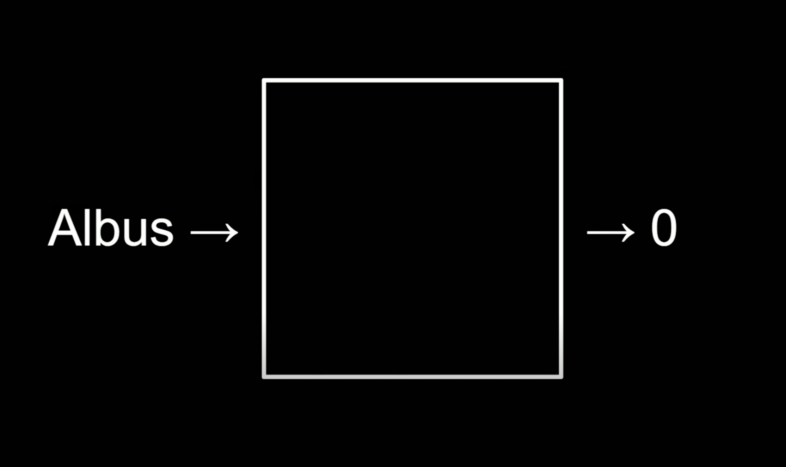
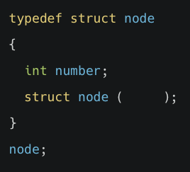

## 1, 배열의 크기 조정하기
#### int 자료형 2개로 이뤄진 배열 list를 int 자료형 5개를 담을 수 있는 배열로 확장하고 싶습니다. 이를 위해 임시 포인터 *tmp를 선언하는 올바른 realloc() 코드는 무엇인가요?

 
<ol>
    <li>int *tmp = realloc(list, 2 * sizeof(int));</li>
    <li>int *tmp = realloc(5 * sizeof(int), list);</li>
    <li>int *tmp = realloc(list, 5 * sizeof(int));</li>
    <li>int *tmp = realloc(5, list);</li>
</ol>

정답확인

(3) int *tmp = realloc(list, 5 * sizeof(int));

 

 

## 2, 연결 리스트: 도입
#### 같은 크기를 가지는 배열과 리스트가 있습니다. 첫번째 값이 아닌 위치의 값에 접근하려고 할 때 소요되는 시간에 대한 설명으로 옳은 것은 무엇인가요?
 
<ol>
    <li>배열이 리스트보다 더 빠르다</li>
    <li>리스트가 배열보다 더 빠르다</li>
    <li>배열과 리스트 모두 동일하다</li>
    <li>알 수 없다</li>
</ol>

정답확인

(1) 배열이 리스트보다 더 빠르다

 

 

## 3, 연결 리스트: 코딩
#### node라는 구조체 안에 number 멤버가 정의되어 있습니다. node *n; 변수가 선언되어 있을 때, (*n).number 와 동일한 의미의 코드는 다음 중 무엇인가요?
 
<ol>
    <li>n.number</li>
    <li>n->number</li>
    <li>*n.number</li>
    <li>n(number)</li>
</ol>

정답확인

(2) n->number

 

 

## 4. 연결 리스트: 시연
#### 연결 리스트에서 값을 검색하는데 걸리는 시간을 Big-O로 올바르게 나타낸 것은 무엇인가요?
 
<ol>
    <li>O(1)</li>
    <li>O(log n)</li>
    <li>O(n)</li>
    <li>O(n log n)</li>
</ol>

정답확인

(3) O(n)

 

 

## 5. 연결 리스트: 트리
#### 트리의 시작점이 되는 가장 최상위 노드를 일컫는 용어는 무엇인가요?
 
<ol>
    <li>베이스 노드(base node)</li>
    <li>루트 노트(root node)</li>
    <li>기본 노드(default node)</li>
    <li>시작 노드(start node)</li>
</ol>

정답확인

(2) 루트 노트(root node)

 

 

## 6. 해시 테이블 
#### 아래와 같이 영문자를 인덱스로 변환해 해시 테이블(Hash table)을 작성하려고 합니다. 어떤 문자가 어떤 값이 될지 매핑하는 함수를 무엇이라고 하나요?

 
<ol>
    <li>해시 함수</li>
    <li>결정 함수</li>
    <li>바구니 함수</li>
    <li>연결 함수</li>
</ol>

정답확인

(1) 해시 함수

 

 

## 7. 트라이
#### 길이가 10인 영어 문자열이 있습니다. 강의에서 살펴본 영어 문자열 트라이에 저장하는 경우 몇 개의 노드를 이어줘야 할까요?
 
<ol>
    <li>1개</li>
    <li>2개</li>
    <li>5개</li>
    <li>10개</li>
</ol>

정답확인

(4) 10개

 

 

## 8. 스택, 큐, 딕셔너리
#### 값을 넣고 뺄 때 ‘선입 선출’ 또는 ‘FIFO(First In First Out)’의 방식을 따르는 자료 구조는 무엇인가요?
 
<ol>
    <li>스택(stack)</li>
    <li>큐(queue)</li>
    <li>딕셔너리(dictionary)</li>
    <li>트리(tree)</li>
</ol>

정답확인

(2) 큐(queue)

 

 

## 9. 연결 리스트 구현
#### 연결 리스트를 구현하기 위해 노드를 구조체로 정의하려 합니다. 노드에 입력될 숫자 number와 다음 노드를 가리키는 포인터 next 를 정의하기 위해 괄호 안에 들어갈 코드로 적절한 것은 무엇인가요?

 
<ol>
    <li>next</li>
    <li>*next</li>
    <li>&next</li>
    <li>_next</li>
</ol>
 

정답확인

(2) *next

 

 

## 10. 다양한 자료 구조와 검색 시간
#### 프로그램에 이름과 전화번호를 저장하는 자료구조를 구현하려고 합니다. 이때 반드시 고려해야할 점이 아닌 것은?
 
<ol>
    <li>시간 복잡도</li>
    <li>공간 복잡도</li>
    <li>메모리 주소 표기법</li>
    <li>데이터의 양</li>
</ol>

정답확인

(3) 메모리 주소 표기법

 