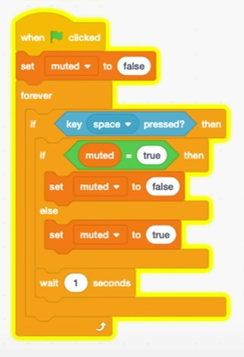

# 1. 컴퓨팅 사고 퀴즈

[컴퓨팅 사고](../Mijin-Kang/20210525_컴퓨팅_사고.md)를 공부한 후 문제를 풀어보았습니다. 퀴즈의 정답은 하단에 있습니다.

## 01_이진법
**Q. 숫자 10을 2진법으로 표현하기 위해서 최소 몇 개의 비트가 필요할까요?**

① 8비트

② 100비트

③ 7비트

④ 4비트

<br>

## 02_정보의 표현
**Q. 링크(https://ko.wikipedia.org/wiki/ASCII) 하단의 아스키 코드를 사용하여 [edwith](소문자)을 10진수로 표현해 보세요.**

① 101 068 087 105 084 104

② 069 068 087 073 084 072

③ 101 100 119 105 116 104

④ 069 100 119 073 084 072

<br>

## 03_알고리즘
**Q. 총 512페이지의 전화번호부에서 '이펭수'는 64페이지에 있습니다. 책의 절반씩을 찾아보는 두 번째 알고리즘을 사용한다면, '이펭수'를 찾기 위해 페이지를 몇 번 찾아봐야 할까요?**

① 1번

② 3번

③ 4번

④ 2번

<br>

## 04_2진법과 10진법 (1)
**Q. 10진법으로 표현된 '14'를 2진법으로 표현하면 어떻게 될까요?**

① 1100

② 1001

③ 1110

④ 1000

<br>

## 05_2진법과 10진법 (2)
**Q. 2진법으로 표현된 [1011]을 10진법으로 표현하면 어떻게 될까요?**

① 13

② 11

③ 12

④ 10

<br>

## 06_정보 표현의 기본 장치
**Q. 다음 문장에서 괄호 안에 들어갈 말로 적절한 것은 무엇인가요?<br>컴퓨터에는 (       )라고 불리는 굉장히 많은 스위치가 있고 on/off 상태를 통해 0과 1을 표현합니다**

① 점퍼

② 트랜지스터

③ 램프

④ 컨버터

<br>

## 07_알고리즘의 표현
**Q. 컴퓨터가 수행할 작업을 프로그램 언어가 아니라 사람이 사용하는 언어로 알고리즘의 논리적 절차를 작성한 코드를 무엇이라고 하나요?**

① 의사 코드 (Pseudo code)

② 머신 코드 (Machine code)

③ 휴먼 코드 (Human code)

④ 순서 코드 (Order code)

<br>

## 08_스크래치
**Q. 다음 중 스크래치에서 블록을 통해 구현할 수 없는 알고리즘 요소는 무엇인가요?**

① 함수

② 조건

③ 루프

④ 컴파일

<br>

## 09_스크래치의 변수와 조건문
**Q. 초록색 깃발을 눌러 아래 스크래치 프로그램을 실행을 시킨 후, muted가 false인 상태에서 스페이스 키를 누르면 muted의 값이 어떻게 변할까요?**



① null

② space

③ false

④ true

<br>

## 10_전화번호부 검색 의사 코드
**Q. 가나다 순으로 정렬된 전화번호부에서 '이펭수'를 찾으려 합니다. 이때 먼저 전화번호부의 가운데를 펴고 '이펭수'를 찾은 후, 이름이 없다면 앞 페이지나 뒷 페이지의 절반에 대해 똑같은 작업을 계속 반복하고자 합니다. 이를 묘사한 아래 의사 코드에서 10번 줄 빈 칸에 들어갈 말로 올바른 것은 무엇인가요?**
```
01 전화번호부를 집어 든다
02 전화번호부의 중간을 편다
03 페이지를 본다
04 만약 '이펭수'가 페이지에 있으면
05 ㄴ '이펭수'에게 전화한다
06 그렇지 않고 만약 '이펭수'가 앞 페이지에 있으면
07 ㄴ 앞 페이지의 절반을 편다
08 ㄴ 3번째 줄부터 다시 실행한다
09 그렇지 않고 만약 '이펭수'가 뒷 페이지에 있으면
10 ㄴ (           )
11 ㄴ 3번째 줄부터 다시 실행한다
12 그렇지 않으면
13 ㄴ 그만둔다
```
① 뒷 페이지의 끝을 편다

② 뒷 페이지의 처음을 편다

③ 앞 페이지의 절반을 편다

④ 뒷 페이지의 절반을 편다

<br>


<details>

<summary><b><span style="font-size: 20px;">정답 확인</span></b></summary>

<span style="font-size: 15px;">
01 - ④ <br>
02 - ③ <br>
03 - ② <br>
04 - ③ <br>
05 - ② <br>
06 - ② <br>
07 - ① <br>
08 - ④ <br>
09 - ④ <br>
10 - ④
</span>

</details>


