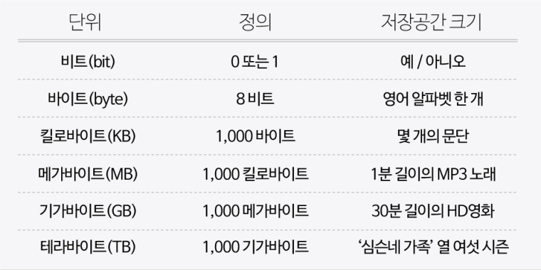
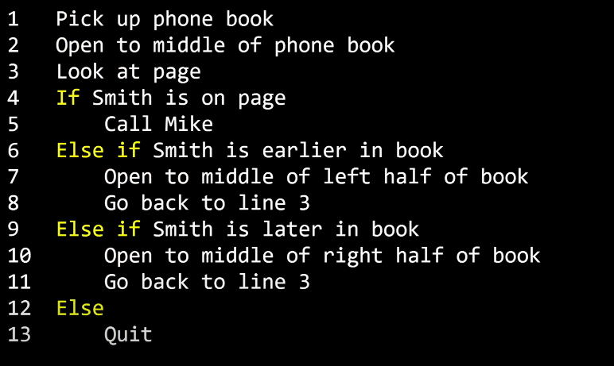

# 1. 컴퓨팅 사고
### **[ 컴퓨터 과학 ]**

컴퓨터 과학은 **문제 해결**에 대한 학문이다. 쉽게 말해 문제를 해결하는 과정인 것이다. 그럼 문제를 해결한다는 것은 어떤 의미일까? 문제 해결은 입력(input)을 전달받아 출력(output)을 만들어내는 과정이다.
그 중간에 있는 과정이 바로 컴퓨터 과학이다.
```
input -> 컴퓨터 과학 -> output
```
> 의문: 그렇다면, 컴퓨터는 입력과 출력을 어떻게 표현할까?

<br>

## 1) 2진법
우리가 일상에서 사용하는 10진법(0,1,2,3,4,5,6,7,8,9)과는 달리 컴퓨터는 오직 0과 1로만 데이터를 표현한다. 이처럼 0과 1로만 표현하는 것을 **2진법**이라 한다.

> 의문: 컴퓨터는 0과 1만으로 어떻게 숫자 뿐만 아니라 글자, 사진, 영상, 소리 등을 저장할 수 있을까?

우리는 '**123**'을 '백이십삼'으로 읽는다. 1을 백의자리, 2를 십의자리, 3을 일의자리로 보기 때문이다. 그 이유는 이러한 표현에 대한 **약속(표준)이 있기 때문이다**. 우리는 이 약속에서 자리수를 10의 거듭제곱으로 표현했다. 비슷하게 2진법에서는 두 개의 숫자만 있으므로 각 자리수가 **2의 거듭제곱**을 의미한다.

|   | 네 번째 자리 | 세 번째 자리 | 두 번째 자리 | 첫 번째 자리 |
|:---:|:---:|:---:|:---:|:---:|
|10진법|10³ = 1000|10² = 100|10¹ = 10|1|
|2진법|2³ = 8|2² = 4|2¹ = 2|1|

이 방법으로 10진법의 3을 2진법으로 표현하면 11이 된다. 표를 보면 2진법에서 첫 번째 자리는 1이고, 두 번째 자리는 2¹로 2인 것을 확인할 수 있다. 따라서 각 자리의 수를 더해서 3이 되는 것이다.


마찬가지로 2진법에서 100은 2²x1 + 2¹x0 + 1x0 = 4가 된다.

이와 같은 2진법은 전기를 통해 연산하는, 즉 전기를 켜고 끄는 방식으로 작동하는 컴퓨터에게 적합한 방법이다. 컴퓨터에는 굉장히 많은 스위치(트렌지스터)가 있고 on/off 상태를 통해 0과1을 표현한다.

컴퓨터는 2진법에서 하나의 자릿수를 표현하는 단위를 **비트(bit)**라고 한다.

### **비트**
정보를 저장하고 연산을 수행하기 위해 컴퓨터는 **비트(bit)** 라는 단위를 쓴다. 비트는 이진 숫자라는 뜻을 가진 'binary digit'의 줄임말이며, 0과 1 두 가지 값만 가질 수 있는 측정 단위다. 디지털 데이터를 여러 비트들로 나타냄으로써 두 가지 값만을 가지고도 많은 양의 정보를 저장할 수 있다. 

### **비트열**
하나의 비트는 0과 1, 이 두 가지의 값만 저장할 수 있다. 컴퓨터 내부에서 물리적으로 표현될 때는 스위치라고 생각할 수 있다. (켜기=1 (true), 끄기=0 (false))

비트 한 개는 많은 양의 데이터를 나타내기에 턱없이 부족하다. 때문에 여러 숫자 조합을 컴퓨터에 나타내기 위해 비트열을 사용한다. **바이트(byte)** 는 여덟 개의 비트가 모여 만들어진 것이다. 하나의 바이트에 여덟 개의 비트가 있고, 비트 하나는 0과 1로 표현될 수 있기 때문에 2^8 = 256 개의 서로 다른 바이트가 존재할 수 있다.


**[ 다양한 데이터 표현하기 ]**



하나의 비트로는 어떠한 값이 참인지 거짓인지, 예를 들면 노트북이나 휴대전화가 충전 중인지 아닌지에 대한 정보만 컴퓨터에 저장할 수 있다. 

<br>

## 2) 정보의 표현
간단한 숫자부터, 문자, 사진, 영상, 음악까지 정보를 표현하는 형태는 매우 많고 다양하다. 컴퓨터는 어떻게 이런 다양한 정보를 처리할 수 있을까? 

### **[ 문자의 표현 ]**

**1) ASCII**

컴퓨터가 스위치를 ON/OFF하면서 숫자를 표현한다. 그럼 문자는 어떻게 표현할까? 바로 문자를 숫자로 표현 할 수 있도록 정해진 약속(표준)이 있다. 그 중 하나는 미국정보교환표준부호 **ASCII**(**아스키코드**/American Standard Code for Information Interchange) 이다.


총 128개의 부호로 정의되어 있는데, 알파벳 A는 10진수 기준으로 65, 알파벳 B는 66로 되어있다.

**그럼 A를 2진법으로 표현한다면?**

A를 2진법으로 표현하면 우선, 10진법 기준으로 65이므로 **2⁶x1** + 2⁵x0 + 2⁴x0 + 2³x0 + 2²x0 + 2x0 + **1x1** **(64+1)** 로 표현할 수 있다. 따라서 A를 2진법로 표현하면 1000001이 된다.

**2) Unicode**

ASCII로는 문자들을 표현하기에 충분하지 않기 때문에 이 외에도 **Unicode**라는 표준에서 더 많은 비트를 사용하여 더 다양한 문자들도 표현 가능하도록 지원하고 있다. Unicode는 😂(기쁨의 눈물) 같은 이모티콘까지 표현할 수 있게 해준다. 이 이모티콘은 10진법으로 128,514, 2진법으로는 11111011000000010이다.

스마트폰으로 😂(기쁨의 눈물) 이모티콘을 전송한다면 11111011000000010 이라는 0과 1의 패턴이 전송되고 -> 수신자의 스마트폰 안드로이드 혹은 iOS는 0과 1의 패턴을 받아 노란색 얼굴에 눈물을 흘리고 있는 사진으로 보여준다.

### **그림, 영상, 음악의 표현**

문자와 같이 그림도 역시 숫자로 표현할 수 있다. 스크린을 통해 보는 그림을 자세히 살펴 보면 수많은 작은 점들이 **빨간색, 초록색, 파란색**을 띄고 있는데, 이런 작은 점을 **픽셀**이라고 한다. 각각의 픽셀은 세 가지 색을 서로 다른 비율로 조합하여 특정한 색을 갖게 된다. 

예를 들어 빨간색 72, 초록색 72, 파란색 33을 섞게 되면 노란색이 되는 것과 같은 방식이다. 이 숫자들을 표현하는 방식을 **RGB(Red, Green, Blue)** 라고 한다. 즉, 노란색의 커다란 이미지는 72 73 33 으로 정의되는 무수히 많은 픽셀들의 RGB코드(숫자)로 표현할 수 있다.

영상 또한 수많은 그림을 빠르게 연속적으로 이어 붙여놓은 것이기 때문에 숫자로 표현이 가능하다. 음악도 마찬가지로 각 음표를 숫자로 표현할 수 있다.

<br>

## 3) 알고리즘


컴퓨팅은 입력을 받아 그 입력을 처리한 후 출력하는 과정이다. 알고리즘은 입력(input)에서 받은 자료를 출력(output) 형태로 만드는 처리 과정을 뜻한다. 즉, 알고리즘이란 입력값을 출력값의 형태로 바꾸기 위해 어떤 명령들이 수행되어야 하는지에 대한 **규칙들의 순서적 나열**이다.

이러한 일련의 순서적 규칙들을 어떻게 나열하는지에 따라 알고리즘의 종류가 달라진다. 같은 출력값이라도 알고리즘에 따라 출력을 하기까지의 시간이 다를 수 있다.

### **[ 정확한 알고리즘 }**

전화번호부에서 Mike Smith를 찾는 일을 한다고 가정하자.

1. 전화번호부를 집어 들고 첫 페이지를 펼친 후 Mike Smith가 첫 페이지에 있는지 찾는다.
2. 없으면 다음 페이지에서 찾는다.
3. Mike Smith를 찾을 때까지 혹은 전화번호부가 끝날 때까지 이것을 반복한다.

Mike Smith가 전화번호부에 있다면 언젠가는 이 알고리즘을 통해 Mike Smith를 찾을 수 있을 것이다. 하지만 알고리즘의 평가를 할 때는 정확성도 중요하지만, 효율성도 중요하다. 효율성은 작업을 완료하기까지 얼마나 시간과 노력을 덜 들일 수 있는지에 대한 것이다.

한 번에 한 페이지씩 보는 알고리즘은 정확하지만, 매우 오래 걸리고 비효율적인 알고리즘이다. 한 번에 두 페이지를 넘기게끔 하여 알고리즘을 개선할 수 있다. 하지만 이 알고리즘을 그대로 사용한다면 Mike Smith가 있는 페이지가 그냥 넘어갈 수도 있으니 주의해야 한다. 이럴 때는 이전 페이지를 확인하면 되지만 이 알고리즘마저도 효율적이지는 않다.

### **[ 정확하고 효율적인 알고리즘 ]**

이번에는 더 직관적이고 효율적인 알고리즘을 적용하여 Mike Smith를 찾아보자.

1. 먼저, 전화번호부 가운데를 펼친다. 만약 Mike Smith가 그 페이지에 있다면 알고리즘은 종료된다.
2. 없다면 전화번호부가 이름순으로 정렬되어 있으므로 Mike Smith가 지금 페이지보다 앞부분에 있는지 뒷부분에 있는지 알 수 있다. 그러므로 책의 절반을 버릴 수 있게 되고 나머지 절반에 대해 똑같은 알고리즘을 수행한다.
3. 한 페이지가 남을 때까지 계속 수행한다. 마지막에 남은 한 페이지에는 Mike Smith의 이름이 있거나 없거나 둘 중 하나일 것이다.

이 알고리즘은 기존 알고리즘보다 더 효율적이다. 만약 기존 전화번호부가 100페이지고, 100페이지가 또 추가되어 200페이지가 되었다고 가정해보자.
한장 한장 넘기는 첫 pseudo-code1.png번째 알고리즘은 100번의 페이지를 더 넘겨야 하지만, 절반씩 줄어드는 두 번째 알고리즘은 단 1번의 절차만 더 수행하면 된다.
단 한 번의 동작으로 200페이지의 반인 100페이지가 사라지기 때문이다.

Mike Smith를 전화번호부에서 찾기 위해 어떤 명령들이 수행되어야 하는지에 대해 두 가지 알고리즘을 찾아봤다. 첫 번째 알고리즘은 한 장을 넘긴 다음 또 한 장 넘기는 규칙들의 순서적 나열이었고, 두 번째 알고리즘은 반을 줄이고, 다음 또 반을 줄이는 규칙들의 순서적 나열이었다.

### **[ 의사코드 ]**

위와 같은 알고리즘은 아래와 같은 의사코드라는 방식으로 보다 명료하게 정리할 수 있다. 의사코드는 필요한 행동이나 조건을 잘 설정하여 컴퓨터가 수행해야 하는 일을 절차적으로 파악할 수 있게 도와준다.


(들여 쓰기가 되어있는 부분은 종속 관계를 나타낸다.)

1. 전화번호부를 집어 든다.
2. 전화번호부의 중간을 편다.
3. 페이지를 본다.
4. 만약 Mike Smith가 페이지에 있으면
5. ㄴ Mike Smith에게 전화한다.
6. 그렇지 않고 만약 Mike Smith가 앞 페이지에 있으면
7. ㄴ 앞 페이지의 절반을 편다.
8. ㄴ 3번째 줄부터 다시 실행한다.
9. 그렇지 않고 만약 Mike Smith가 뒤 페이지에 있으면
10. ㄴ 뒤 페이지의 절반을 편다.
11. ㄴ 3번째 줄부터 다시 실행한다.
12. 그러지 않으면
13. ㄴ 그만둔다.


노란색으로 강조된 부분들은 앞으로 함수(functions)로 불린다. 함수는 컴퓨터에게 이 경우에는 사람에게 무엇을 할지 알려주는 동사와 같다.



다음으로 노란색으로 강조된 부분들은 조건이라고 불린다. 이 것은 여러 선택지 중 하나를 고르는 것이다.


앞서 말한 결정을 내리기 위한 질문이 필요하다. 이것을 불리언(Boolean)이라고 한다. 답이 Yes(예) 또는 No(아니오) 혹은 True(참) 또는 False(거짓)로 나온다. 아니면 2진법에서 0또는 1로 나오는 질문을 뜻한다.


마지막으로 노란색으로 강조된 부분은 루프(loop)라고 한다. 이 것은 뭔가를 계속해서 반복하는 순환이다.

<br>

## 4) 스크래치: 기초

### **[ 스크래치 ]**

알고리즘을 만들기 위해 여러가지 프로그래밍 언어를 사용할 수 있다. 쉬운 방법중 하나는 스크래치와 같은 그래픽 프로그래밍 언어를 사용하는 것이다. 


알고리즘을 구성하는 요소로는 함수, 조건, 불리언 표현, 루프 등이 있다. 스크래치라는 그래픽 프로그래밍 언어를 사용하면 블록을 옮겨 붙여서 알고리즘을 만들어 볼 수 있다.

- 화면 왼쪽에는 함수나 변수 등을 나타내는 퍼즐 조각들이 있다.
- 이 블록들은 화면 중간으로 옮길 수 있다. 
- 화면 오른쪽에는 알고리즘 결과나 보여지는 무대가 있다. 
- 블록을 완성시켜 캐릭터의 요정이 “hello, world’ 라고 말 하거나 “What is your name”이라고 묻고, “David”라고 답할 수 있다.

<br>

## 5) 스크래치: 심화

### **[ 변수와 루프 ]**

변수를 사용하면 정보를 저장하고 다시 재사용할 수 있다. 'counter'라는 변수를 사용하여 양이 숫자를 셀 수 있도록 해 보자!


초록색 깃발이 클릭되었을 때, counter 변수를 1로 설정한다. 그리고 무한 루프를 돌면서 counter 변수에 저장된 값을 1초동안 말하도록 한다. 그 후 1초를 기다리고, counter의 값을 1 증가시킨다.

### **[변수와 조건문]**


**조건문**을 활용하면 더 복잡한 프로그램도 가능하다. 여기서는 '참' 또는 '거짓' 값을 가지는 불리언 변수를 사용한다.
1. 초록색 깃발이 클릭되면 muted 변수를 '거짓'으로 설정한다. 
2. 그리고 루프를 돌면서, 스페이스 키가 눌려지게 되면 muted가 '참'인지 확인한 후 
3. 만약 '참'이라면 muted를 거짓으로 설정하고, 
4. '참'이 아니라면 muted를 ‘참’으로 설정한다.
5. 그리고 1초를 기다린다.