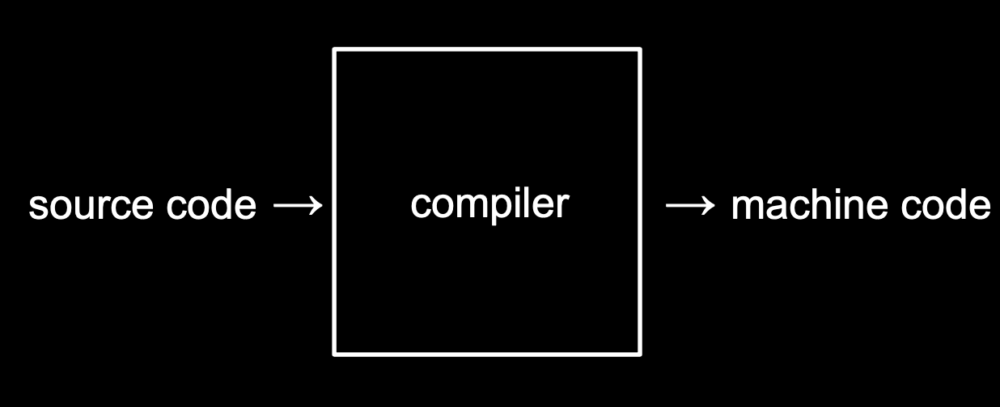
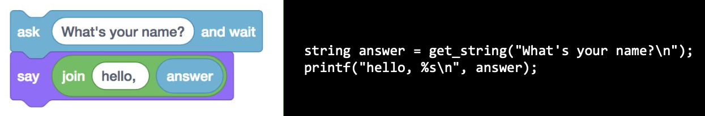
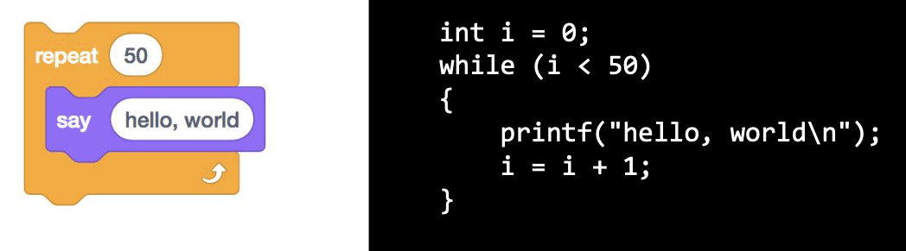

# 2. C


## 1) C 기초

### **[ C언어 ]**

C는 아주 오래되고 전통적인 순수 텍스트 기반의 언어이다. 아래 검은색 바탕의 글자들은 스크래치 블록과 결과적으로 정확히 같다.


int main(void)는 스크래치의 노란색 블록과 같은 역할을 한다. 즉, 프로그램을 **시작한다**는 의미를 가지고 있다. 앞으로 작성할 코드 모두 이 int main(void) { }의 중괄호 사이에 작성하게 될 것 이다.

- C에서는 스크래치의 say라는 함수 대신 printf라는 함수가 있다. printf(“hello, world\n”) 은 스크래치의 보라색 블록과 같은 역할을 한다.

- 글자나 단어, 문장을 적을 때는 텍스트에 " " 쌍따옴표로 감싸야 한다.

- 일상에서 문장 끝에 마침표(.)를 붙이는 것 처럼 C에서는 세미콜론(;)을 붙여야 한다.

- \n은 줄바꿈의 기능을 한다. 키보드에서 ENTER의 기능과 동일하다.

### **[ 컴파일러 ]**

'**소스 코드**'는 사람이 직접 작성한 코드이고, 이를 2진수로 작성된 '**머신 코드**'로 변환해야 컴퓨터가 이해할 수 있다. 이런 작업을 컴파일러라는 프로그램이 수행해준다.





- 터미널창의 명령어 프롬프트에서 '$' 기호 옆에 원하는 명령어를 입력하면 된다.
- clang hello.c 라는 명령어는 'clang' 이라는 컴파일러로 'hello.c'라는 코드를 컴파일하라는 의미이다.
- 그 결과 a.out 이라는 파일이 생성된다.
- ./a.out 이라는 명령어를 실행하면 컴퓨터가 현재 디렉토리에 있는 a.out이라는 프로그램을 실행하게 해준다. (./a. out에서 제일 앞에 있는 .은 지금 있는 현재 폴더를 나타냄)

<br>

## 2) 문자열

스크래치 강의에서 사용자의 이름을 입력으로 받고, 그 사람의 이름을 불러서 인사를 하도록 설계했다. 스크래치 블록은 하단의 왼쪽 그림과 같았고, 이것을 C로 작성하면 오른쪽 이미지의 문장들이 된다.

(CS50 Sandbox에서 스크래치의 ask함수와 가장 비슷한 것은 get_string 함수이다.)



사용자의 이름을 저장할 변수명을 answer이라고 정했다. 이때 변수명은 x, y, z, name 등 마음대로 정해도 무관하지만 여기서 유의해할 점은 변수가 저장하는 데이터의 종류를 아주 정확하게 명시해줘야 한다.

저장하고자 하는 값의 종류가 문자열(string)이라는 것을 알려줘야 한다. 이때 string을 형식지정자라고 한다. 왜냐하면 너무나 당연하게 이름은 숫자가 아닌 문자이기 때문에 컴퓨터에게 "answer에 들어갈 것들은 문자야!" 라고 말해주는 것이다.

우리가 일반적으로 사용하는 '=' 은 '같다'라는 뜻이다. 하지만 프로그래밍 언어에서는 오른쪽에 있는 것을 왼쪽에 지정한다는 의미가 된다. 이를 할당 연산자라고 한다. get_string 함수가 사용자의 이름을 반환하면 그 이름을 anwser이라는 변수에 저장하는 것이다. 오른쪽에서 왼쪽으로!

이제 컴퓨터의 메모리 어딘가에 사용자의 이름이 저장되어 있다.

```c
printf("hello, %s\n", answer);
```

그럼 이것을 printf 함수로 출력해보자. **이때 유의할 점은 printf("hello, answer");이 아니라는 점이다.** 이 코드를 실행한다면 hello, answer이 그대로 결과로 나오게 될 것이고, 이건 내가 원하는 결과가 아니다.

answer이라는 변수에 들어있는 이름을 출력하려면 %를 사용해야 한다. 이때도 어떤 종류의 인자를 받는지 말해줘야 한다. 이름이라는 문자열을 받기때문에 string에서의 s를 %뒤에 붙여서 인자를 받아준다.

**최종적으로 `printf("hello, %s\n", answer);`이 된다.**


가장 위에 포함된 cs50.h 파일 안에 string이라는 문자열 형식과 get_string 이라는 함수에 대한 코드가 포함되어 있다. 이 파일을 포함해야만 전체 코드를 컴파일 하고 실행할 수 있다. 터미널창에 아래 명령어를 입력하여 컴파일을 할 수 있다.

`$ clang -o string string.c -lcs50`

여기서 -o string 은 string.c 를 string.out 이라는 머신코드로 저장하도록 하는 명령어이다. -lcs50은 'link'라는 의미를 지닌 -l 이라는 인자에 우리가 추가로 포함한 'cs50' 파일을 합친 것이다. 이를 통해 컴파일시 cs50 파일을 연결하도록 알려줄 수 있다.

다소 복잡한 이런 과정 대신, 아래 **make** 명령어를 통해 간단하게 컴파일을 수행할 수도 있다.

`$make string`

> 결론: 이와 같이 작성한 코드를 컴파일 하고 실행하면, 사용자에게 입력값을 받고 문장 내에 포함하여 출력하는 프로그램이 된다.

<br> 

## 3) 조건문과 루프

스크래치에서 counter 라는 변수를 생성하고 0을 저장하기 위해서 아래와 같은 블록을 사용했다.


오른쪽 이미지는 C언어로 counter라는 변수에 숫자를 저장한 것이다.
- int 는 변수가 정수(integer)라는 것을 알려주는 것이고, counter는 변수의 이름, 0은 그 값에 0을 저장(초기화)하는 것이다.
- 그림처럼 코드의 마지막에 세미콜론(;)을 붙여줘야 한다.
- 여기서 등호(=)는 같다는 의미가 아닌, 오른쪽에 있는 값을 왼쪽에 할당한다는 의미이다.

**변수의 값을 1씩 증가시키려면?**

 `counter = counter + 1;`

이를 더 간단하게 아래 두 가지 방식으로 수행할 수도 있다.

`counter += 1;`

`counter++;`

### **[ 조건문 ]**

마찬가지로 스크래치의 조건문 블록을 C코드로 나타낼 수 있다.


1. if ( ) 의 괄호 안에는 검사하고자 하는 조건이 들어가고, { } 안에는 조건을 만족할 때 수행하고자 하는 작업이 들어간다. 여기에서는 조건이 True면 "x is less than y"를 출력을 하라는 것이다.

2. else if 를 통해서 아래와 같이 조건을 추가할 수도 있다. 이 경우에는 첫 번째 x < y 조건이 False, 즉 x가 y보다 작지 않을 경우에는 "x is not less than y"를 출력하라는 것이다.

3. if(x < y), else if (x > y), else if (x == y) 이렇게 3개의 조건문을 사용했다. 하지만 여기서 한 가지 굳이 물어볼 필요가 없는 것이 있는데, 바로 else if (x == y) 이다.

4. 만약 x가 y보다 작지도 크지도 않다면 남은 유일한 가능성은 x와 y가 같다는 것 이다. 따라서 위의 코드를 수정하면 아래와 같다.

```C
if (x < y)
{
    printf("x is less than y\n");
} 
else if (x > y)
{
    printf("x is greater than y\n");
}
else
{
    printf("x is equal to y\n");
}
```

이렇게 좀 더 간결하게 만들 수 있다. 이렇듯 얼마나 효율적으로 코딩을 하는지, 혹은 얼마나 적은 메모리나 CPU를 사용해서 수행하는지는 정말 중요하다. 추가로 if, else, else if 뒤에는 세미콜론(;)이 붙지 않은 것을 볼 수 있다. 보통 조건과 같은 것들의 끝에는 세미콜론을 붙이지 않는다.

### **[ 루프 ]**
스크래치에서의 루프는 “forever” 또는 “repeat 50”과 같은 블록을 통해서 수행했다. C에서도 while 이나 for 을 통해서 루프를 구현할 수 있다.


먼저 while 의 경우 while ( )의 괄호 안에 조건을 넣고 { } 안에 수행할 작업을 포함시키면 된다. 즉, C에서 루프를 구현하고 싶다면 성립 조건을 정해줘야 한다. 답이 네, 참, 혹은 1로 나올 수 있는 질문을 던져줘야 한다.

답이 참으로 나오게 하는 방법은 여러가지가 있을 수 있다. 

5=5, 1<2 등등.. 하지만 가장 간단한 방법은 그냥 true를 적는 것이다. true라는 항상 참이 되는 조건을 통해 while 루프가 영원히 수행되도록 한다. 따라서 위의 코드는 계속해서 "hello, world"를 무한정 출력하게 될 것이다.

**만약 특정 횟수만큼 작업을 수행하고 싶으면 어떻게 할까?**



counter라는 변수는 너무 긴 단어다. 프로그래머들은 무언가를 셀 때 간단하게 정수를 나타내는 i를 사용한다.
 
1. i<50이라는 조건을 추가해준다.
2. 처음에 i를 0이라고 정해주었고, while은 계속해서 i가 50보다 작은지를 물어볼 것이다.
3. 따라서 이 코드가 정상적으로 작동하려면 i를 증가시켜야 한다. ( i = i + 1, i += 1, i++ 모두 같은 결과를 낸다. )

진행 순서를 정리해보자면 아래와 같다.

```
i는 0으로 설정 -> i는 50보다 작은가? -> 작다 -> hello world를 출력한다 -> i를 1증가시킨다 -> i가 50보다 작은가?
-> (반복) -> i가 50보다 작은가? -> 작지 않다 -> 종료
```

따로 변수를 선언해도 되지만 아래와 같이 for 를 사용하면 for ( ) 안에 각각 (변수 초기화; 변수 조건; 변수 증가) 에 해당하는 코드를 넣어서 간단하게 표현할 수 있다.

즉, 가장 먼저 정수 값을 가지는 i라는 변수를 0으로 초기화하고, i가 50인지 매번 검사를 하고, 이를 만족하면 { } 안의 내용을 수행한 후에,  i를 1씩 증가시킨다는 의미이다.


**while문과 비교하여 코드가 엄청 간단해진 것을 확인할 수 있다.**

<br>

## 4) 자료형, 형식 지정자, 연산자

### **[ 데이터 타입 ]**

- **bool**: 불리언 표현, (예) True, False, 1, 0, yes, no
- **char**: 문자 하나 (예) 'a', 'Z', '?'
- **string**: 문자열
- **int**: 특정 크기 또는 특정 비트까지의 정수 (예) 5, 28, -3, 0
- **long**: 더 큰 크기의 정수
- **float**: 부동소수점을 갖는 실수 (예) 3.14, 0.0, -28.56
- **double**: 부동소수점을 포함한 더 큰 실수

> 참고: int는 대략 40억까지 셀 수 있기 때문에 40억게 이상의 데이터를 가진 일부 거대 기업과 같은 상황이 아닌 일반 사용자들은 대부분 정수에 int를 사용한다.

### **[ CS50 라이브러리 내의 get 함수 ]**

(CS50 라이브러리에서 사용되는 함수이기 때문에 가볍게 읽어보자.)

- get_char
- get_double
- get_float
- get_int
- get_long
- get_string


### **[ 형식 지정자 ]**

- *%c* : char
- %f : float, double
- %i : int
- %li : long
- %s : string


### **[ 기타 연산자 및 주석 ]**

- +: 더하기
- -: 빼기
- *: 곱하기
- /: 나누기
- %: 나머지
- &&: 그리고
- ||: 또는
- //: 주석

### **[ 정수와 실수를 받아서 출력해보기 ]**

이번에는 문자열 대신 나이(정수)를 사용해보겠습니다.

```C
# include <cs50.h>
# include <stdio.h>

int main(void)
{
    int age = get_int("what's your age?\n");
    int days = age * 365;
    printf("Your are at least %i days old.\n", days);
}
```

1. get_int라는 정수 값을 받아오는 CS50 라이브러리에 있는 함수를 사용한다.
2. 사용자의 나이는 오른쪽에서 왼쪽으로 복사되어 age라는 변수에 저장된다. 변수의 종류는 int 정수이다.
3. 그럼 이 사람의 나이를 일 수로 환산하면 며칠인지 계산해보자.
4. days라는 정수 변수에 age에 365를 곱한 수를 저장해준다.
5. printf 함수에 이번에는 문자가 아닌 정수이기 때문에 %i로 days의 인자를 받아주고 출력해준다.

**이 코드를 좀 더 간단하게 작성하면?**

```C
# include <cs50.h>
# include <stdio.h>

int main(void)
{
    int age = get_int("what's your age?\n");
    printf("Your are at least %i days old.\n", age * 365);
}
```

이전에 days에 age에 365를 곱한 값을 저장했다. 하지만 엄밀히 말하면 이 행은 필요 없다. days 대신 age*365를 넣으면 되기 때문이다.

**좀 더 극단적으로 줄여보자.**

```C
# include <cs50.h>
# include <stdio.h>

int main(void)
{
    printf("Your are at least %i days old.\n", get_int("what's your age?\n") * 365);
}
```

age라는 변수를 없애버리고 age*365 대신에 get_int 함수를 넣어 365를 곱할 수 있다.

**그렇다면 극단적으로 줄여버린 코드가 옳은 것일까?**

- 마지막 코드는 좌우로 너무 길어서 가독성이 떨어진다.
- 디자인 측면에서는 시선이 왼쪽에서 오른쪽으로 가는 것보다 위에서 아래로 가는 것이 좋다.
- 이 것은 사람마다 생각이 다르기 때문에 정답은 없다.
- 하지만 읽기 편하고 이해하기 쉬운 코드가 더 선호되어지는 것 또한 사실이다.

 **이번에는 실수(float)를 사용해보자.**

```C
# include <cs50.h>
# include <stdio.h>

int main(void)
{
    float price = get_float("What's the price?\n");
    printf("Your total is %f\n", price*1.0625);
}
```

1. get_float 함수를 사용하여 물건의 가격을 물어보고 가격을 받아 price에 저장한다.
2. 세금을 포함한 값을 계산해서 출력. (부가세 : 6.25%)
3. 총액은 실수(float)이므로 %f를 사용한다.

**이제 코드를 실행해서 가격을 100으로 넣어보자.**


( 결과 값 : 105.250000 )

소수점이 6번째 자리까지 나와 보기 좋지않다. 소수점 2번째 자리까지 나오게 해보자!

```C
printf("Your total is %.2f \n", price*1.0625);
```

이때는 %f에서 f앞에 '.원하는 자리수'를 넣어 %.2f로 소수점 2번째 자리까지 나오게 할 수 있다.

### **[ 짝수인지 홀수인지 알려주는 코드짜기 ]**

```C
#include <cs50.h>
#include <stdio.h>

int main(void)
{
    int n = get_int("n: ");

    if (n % 2 == 0)
    {
        printf("even\n");
    }
    else
    {
        printf("odd\n")
    }
}
```

### **[ 주석 ]**

C에서는 //로 주석을 달 수 있다.

```C
// 주석입니다.
```

**그렇다면 주석은 왜 다는 것일까?** 

주석은 이 코드가 무슨 일을 하는지 설명하는 것이다. 처음보는 사람들에게 설명이 필요하기 때문이다. 만약 코드가 수 백, 수 천줄인 경우에 주석이 없다면 부분 부분마다 어떤 일을 하는지 찾기 매우 힘들다.

<br>

 > **참고: #include<cs50.h> 는 무엇인가?** <br>
  CS50 수업을 위해 만들어진 라이브러리다. 라이브러리는 여러 함수들을 모아둔 것이라고 볼 수 있는데, CS50 수업에서 좀 더 쉽게 코딩을 짤 수 있게 CS50 라이브러리 안에 여러 함수(get_int, get_double, get_float 등등)를 만들어 두었다.

<br>

## 5) 사용자 정의 함수, 중첩 루프

### **[ 사용자 정의 함수 ]**

“cough”라고 세 번 말하는 C 프로그램을 작성하고 싶으면 어떻게 해야할까?

```C
#include <stdio.h>

int main(void)
{
    printf("cough\n");
    printf("cough\n");
    printf("cough\n");
}
```

단순히 printf를 세 번 반복하면 되지만, 동일한 작업을 반복하는 것이기 때문에 사용자 정의 함수를 이용하면 아래 코드와 같이 더 단순화 할 수 있다.

```C
#include <stdio.h>

int main(void)
{
    for (int i = 0; i < 3; i++)
    {
        printf("cough\n")
    }
}
```

**이것을 함수로 만들어 보자.**

```C
#include <stdio.h>

void cough(void)
{
    printf("cough\n")
}

int main(void)
{
    for (int i = 0; i < 3; i++)
    {
        cough();
    }
}
```

void를 입력하고 원하는 함수명(cough)을 적은 뒤 괄호 안에 void를 적어준다. 그리고 printf로 cough를 출력하는 코드를 작성한다. 하지만 여기에도 문제가 있다. 함수를 1개가 아닌 여러개를 만들수록 main 함수는 아래로 내려가기 때문이다. 중요한 것이 아래에 있는 것보다 바로 나오는 것이 보기 좋다.

**그럼 main 함수를 위로 올리고 cough 함수를 내려보자.**

- 실행을 해보면 오류가 발생한다. 
- main 함수에서 cough() 함수를 사용했다.
- 하지만 cough함수는 아래에 있다.
- C는 아래에 cough라는 함수가 있을 것이라 생각하지 못한다.
- 이것을 해결하려면 다시 cough 함수를 위로 올려야한다.
- 이것은 악순환의 반복이다. 영원히 새로운 함수를 위에 올릴수는 없다.

**다른 방법을 찾아보자.**

```C
#include <stdio.h>

void cough(void);

int main(void)
{
    for (int i = 0; i < 3; i++)
    {
        cough();
    }
}

void cough(void)
{
    printf("cough\n");
}
```

void cough(void)를 세미콜론과 함께 위로 올리는 것이다. 마치 이전에 cough를 봤던 것처럼 C를 속이는 방법이다. cough함수를 전부 본 적은 없어도 이름은 본적이 있으니 main 함수에 나올 때까지 코드를 계속 읽도록 하는 것이다.

**이번에는 원하는 횟수만큼 cough를 출력할 수 있도록 해보자.**

```C
#include <stdio.h>

void cough(int n);

int main(void)
{
    cough(3);
}

void cough(int n)
{
    for (int i = 0; i < n; i++)
    {
        printf("cough\n");
    }
}
```

cough( ) 안의 int n 은 함수가 입력값을 받아서 int 형식을 갖는 n이라는 변수에 저장하겠다는 의미이다. 그리고 { } 안의 내용을 보면 n번 동안 cough를 출력하는 for 루프가 있다. 다시 main 함수 안으로 돌아가보면 cough(3) 이라는 한 줄의 코드를 통해서 3이라는 값을 cough 함수에 전달하고, 궁극적으로는 cough를 세 번 출력할 수 있게 되는 것이다.

다만, 여기서 main 함수를 cough 함수보다 위에 위치시키고 싶다면, 예시에서와 같이 void cough(int n);를 먼저 입력해서 cough 라는 함수가 정의되어있음을 알려줘야 한다. 


좀 더 이해하기 쉬운 예제를 확인해보자.

```C
#include <cs50.h>
#include <stdio.h>

int get_positive_int(void);

int main(void)
{
    int i = get_positive_int();
    printf("%i\n", i);
}

int get_positive_int(void)
{
    int n;
    do
    {
        n = get_int("Positive Integer: ");
    }
    while (n < 1);
    return n;
}
```

**do-while의 루프를 알아보자.**

이 불리언 표현 while(n<1); 이 참일때 다음을 수행하라는 뜻이다. 만약 n이 1보다 작다면 계속해서 질문을 반복한다. while을 단독으로 사용하면 while의 조건이 참이어야만 수행을 한다. 하지만 do-while은 do에서 무조건 한 번은 먼저 수행하게 해준다.

### **[ 중첩 루프 ]**

화면에 여러개의 이미지를 가로나 세로로 여러개 이어서 출력하고 싶으면 아래처럼 for 루프를 사용할 수 있다.

```C
#include <cs50.h>
#include <stdio.h>

int main(void)
{
    int n;

    do
    {
        n = get_int("Size: ");
    }
    while (n < 1);

    for (int i = 0; i < n; i++)
    {
        for (int j = 0; j < n; j++)
        {
            printf("#");
        }
        printf("\n");
    }
}
```

먼저 int n; 으로 정수 값을 갖는 변수 n을 정의한다. 

do{ …} while()을 이용해서 while( )의 조건이 만족할 때까지 get_int 함수로 사용자가 입력값을 받아 n에 저장한다. do{ } while()을 사용하면 조건과 상관없이 최소한 한 번은 { }안의 내용을 실행할 수 있다.

그리고 for 루프를 두 번 중첩해서 돌면서 “#”을 출력한다. 첫 번째 루프에서는 변수 i를 기준으로 n번 반복하고, 그 안의 내부 루프에서는 변수 j를 기준으로 n번 반복한다. 내부 루프에서는 “#”을 출력하고, 내부 루프가 끝날 때마다 줄바꿈을 수행한다. 따라서 최종적으로는 가로가 n개, 세로가 n개인 “#”이 출력되게 된다.

<br>

## 6) 하드웨어의 한계

컴퓨터는 RAM(랜덤 액세스 메모리)이라는 물리적 저장장치를 포함하고 있다. 프로그램은 구동중에 RAM에 저장되는데, RAM은 유한한 크기의 비트만 저장할 수 있기 때문에 때때로 부정확한 결과를 내기도 한다.

### **[ 부동 소수점 부정확성 ]**

아래와 같이 실수 x, y를 인자로 받아 x 나누기 y를 하는 프로그램이 있다고 해보자.

```C
#include <cs50.h>
#include <stdio.h>

int main(void)
{
    // 사용자에게 x 값 받기
    float x = get_float("x: ");

    // 사용자에게 y 값 받기
    float y = get_float("y: ");

    // 나눗셈 후 출력
    printf("x / y = %.50f\n", x / y);
}
```

나눈 결과를 소수점 50자리까지 출력하기로 하고, x에 1을, y에 10을 입력하면 아래와 같은 결과가 나온다.

```C
x: 1
y: 10
x / y = 0.10000000149011611938476562500000000000000000000000
```

정확한 결과는 0.1이 되어야 하지만, float에서 저장 가능한 비트 수가 유한하기 때문에 다소 부정확한 결과를 내게 되는 것이다.

### **[ 정수 오버플로우 ]**

비슷한 오류로, 1부터 시작하여 2를 계속해서 곱하여 출력하는 아래와 같은 프로그램이 있다고 해보자.

```C
#include <stdio.h>
#include <unistd.h>

int main(void)
{
    for (int i = 1; ; i *= 2)
    {
        printf("%i\n", i);
        sleep(1);
    }
}
```

변수 i를 int로 저장하기 때문에, 2를 계속 곱하다가 int 타입이 저장할 수 있는 수를 넘은 이후에는 아래와 같은 에러와 함께 0이 출력된다.

```C
...
1073741824
overflow.c:6:25: runtime error: signed integer overflow: 1073741824 * 2 cannot be represented in type 'int'
-2147483648
0
0
...
```

정수를 계속 키우는 프로그램에서 10억을 넘기자 앞으로 넘어갈 1의 자리가 없어진 것이다. int는 32비트이기 때문에 그 이상의 숫자는 저장할 수 없다.