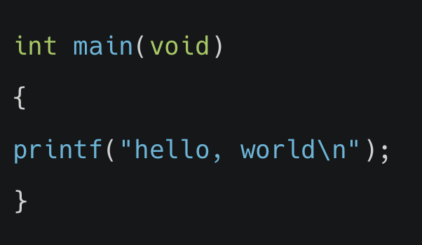

# 3. 배열 퀴즈

[배열](20210527_배열.md)을 공부한 후 문제를 풀어보았습니다. 퀴즈의 정답은 하단에 있습니다.

## 01_컴파일링
**Q. 컴파일링의 네 단계에 해당하지 않는 것은 무엇인가요?**

① 어셈블링(assembling)

② 디버깅(debugging)

③ 링킹(linking)

④ 전처리(preprocessing)

 

## 02_디버깅
**Q. 소스코드 내에 존재하는 오류를 해결하기 위한 작업을 무엇이라고 하나요?**

① 체킹(checking)

② 컴파일링(compling)

③ 리졸빙(resolving)

④ 디버깅(debugging)

 

## 03_스타일 가이드
**Q. 아래 코드는 기능상으로는 문제가 없지만 C 언어 스타일 가이드에는 부합하지 않습니다. 어떻게 변경하면 스타일 가이드에 부합한 코드가 될까요?**

① printf 함수를 들여쓰기해서 중괄호{} 사이에 포함되었음을 표현한다.

② int main(void) 바로 옆에서 여는 중괄호 '{'를 시작한다.

③ 여는 중괄호 '{'와 같은 줄에 printf 함수를 작성한다.

④ printf 함수와 세미콜론(;) 사이에 공백을 추가한다.

 

## 04_배열
**Q. char 자료형을 5개 담을 수 있는 [edwith]라는 이름의 배열을 선언하는 코드는 무엇인가요?**

① char edwith[5];

② chars edwith[5];

③ char edwith[4];

④ char edwith*5;

 

## 05_배열
**Q. int scores[10]; 이라는 배열이 선언되어 있습니다. 이 배열의 처음부터 끝 인덱스까지 순환하는 for 루프는 무엇인가요?**

① for (int i = 0; i < 11; i++) {... scores[i] ...}

② for (int i = 1; i < 10; i++) {... scores[i] ...}

③ for (int i = 1; i < 11; i++) {... scores[i] ...}

④ for (int i = 0; i < 10; i++) {... scores[i] ...}

 

## 06_배열
**Q. 아래와 같은 코드가 주어졌을 때 보기 중 그 값이 다른 것은 무엇일까요?**

string names[2];

names[0] = "MONSTER";

names[1] = "MOM";

① names[0][0]

② names[1][0]

③ names[0][2]

④ names[1][2]

 

## 07_배열
**Q. 아래와 같은 main 함수를 지니는 edwith.c 코드소스를 작성하고 컴파일했습니다. '$ ./edwith hello world'를 실행하였을 때 argc의 값은 무엇일까요?**

① 2

② 4

③ 1

④ 3

 

## 08_컴파일링 자동화
**Q. C 소스파일의 링크, 컴파일, 빌드 작업을 자동화해주는 툴은 다음 중 무엇인가요?**

① clang

② autocompile

③ make

④ link

 

## 09_코드 내의 오류
**Q. 소스코드를 작성할 때 우리가 의식적으로 또는 무의식적으로 저지른 실수나 오류를 통상적으로 일컫는 단어는 무엇인가요?**

① 버그(bug)

② 미스테이크(mistake)

③ 폴트(fault)

④ 앱노멀(abnormal)

 

## 10_문자열의 저장 방식
**Q. 다음 중 문자열(string)이 메모리에 저장되는 방식에 대한 설명으로 틀린 것은 무엇인가요?**

① 문자열(string)의 각 문자(char)는 메모리상에 연이어서 저장된다

② 문자열(string)은 문자(char)의 배열로 저장된다

③ 문자열(string)은 포함된 문자(char) 개수 만큼의 메모리 자리를 차지한다

④ 문자열(string)의 끝에는 널(NUL) 종단 문자가 포함된다

 

<b>정답 확인</b>

01 - ② 디버깅(debugging)  
02 - ② 컴파일링(compling)  
03 - ① printf 함수를 들여쓰기해서 중괄호{} 사이에 포함되었음을 표현한다.  
04 - ① char edwith[5];  
05 - ④ for (int i = 0; i < 10; i++) {... scores[i] ...}  
06 - ③ names[0][2]  
07 - ④ 3  
08 - ③ make  
09 - ① 버그(bug)  
10 - ③ 문자열(string)은 포함된 문자(char) 개수 만큼의 메모리 자리를 차지한다

