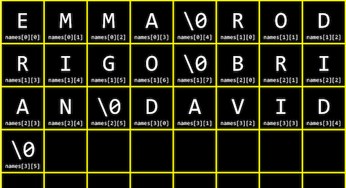

# 3.배열

## 1) 컴파일링
작성한 코드를 실행하기 위해서는 **컴파일링**을 해줘야 한다. C문법으로 작성된 텍스트 형식의 파일은 컴파일링시 네 개의 단계를 거친다. 구체적으로 어떤 단계를 거쳐서 컴퓨터가 해석 가능한 파일로 변환되는지 알아보자.

### **① 전처리(Precompile)**
컴파일의 전체 과정은 네 단계로 나누어볼 수 있다. 그 중 첫 번째 단계는 전처리인데, 전처리기에 의해 수행된다. '#' 으로 시작되는 C 소스 코드는 전처리기에게 실질적인 컴파일이 이루어지기 전에 무언가를 실행하라고 알려준다.

예를 들어, #include는 전처리기에게 다른 파일의 내용을 포함시키라고 알려준다. 프로그램의 소스 코드에 #include와 같은 줄을 포함하면, 전처리기는 새로운 파일을 생성하는데 이 파일은 여전히 C 소스 코드 형태이며 stdio.h 파일의 내용이 #include 부분에 포함된다.

### **② 컴파일(Compile)**
전처리기가 전처리한 소스 코드를 생성하고 나면 그 다음 단계는 컴파일이다. 컴파일러라고 불리는 프로그램은 C 코드를 어셈블리어라는 저수준 프로그래밍 언어로 컴파일한다.

어셈블리는 C보다 연산의 종류가 훨씬 적지만, 여러 연산들이 함께 사용되면 C에서 할 수 있는 모든 것들을 수행할 수 있다. C 코드를 어셈블리 코드로 변환시켜줌으로써 컴파일러는 컴퓨터가 이해할 수 있는 언어와 최대한 가까운 프로그램으로 만들어 준다. 컴파일이라는 용어는 소스 코드에서 오브젝트 코드로 변환하는 전체 과정을 통틀어 일컫기도 하지만, 구체적으로 전처리한 소스 코드를 어셈블리 코드로 변환시키는 단계를 말하기도 한다.

### **③ 어셈블(Assemble)**
소스 코드가 어셈블리 코드로 변환되면, 다음 단계인 어셈블 단계로 어셈블리 코드를 오브젝트 코드로 변환시키는 것이다. 컴퓨터의 중앙처리장치가 프로그램을 어떻게 수행해야 하는지 알 수 있는 명령어 형태인 연속된 0과 1들로 바꿔주는 작업이다. 이 변환작업은 어셈블러라는 프로그램이 수행합니다. 소스 코드에서 오브젝트 코드로 컴파일 되어야 할 파일이 딱 한 개라면, 컴파일 작업은 여기서 끝이난다. 그러나 그렇지 않은 경우에는 링크라 불리는 단계가 추가된다.

### **④ 링크(Link)**
만약 프로그램이 (math.h나 cs50.h와 같은 라이브러리를 포함해) 여러 개의 파일로 이루어져 있어 하나의 오브젝트 파일로 합쳐져야 한다면 링크라는 컴파일의 마지막 단계가 필요한다. 링커는 여러 개의 다른 오브젝트 코드 파일을 실행 가능한 하나의 오브젝트 코드 파일로 합쳐준다. 예를들어, 컴파일을 하는 동안에 CS50 라이브러리를 링크하면 오브젝트 코드는 GetInt()나 GetString() 같은 함수를 어떻게 실행할 지 알 수 있게 된다.

**이 네 단계를 거치면 최종적으로 실행 가능한 파일이 완성된다.**

<br>

## 2) 디버깅

### [ 버그와 디버깅 ]
버그(bug)는 코드에 들어있는 오류이다. 버그로 인해 프로그램의 실행에 실패하거나 프로그래머가 원하는 대로 동작하지 않게 된다. 디버깅(debugging)은 이러한 버그를 식별하고 고치는 과정이다. 프로그래머는 디버거라고 불리는 프로그램을 사용하여 디버깅을 하게 된다.

### [ 디버깅의 기본 ]
프로그램은 일반적으로 인간보다 훨씬 빠르게 연산을 수행하기 때문에 프로그램을 실행시켜보는 것만으로는 무엇이 잘못됐는지 찾아내기 어렵다. 디버거는 프로그램을 특정 행에서 멈출 수 있게 해주기 때문에 버그를 찾는 데 도움이 된다. 프로그래머는 멈춰진 그 지점에서 무슨 일이 일어나는지 볼 수 있다. 프로그램이 멈추는 특정 지점을 중지점이라고 하고, 프로그래머가 프로그램을 한 번에 한 행씩 실행할 수 있게 해준다. 이로써 프로그래머는 프로그램이 내리는 모든 결정들을 단계별로 따라갈 수 있게 된다.

<br>

## 3) 코드의 디자인
규모가 큰 프로그램을 작성할 때는 보통 한 사람이 아닌 여러 사람들이 함께 작업을 진행하게 된다. 이 때는 내가 기여한 부분이 프로그램에 오류를 발생시키지 않도록 주의를 기울여야 한다. 또한 코드의 내용 뿐만 아니라 그 형식도 신경써야 하는데, 같은 내용이라 하더라도 어떻게 표현하느냐에 따라 코드를 이해하고 수정하는 속도가 달라질 수 있기 때문이다.

많은 회사들은 사내에서 코드를 작성할 때 특정한 스타일 가이드를 따르도록 한다. 여러 사람들이 코드를 작성하기 때문에 서로 불필요한 오해를 없애고, 코드를 이해하는 데 드는 비용을 최소화할 수 있기 때문이다.

**[의문] 만약 여러 사람들이 함께 참여하는 프로젝트에서 작성하는 코드 스타일이 서로 모두 다르다면 어떤 비효율적인 일이 발생할까?**

: 코드 공유를 할 때 서로의 디자인이 다를 경우 가독성의 문제와 프로그램의 유지, 보수가 어려워진다. 결과적으로 작업 속도는 느려질 것이고, 생산성이 떨어질 수밖에 없을 것이다.

<br>

## 4) 배열(1)

### **[ 메모리 ]**

C에는 아래와 같은 여러 자료형이 있고, 각각의 자료형은 서로 다른 크기의 메모리를 차지한다.

- bool - 불리언, 1바이트
- char - 문자, 1바이트
- int - 정수, 4바이트
- float - 실수, 4바이트
- long - (더 큰) 정수, 8바이트
- double - (더 큰) 실수, 8바이트
- string - 문자열, ? 바이트

컴퓨터 안에는 아래 사진과 같은 RAM 이라고 하는 물리적 칩이 메모리 역할을 한다. 여러 개의 노란색 사각형이 메모리를 의미하고, 작은 사각형 하나가 1바이트를 의미한다고 볼 수 있다.


예를 들어 char 타입의 변수를 하나 생성하고, 그 값을 입력한다고 하면 위 사진에서 한 사각형 안에 그 변수의 값이 저장되는 것이다.

### **[ 배열 ]**

아래와 같이 세 개의 점수를 저장하고 그 평균을 출력하는 프로그램이 있다.

```C
#include <cs50.h>
#include <stdio.h>

int main(void)
{
    // Scores
    int score1 = 72;
    int score2 = 73;
    int score3 = 33;

    // Print average
    printf("Average: %i\n", (score1 + score2 + score3) / 3);
}
```

만약 점수의 개수가 더 많아진다면 이 프로그램은 많은 부분을 수정해 줘야 한다. 이때 활용할 수 있는 것이 **배열**의 개념이다. 배열은 같은 자료형의 데이터를 메모리상에 연이어서 저장하고 이를 하나의 변수로 관리하기 위해 사용된다.

배열을 이용하면 아래와 같이 바꿀 수 있다.

```C
#include <cs50.h>
#include <stdio.h>

int main(void)
{
    // Scores
    int scores[3];
    scores[0] = 72;
    scores[1] = 73;
    scores[2] = 33;

    // Print average
    printf("Average: %i\n", (scores[0] + scores[1] + scores[2]) / 3);
}
```

int scores[3]; 이라는 코드는 int 자료형을 가지는 크기 3의 배열을 scores 라는 이름으로 생성하겠다는 의미이다. 배열의 인덱스는 0부터 시작하기 때문에, scores의 인덱스는 0, 1, 2 이렇게 세 개가 있다. 이 인덱스를 변수명 뒤 대괄호 [ ] 사이에 입력하여 배열의 원하는 위치에 원하는 값을 저장하고 불러올 수 있다.

**하지만 위와 같은 코드는 여전히 점수의 개수가 바뀌는 상황에서 제약이 많이 따른다.**

<br>

## 5) 배열(2)

### **[ 전역 변수 ]**

아래 코드에서 scores 배열의 크기를 정해주는 N 이라는 변수를 새로 선언했다. 만약 N이 고정된 값(상수)이라면 그 값을 선언할 때 const를 앞에 붙여서 전역 변수, 즉 코드 전반에 거쳐 바뀌지 않는 값임을 지정해줄 수 있다.

관례적으로 이런 전역 변수의 이름은 대문자로 표기한다.

```C
#include <cs50.h>
#include <stdio.h>

const int N = 3;

int main(void)
{
    // 점수 배열 선언 및 값 저장
    int scores[N];
    scores[0] = 72;
    scores[1] = 73;
    scores[2] = 33;

    // 평균 점수 출력
    printf("Average: %i\n", (scores[0] + scores[1] + scores[2]) / N);
}
```

scores의 크기로 전역 변수를 선언하였기 때문에 점수 개수가 바뀌었을때 수정해야 하는 코드가 조금 줄었다. 하지만 여전히 배열의 인덱스마다 일일이 점수를 지정해줘야 하는 불편함이 있다.

### **[ 배열의 동적 선언 및 저장 ]**

아래 코드에서와 같이 루프와 함수를 선언하여 좀 더 동적인 프로그램을 작성할 수 있다.

```C
#include <cs50.h>
#include <stdio.h>

float average(int length, int array[]);

int main(void)
{
    // 사용자로부터 점수의 갯수 입력
    int n = get_int("Scores:  ");

    // 점수 배열 선언 및 사용자로부터 값 입력
    int scores[n];
    for (int i = 0; i < n; i++)
    {
        scores[i] = get_int("Score %i: ", i + 1);
    }

    // 평균 출력
    printf("Average: %.1f\n", average(n, scores));
}

//평균을 계산하는 함수
float average(int length, int array[])
{
    int sum = 0;
    for (int i = 0; i < length; i++)
    {
        sum += array[i];
    }
    return (float) sum / (float) length;
}
```

여기서는 배열의 크기를 사용자에게 직접 입력받고, 배열의 크기만큼 루프를 돌면서 각 인덱스에 해당하는 값을 역시 사용자에게 동적으로 입력받아 저장한다. 그리고 average 라는 함수를 따로 선언하여 평균을 구한다.

average 함수는 length 와 array[], 즉 배열의 길이와 배열을 입력으로 받는다. 함수 안에서는 배열의 길이만큼 루프를 돌면서 값의 합을 구하고 최종적으로 평균값을 반환한다.

이와 같은 방법을 통해서 임의의 점수 개수와 점수 배열에 대해서 동적으로 평균값을 구하는 프로그램을 작성할 수 있다.

<br>

## 6) 문자열과 배열

문자열(string) 자료형의 데이터는 문자(char) 자료형의 데이터들의 배열이다. 

string s = “HI!”; 과 같이 문자열 s가 정의되어 있다고 해보자. s는 문자의 배열이기 때문에 메모리상에 아래 그림과 같이 저장되고, 인덱스로 각 문자에 접근할 수 있다.


여기서 가장 끝의 ‘\0’은 문자열의 끝을 나타내는 널 종단 문자이다. 단순히 모든 비트가 0인 1바이트를 의미한다. 그럼 아래 코드와 같이 여러 문자열이 동시에 선언된 경우를 살펴보자. names라는 문자열 형식의 배열에 네 개의 이름이 저장되어있다.

```C
string names[4];

names[0] = "EMMA";
names[1] = "RODRIGO";
names[2] = "BRIAN";
names[3] = "DAVID";

printf("%s\n", names[0]);
printf("%c%c%c%c\n", names[0][0], names[0][1], names[0][2], names[0][3]);
```

- 첫 번째 printf에서는 names의 첫번째 인덱스의 값, 즉 “EMMA”를 출력한다.
- 두 번째 printf에서는 형식 지정자가 %s가 아닌 %c로 설정되어 있음을 확인할 수 있다. 따라서 출력하는 것은 문자열이 아닌 문자이다. 
- 여기서는 각 이름의 두번째 문자를 출력하고자 한다.
- 이는 names[0][1]과 같이 2차원 배열을 통해 접근할 수 있습니다. 다시 말해 names[0][1]는 names의 첫 번째 값, 즉 “EMMA”라는 문자열에서, 그 두번째 값, 즉 ‘M’ 이라는 문자를 의미한다.

아래 그림에서 names가 실제 메모리상에 저장된 예시와 해당하는 인덱스를 확인할 수 있다.




**[고민] 널 종단 문자는 왜 필요할까?**

우선 string 자료형의 특징을 생각해보자.

타 자료형과 다르게 string은 문자열의 character개수만큼의 바이트가 필요하다.

```C
int scores[1];
```

scores[0]=73;의 경우 자료형 0의 위치에 있는 73은 4바이트를 차지한다. 그런데 string의 경우에는 글자가 몇 개인지 알지 못하는 경우에는 바이트를 얼마나 차지하는지 알 수 없다. 

예를 들어 `string s="hi";` 라고 하면 h, i 이렇게 2개의 character가 모인 것이다. 따라서 각 문자마다 1개의 바이트가 소모된다. 즉 우리가 한번에 표현하고자 하는 단어 hi를 잘못하다간 다른 위치에 있는 nice to meet you 와 같이 저장할 수 있다.

hi nice to meet you 이렇게 말이다. 그리고 뒤이어 저장한 모든 배열의 값들이 저런식으로 나열 될 것이다.

정리하면 문자열은 한 방안에 있는 것이 아니라 나열된 같은 char 자료형의 배열이기 때문에 구분을 해주지 않으면 우리가 원하는 "hi" 와 같은 문자열을 불러올 수 없다.

<br>

## 7) 문자열의 활용

### **[ 문자열의 길이 및 탐색 ]**

문자열의 끝은 어떻게 알 수 있을까?

한가지 방법은 해당하는 인덱스의 문자가 널 종단 문자, 즉 ‘\0’와 일치하는지 검사하는 것이다. 즉, s라는 문자열이 있다고 할 때 `for (int i = 0; s[i] != ‘\0’; i++) { ..}` 과 같은 루프를 사용하면 된다.

그리고 아래 코드와 같이 strlen() 이라는 함수를 사용할 수도 있다.

```C
#include <cs50.h>
#include <stdio.h>
#include <string.h>

int main(void)
{
    string s = get_string("Input: ");
    printf("Output:\n");
    for (int i = 0, n = strlen(s); i < n; i++)
    {
        printf("%c\n", s[i]);
    }
}
```

strlen은 문자열의 길이를 알려주는 함수로, string.h 라이브러리 안에 포함되어 있다. 위 코드에서는 n이라는 변수에 문자열 s의 길이를 저장하고, 해당 길이 만큼만 for 루프를 순환한다.

### **[ 문자열 탐색 및 수정 ]**

문자열을 입력받아 대문자로 바꿔주는 프로그램을 아래와 같이 작성할 수 있다.

```C
#include <cs50.h>
#include <stdio.h>
#include <string.h>

int main(void)
{
    string s = get_string("Before: ");
    printf("After:  ");
    for (int i = 0, n = strlen(s); i < n; i++)
    {
        if (s[i] >= 'a' && s[i] <= 'z')
        {
            printf("%c", s[i] - 32);
        }
        else
        {
            printf("%c", s[i]);
        }
    }
    printf("\n");
}
```

- 먼저 사용자로부터 입력받은 문자를 s라는 변수에 저장한다.
- s의 길이만큼 for 루프를 돌면서, 각 인덱스에 해당하는 문자가 ‘a’보다 크고 ‘z’보다 작은지 검사한다. 즉, 소문자인지 검사하는 것과 동일하다.
- 여기서 문자의 대소비교가 가능한 이유는 ASCII값, 즉 그 문자가 정의되는 ASCII 코드 상에서의 숫자값으로 비교할 수 있기 때문이다.
- 또한 알파벳의 ASCII 값을 잘 살펴보면 각 알파벳의 소문자와 대문자는 32씩 차이가 남을 확인할 수 있다.
- 따라서 각 문자가 소문자인 경우 그 값에서 32를 뺀 후에 ‘문자’ 형태로 출력하면 대문자가 출력된다.
- 각 문자가 이미 대문자인 경우는 그냥 그대로 출력하면 됩니다.

이와 동일한 작업을 수행하는 함수가 ctype 라이브러리에 toupper() 라는 함수로 정의되어 있다. 이를 이용하면 간단하게 아래와 같이 대문자 변환 프로그램을 작성할 수 있다.

```C
#include <cs50.h>
#include <ctype.h>
#include <stdio.h>
#include <string.h>

int main(void)
{
    string s = get_string("Before: ");
    printf("After:  ");
    for (int i = 0, n = strlen(s); i < n; i++)
    {
        printf("%c", toupper(s[i]));
    }
    printf("\n");
}
```

<br>

## 8) 명령행 인자
여태껏 사용해온 main 함수를 보다 자세히 들여다볼 때가 왔다. main도 그 형태를 보면 하나의 함수임을 알 수 있는데, main() 안에 기계적으로 void 라고 입력하는 대신 아래 코드와 같이 argc, argv를 정의해보았다.

```C
#include <cs50.h>
#include <stdio.h>

int main(int argc, string argv[])
{
    if (argc == 2)
    {
        printf("hello, %s\n", argv[1]);
    }
    else
    {
        printf("hello, world\n");
    }
}
```

여기서 첫번째 변수 argc는 main 함수가 받게 될 입력의 개수이다. 그리고 argv[]는 그 입력이 포함되어 있는 배열이다. 프로그램을 명령행에서 실행하므로, 입력은 문자열로 주어진다. 따라서 argv[]는 string 배열이 된다.

argv[0]는 기본적으로 프로그램의 이름으로 저장된다. 만약 하나의 입력이 더 주어진다면 argv[1]에 저장될 것다. 

예를들어, 위 프로그램을 “arg.c”라는 이름으로 저장하고 컴파일 한 후 “./argc”로 실행해보면 “hello, world”라는 값이 출력된다. 명령행 인자에 주어진 값이 프로그램 이름 하나밖에 없기 때문이다. 하지만 “./argc David”로 실행해보면 “hello, David”라는 값이 출력된다. 명령행 인자에 David라는 값이 추가로 입력되었고, 따라서 argc는 2, argv[1] 은 “David”가 되기 때문이다.