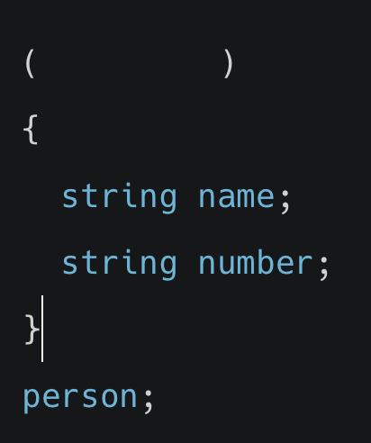
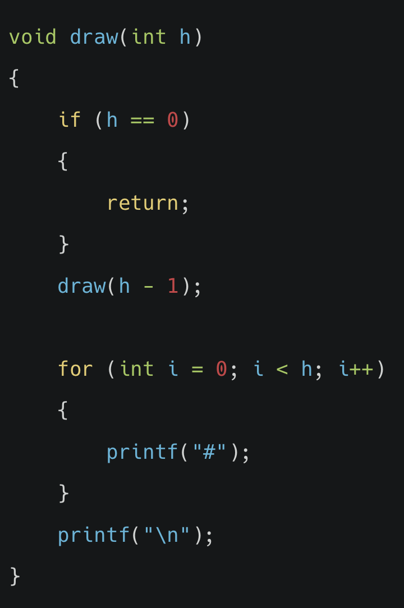

# 4. 알고리즘 퀴즈

[알고리즘](20210528_알고리즘.md)을 공부한 후 문제를 풀어보았습니다. 퀴즈의 정답은 하단에 있습니다.

## 01_알고리즘
**Q. 알고리즘의 성능 및 시간 복잡도를 표현하는 표기법 중 하나로, 최악의 경우일때(상한)를 나타내는 것은 다음 중 무엇인가요?**

① O()

② φ()

③ Ω()

④ θ()

 

## 02_자료형
**Q. name과 number 두개의 멤버를 갖는 person이라는 새로운 자료형을 구조체로 정의하고자 합니다. 아래 코드의 괄호 안에 들어갈 코드로 알맞은 것은 무엇인가요?**

① typedef struct

② function struct

③ construct

④ function

 

## 03_알고리즘
**Q. 전화번호부 책에서 '이펭수'를 찾는 작업을 선형 검색으로 수행하게 될 경우 Big-O 는 어떻게 될까요?**

① O(log n)

② O(1)

③ O(n)

④ O(n^2)

 

## 04_정렬
**Q. 5 6 7 3 2 과 같은 숫자 리스트가 주어졌습니다. 오름차순 정렬을 위해 버블 정렬을 왼쪽 처음부터 오른쪽 끝까지 ‘한 번’ 수행했을 때의 리스트는 어떻게 될까요?**

① 5 6 7 2 3

② 5 6 2 3 7

③ 5 6 3 2 7

④ 2 3 5 6 7

 

## 05_선택 정렬
**Q. 5 6 7 3 2 와 같은 숫자 리스트가 주어졌습니다. 오름차순 정렬을 위해 선택 정렬을 통해 교환을 ‘한 번’ 수행했을 때의 리스트는 어떻게 될까요?**

① 2 6 7 3 5

② 2 3 5 6 7

③ 5 6 7 2 3

④ 2 5 6 7 3

 

## 06_알고리즘
**Q. 선택 정렬, 버블 정렬, 선형 검색, 이진 검색 4가지 알고리즘이 최선인 경우일 때의 실행시간이(하한) 빠른 순서대로 나열한 것은 무엇인가요? (단, 하한이 같은 경우 상한이 빠른 순으로 나열합니다)**

① 버블 정렬 - 선택 정렬 - 선형 검색 - 이진 검색

② 선형 검색 - 이진 검색 - 선택 정렬 - 버블 정렬

③ 이진 검색 - 선형 검색 - 버블 정렬 - 선택 정렬

④ 선택 정렬 - 버블 정렬 - 선형 검색 - 이진 검색

 

## 07_함수
**Q. 아래 코드는 '#'으로 피라미드를 쌓는 코드입니다. draw()와 같이 함수 안에서 함수 자기 자신을 호출하는 방식을 무엇이라고 할까요?**

① 반복(repeat)

② 재귀(recursive)

③ 검색(search)

④ 정렬(sort)

 

## 08_알고리즘 실행 시간의 단위
**Q. 아래 코드와 같이 피라미드 쌓기를 재귀적으로 작성한 코드에서, h 값으로 3이 입력되었을 때 draw 함수는 총 몇 번 호출될까요?**

① 1

② 4

③ 3

④ 2

 

## 09_정렬
**Q. 병합 정렬, 선택 정렬, 버블 정렬의 실행시간의 하한을 빠른 순서대로 정렬한 것은 무엇인가요?**

① 버블 정렬 - 선택 정렬 - 병합 정렬

② 선택 정렬 - 병합 정렬 - 버블 정렬

③ 버블 정렬 - 병합 정렬 - 선택 정렬

④ 병합 정렬 - 선택 정렬 - 버블 정렬

 

## 10_알고리즘 실행 시간의 표기법
**Q. 알고리즘의 실행 시간의 상한을 비교하기 위해 Big-O 표기법을 사용합니다. 다음 Big-O 표기법 중 빠른 순서대로 올바르게 정렬한 것은 무엇인가요?**

① O(1) – O(n log n) – O(n) – O(n^2)

② O(log n) – O(n log n) – O(n) – O(n^2)

③ O(log n) – O(1) – O(n) – O(n^2)

④ O(1) – O(log n) – O(n) – O(n^2)

 

<b>정답 확인</b>

01 - ① O()  
02 - ① typedef struct  
03 - ③ O(n)  
04 - ③ 5 6 3 2 7  
05 - ① 2 6 7 3 5  
06 - ③ 이진 검색 - 선형 검색 - 버블 정렬 - 선택 정렬  
07 - ② 재귀(recursive)  
08 - ③ 3  
09 - ③ 버블 정렬 - 병합 정렬 - 선택 정렬  
10 - ④ O(1) – O(log n) – O(n) – O(n^2)

