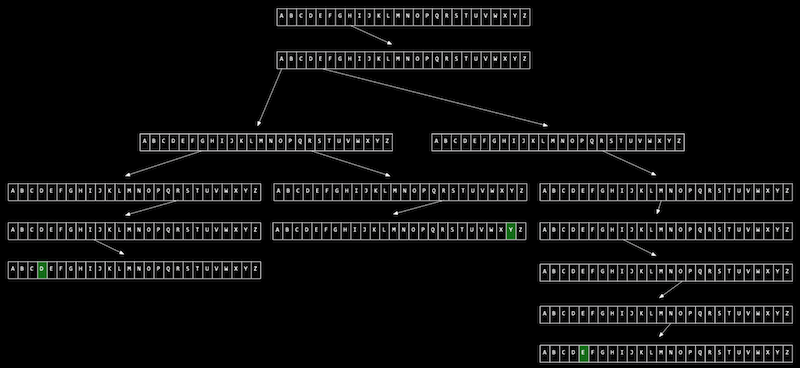

# **malloc과 포인터 복습**
### 학습 목표
```
포인터의 개념과 malloc 함수의 용법을 잘 이해할 수 있다.
```

## **1. 오류 파악하기**
아래 코드를 보고 문제가 될 만한 지점이 어디인지 찾아보자.

```c
int main(void)
{
    int *x;
    int *y;

    x = malloc(sizeof(int));

    *x = 42;
    *y = 13;
}
```
- malloc 함수는 할당하고 싶은 크기를 인자로 받는다.
- 의미를 바로 파악하지 못한 부분:  
  `*x = 42`  
  = `x의 주소로 가서 42를 저장해라.`
- 문제가 되는 부분은 *y = 13; 이 부분이다. 위 코드에서 x에는 메모리를 할당해줬는데, y에는 아무런 액션을 취한 것이 없다.
- y는 포인터로는 선언되었는데, 어디를 가리킬지에 대해서는 아직 정의가 되지 않았다.
- 초기화 되지 않은 *y는 프로그램 어딘가를 임의로 가리키고 있을 수 있는데, 그 곳에 13이라는 값을 저장하면 오류를 발생시킬 수가 있다.
- 포인터를 초기화하지 않으면 접근이 허용되지 않는 주소 또는 의도하지 않은 주소를 가리킬 수 있어 예상치 못한 오류가 발생할 수 있다. 그렇기 때문에 프로그래머가 원하는 방식으로 구동되지 않을 수 있다.
<br>
<br>

## **2. 오류 고치기**

```c
y = x;

*y = 13;
```
- y = x; 라는 코드를 넣어주면 y는 x가 가리키는 곳과 같은 곳을 가리키게 된다.
- *y = 13; 코드를 실행하게 되면 x가 가리키는 곳에 13으로 저장이 되기 때문에 42 -> 13으로 덮어써지게 된다.
<br>
<br>
<br>

***
# **배열의 크기 조정하기**
### 학습 목표
```
배열의 크기를 조정하는 코드를 작성할 수 있다.
```

## **1. 배열의 크기 조정**
배열의 크기를 키우려면 어떻게 해야 할지 생각해보자.  

배열의 크기가 3이고, 이 크기를 4로 하고 싶다면 단순히 생각하면 크기가 3인 배열 바로 옆에 한 바이트의 공간만 더 붙이면 된다.  
실제로도 이런 방식으로 배열의 크기를 조정할 수 있을까?  

실제로는 키우려는 배열 메모리 주위에는 다른 메모리들로 둘러 쌓여있을 확률이 높다. 
기존에 사용하고 있던 메모리 뒤에는 다른 데이터들이 담겨 있을 수 있는데 이 상태에서 데이터를 메모리를 새로 할당하지 않고 메모리 크기를 키운다면 뒤에 있던 메모리에 데이터를 덮어쓰는 일이 발생할 수 있다.

따라서 안전하게 새로운 공간에 큰 크기의 메모리를 다시 할당하고 기존 배열의 값들을 하나씩 옮겨줘야 한다.

이런 작업은 배열의 크기 n 만큼 실행 시간이 걸리므로 시간 복잡도는 O(n)이다.
<br>
<br>

## **2. 새로운 메모리 할당**

### **2.1 새로운 공간 만들기**
```c
#include <stdio.h>
#include <stdlib.h>

int main(void)
{
    int *list = malloc(3 * sizeof(int));

    if (list == NULL)
    {
        return 1;
    }

    list[0] = 1;
    list[1] = 2;
    list[2] = 3;

    int *tmp = malloc(4 * sizeof(int));

    if (tmp == NULL)
    {
        return 1;
    }

    for (int i = 0; i < 3; i++)
    {
        tmp[i] = list[i];
    }


    tmp[3] = 4;


    free(list);


    list = tmp;


    for (int i = 0; i < 4; i++)
    {
        printf("%i\n", list[i]);
    }

    free(list);
}
```
- 코드를 읽어보면 다 이해가 가는데, `free(list);` 메모리 해제하는 부분이 아직 헷갈린다. 메모리 공간에서 포인터를 없애는 건지, 할당된 공간 자체를 없애버리는 건지?  
- tmp는 왜 해제를 안하는 거지??

!! 해결되면 어떻게 이해했는지 과정 적고 삭제.
<br>
<br>

### **2.2 realloc**
realloc 함수는 malloc을 통해 할당된 메모리의 크기를 축소하거나 확장하고 싶을 때 사용한다.

```c
#include <stdio.h>
#include <stdlib.h>

int main(void)
{
    int *list = malloc(3 * sizeof(int));
    if (list == NULL)
    {
        return 1;
    }

    list[0] = 1;
    list[1] = 2;
    list[2] = 3;

    // tmp 포인터에 메모리를 할당하고 list의 값 복사
    int *tmp = realloc(list, 4 * sizeof(int));
    if (tmp == NULL)
    {
        return 1;
    }

    // list가 tmp와 같은 곳을 가리키도록 지정
    list = tmp;

    // 새로운 list의 네 번째 값 저장
    list[3] = 4;

    // list의 값 확인
    for (int i = 0; i < 4; i++)
    {
        printf("%i\n", list[i]);
    }

    //list 의 메모리 초기화
    free(list);
}
```
- realloc을 사용하니까 list의 값을 tmp로 복사하는 코드를 안적어도 된다.

```c
void* realloc(void* ptr, size_t size);
```
- realloc은 ptr이 가리키는 메모리 주소의 크기를 size 바이트로 확장 또는 축소한다.
<br>
<br>
<br>


***
# **연결리스트: 도입**
### 학습 목표
```
연결 리스트의 정의를 설명할 수 있다.
```
<br>

## **1. 데이터 구조**
기본적인 포인터 구조만 이용해서 메모리를 관리하기에는 다소 번거로울 때가 많다.  

`데이터 구조`는 컴퓨터 메모리를 더 효율적으로 관리하기 위해 새로 정의하는 구조체이다.

쉽게 기억하기 위해, 일종의 메모리 레이아웃 또는 메모리 지도라고 생각하자.
<br>
<br>

## **2. 연결 리스트**
`배열`에서는 각 인덱스의 값이 메모리상에서 연이어 저장되어 있다.  
하지만 다음 인덱스의 값이 메모리상에서 멀리 떨어져 있다면 안되는 걸까?  

각 인덱스 값이 메모리상에 여러 군데 나뉘어져 있다고해도 자기 바로 뒤에 오는 값의 `메모리 주소`만 기억하고 있다면 그 값을 연이어서 읽어들일 수 있다.

이것을 `연결 리스트`라고 한다.


- 크기가 3인 연결 리스트 이다. 
- 이 연결리스트는 각 인덱스가 메모리 주소에서 `자기 값`이랑 함께 `바로 다음에 오는 값의 주소(포인터)`를 저장한다.
- 연결 리스트의 첫 번째 값인 1은 2의 메모리 주소를 저장하고 있고, 두 번째 값인 2는 3의 메모리 주소를 저장하고 있다.
- 3은 다음에 오는 값이 없기 때문에 NULL을 주소 값으로 저장한다.
<br>
<br>

### **2.1 구조체**
```c
typedef struct node
{
    int number;
    struct node *next;
}
node;
```
- node라는 이름의 구조체에는 number와 *next 필드가 정의되어 있다.
- number는 각 node가 가지는 값, 위의 그림에 나온 크기가 3인 연결리스트에서 1, 2, 3을 말하고, *next는 다음 node를 가리키는 포인터이다.
<br>
<br>

## **3. 배열과 비교했을 때**
- 연결리스트는 다음 값의 주소를 저장하기 때문에 배열과 달리 메모리 상에서 서로 물리적으로 떨어져 있어도 연결이 가능하다.
- 배열은 고정된 갯수만 저장할 수 있는데, 연결 리스트는 필요할 때마다 데이터를 추가, 삭제할 수 있다.
- 연결리스트는 위치를 나타낼 때 인덱스 사용이 불가능하다.
- 원하는 값을 찾을 때까지 포인터를 통해서 노드를 탐색해 나가야하기 때문에 시간이 오래 걸린다.
<br>
<br>
<br>


***
# **연결 리스트: 코딩 그리고 시연**
### 학습 목표
```
연결 리스트를 구현하고 사용할 수 있다.
연결 리스트와 배열의 장단점을 설명할 수 있다.
```

## **1. 코드**
```c
#include <stdio.h>
#include <stdlib.h>

//연결 리스트의 기본 단위가 되는 node 구조체를 정의합니다.
typedef struct node
{
    //node 안에서 정수형 값이 저장되는 변수를 name으로 지정합니다.
    int number; 

    //다음 node의 주소를 가리키는 포인터를  *next로 지정합니다.
    struct node *next;
}
node;

int main(void)
{
    // list라는 이름의 node 포인터를 정의합니다. 연결 리스트의 가장 첫 번째 node를 가리킬 것입니다. 
    // 이 포인터는 현재 아무 것도 가리키고 있지 않기 때문에 NULL 로 초기화합니다.
    node *list = NULL;

    // 새로운 node를 위해 메모리를 할당하고 포인터 *n으로 가리킵니다.
    node *n = malloc(sizeof(node));
    if (n == NULL)
    {
        return 1;
    }

    // n의 number 필드에 1의 값을 저장합니다. “n->number”는 “(*n).numer”와 동일한 의미입니다. 
    // 즉, n이 가리키는 node의 number 필드를 의미하는 것입니다. 
    // 간단하게 화살표 표시 ‘->’로 쓸 수 있습니다. n의 number의 값을 1로 저장합니다.
    n->number = 1;

    // n 다음에 정의된 node가 없으므로 NULL로 초기화합니다.
    n->next = NULL;

    // 이제 첫번째 node를 정의했기 떄문에 list 포인터를 n 포인터로 바꿔 줍니다.
    list = n;

    // 이제 list에 다른 node를 더 연결하기 위해 n에 새로운 메모리를 다시 할당합니다.
    n = malloc(sizeof(node));
    if (n == NULL)
    {
        return 1;
    }

    // n의 number와 next의 값을 각각 저장합니다.
    n->number = 2;
    n->next = NULL;

    // list가 가리키는 것은 첫 번째 node입니다. 
    //이 node의 다음 node를 n 포인터로 지정합니다.
    list->next = n;

    // 다시 한 번 n 포인터에 새로운 메모리를 할당하고 number과 next의 값을 저장합니다.
    n = malloc(sizeof(node));
    if (n == NULL)
    {
        return 1;
    }

    n->number = 3;
    n->next = NULL;

    // 현재 list는 첫번째 node를 가리키고, 이는 두번째 node와 연결되어 있습니다. 
    // 따라서 세 번째 node를 더 연결하기 위해 첫 번째 node (list)의 
    // 다음 node(list->next)의 다음 node(list->next->next)를 n 포인터로 지정합니다.
    list->next->next = n;

    // 이제 list에 연결된 node를 처음부터 방문하면서 각 number 값을 출력합니다. 
    // 마지막 node의 next에는 NULL이 저장되어 있을 것이기 때문에 이 것이 for 루프의 종료 조건이 됩니다.
    for (node *tmp = list; tmp != NULL; tmp = tmp->next)
    {
        printf("%i\n", tmp->number);
    }

    // 메모리를 해제해주기 위해 list에 연결된 node들을 처음부터 방문하면서 free 해줍니다.
    while (list != NULL)
    {
        node *tmp = list->next;
        free(list);
        list = tmp;
    }
}
```
- 반드시 그림으로 그려가면서 이해할 것.
- 학생들이 시연했던 장면을 꼭 기억하면서 이해할 것.(포인터가 중요)
<br>
<br>

## **2. 연결 리스트와 배열**
연결 리스트는 새로운 값을 추가할 때 다시 메모리를 할당하지 않아도 된다.  
하지만 이런 유동적인 구조는 그 대가가 따르는데...구조가 정적인 배열과 달리 연결 리스트에서는 `임의 접근`이 `불가능`하다.

연결 리스트에 값을 추가하거나 검색하는 경우를 생각해보자.  
연결 리스트에 값을 추가하기 위해서는 해당하는 위치까지 연결 리스트의 각 node들을 따라 이동해야 했다.  

연결 리스트의 크기가 n일 때 실행 시간은 O(n)이 된다.  
배열의 경우에는 임의 접근이 가능하기 때문에 (물론 정렬 되어있다는 가정하에) 이진 검색을 이용하면 O(log n)의 실행 시간이 소요되는데 이에 비하면 다소 불리하다.

여러 데이터 구조에는 각각 장단점이 존재하므로, 프로그래밍을 할 때 목적에 맞는 가장 효율적인 데이터 구조가 무엇인지 고민하고 생각하면서 사용하는 것이 중요하다.
<br>
<br>
<br>


***
# **연결 리스트: 트리**
### 학습 목표
```
트리의 구조를 설명하고 활용하는 코드를 작성할 수 있다.
```
<br>

## **1. 트리**
트리는 연결리스트를 기반으로 한 새로운 데이터 구조이다.

연결리스트에서는 각 노드들의 연결이 1차원적으로 구성되어 있다면, `트리`에서 각 노드들의 연결은 2차원적으로 구성되어 있다고 볼 수 있다.

연결리스트에서 각 노드들이 다음에 오는 `노드`를 가리키는 메모리 주소를 기억하고 있었다면, 트리에서 노드는 다음에 오는 `노드들`을 가리키고 있다.   
<br>


- 이 그림은 트리의 예를 보여주고 있는데, 나무가 거꾸로 뒤집혀 있는 모습을 생각해보면 된다.
- 가장 높은 층에서 트리가 시작되는 노드를 `루트`라고 한다. (4번 노란색 노드)
- 연결 리스트에서 node 라는 이름의 구조체에서는 *next 필드가 정의 되어 있었다면, 그림에서 보면 알 수 있듯이 트리는 왼쪽, 오른쪽 2개의 노드를 가지고 있다.
- 트리는 `이진 검색`이 가능하다.  트리의 구조를 보면 규칙이 보이는데, 하나의 노드를 기준으로 자신의 왼쪽에 있는 노드는 자신의 값 보다 작고, 오른쪽에 있는 노드는 자신의 값보다 크다.
<br>
<br>

## **2. 이진 검색 함수**
이진 검색 트리의 노드 구조체와 50을 재귀적으로 검색하는 이진 검색 함수를 구현한 코드인데, 주석을 따라가며 이해해보자.

```c
//이진 검색 트리의 노드 구조체
typedef struct node
{
    // 노드의 값
    int number;

    // 왼쪽 자식 노드
    struct node *left;
 
   // 오른쪽 자식 노드
    struct node *right;
} node;

// 이진 검색 함수 (*tree는 이진 검색 트리를 가리키는 포인터)
bool search(node *tree)
{
    // 트리가 비어있는 경우 ‘false’를 반환하고 함수 종료
    if (tree == NULL)
    {
        return false;
    }
    // 현재 노드의 값이 50보다 크면 왼쪽 노드 검색
    else if (50 < tree->number)
    {
        return search(tree->left);
    }
    // 현재 노드의 값이 50보다 작으면 오른쪽 노드 검색
    else if (50 > tree->number)
    {
        return search(tree->right);
    }
    // 위 모든 조건이 만족하지 않으면 노드의 값이 50이므로 ‘true’ 반환
    else {
        return true;
    }
}
```
- 이진 검색 트리를 활용했을 때, 검색 실행 시간과 노드 삽입 시간은 모두 O(log n)이다.
<br>
<br>

## **3. 이진 검색 트리**
값을 검색할 때 이진 검색 트리가 기본 연결 리스트에 비해 가지는 장점과 단점에는 무엇이 있을까?

### **3.1 장점**
- 포인터를 따라 각 노드의 값들을 전부 확인해서 가야하는 연결 리스트에 비해 이진 검색을 사용해 기준을 정하고 범위를 반으로 좁혀 나갈 수 있으므로 검색 시간이 줄어들어 효율적이다.
- 실행시간과 삽입시간이 둘 다 O(log n)이라 시간 복잡도가 좋다.

### **3.2 단점**
- 바로 다음 메모리 주소를 기억하고 있으면 되는 연결 리스트에 비해 이진 검색 트리는 2개의 노드들의 주소를 기억해야 하므로 메모리를 더 많이 차지한다.
- 삽입되는 노드의 값이 불균형해질 수 있다. 예를 들어 값들이 계속해서 왼쪽에 삽입이 되면 트리의 균형이 한쪽으로 치우칠 수 있다.   
이는 이진 검색의 장점을 살렸다고 보기 어렵다.
<br>
<br>
<br>


***
# **해시 테이블**
### 학습 목표
```
해시 테이블의 원리와 구조를 설명할 수 있다.
```

## **왜?**
연결리스트나 트리에서는 값을 검색할 때 O(n) 또는 O(log n)의 시간이 걸렸다. 이 시간을 조금 더 단축해서 거의 O(1)에 가깝게 할 수도 있을까?  
이것을 가능하게 해주는 `해시 테이블`이라는 자료 구조에 대해서 알아보자.
<br>

## **1. 해시 테이블?**
해시 테이블은 `연결 리스트의 배열`이다.  
여러 값들을 바구니에 나눠 담는 상황을 생각해보자.  
각 값들은 `해시 함수`라는 맞춤형 함수를 통해서 어떤 바구니에 들어갈지 결정이 된다.  

각 바구니에 들어가있는 값이 여러 개라면 그 값들은 그 바구니에서 새롭게 정의되는 연결 리스트로 이어진다.   
한 바구니에 1, 3, 4가 들어있다면 1, 3, 4는 연결 리스트로 이어진다.  

이처럼 연결 리스트가 담긴 바구니가 여러개 있는 것이 `연결 리스트의 배열`, 즉 `해시 테이블`이다.
<br>
<br>

## **2. 예시**
해리포터에 등장하는 캐릭터들을 불러보자. 이 캐릭터들의 이름을 아래와 같이 하나씩 바구니에 넣을 것이다.


- 캐릭터의 이름은 해시 테이블에 저장이 되고, 해시 함수는 `이름의 첫 알파벳`인 경우이다.
- 알파벳이 총 26개이므로, 총 26개의 포인터가 있을 수 있고 각 포인터는 그 알파벳으로 시작되는 이름들을 저장하는 연결 리스트를 가리키게 된다.
- 이름의 첫 알파벳이 L인 경우, L을 가리키고 있는 포인터는 L로 시작하는 이름들을 저장하는 연결 리스트를 가리키게 된다.
<br>
<br>

## **3. 검색 시간**
만약 해시 함수가 이상적이라면, 각 바구니에는 단 하나의 값들만 담기게 될 것이다. 따라서 검색시간은 O(1)이 된다.

하지만 그렇지 않다면?  
최악의 경우에는 하나의 바구니에 모든 값들이 담겨서 하늘까지 치솟아있다고 생각해보자. 이 경우에 검색시간은 O(n)이 될 수도 있다.

일반적인 경우라면, 해시 테이블은 최대한 많은 바구니를 만드는 해시 함수를 사용한다.  
예를 들어, 그림에는 L 바구니에 Luna, Lilly, Lucius가 담겨져 있는데, L 바구니가 아닌 La...Li..Lu 이렇게 더 세분화 된 바구니를 만들어 놓는 것이다.  
그렇기 때문에 검색 시간은 O(1)에 가깝다고 볼 수 있다.
<br>
<br>
<br>


***
# **트라이**
### 학습 목표
```
트라이의 원리와 구조를 설명할 수 있다.
```

## **왜?**
문자열의 길이가 일정한 경우 이 문자열들을 저장하고 관리하는 데 최적의 자료 구조는 무엇일까?  
연결 리스트, 트리, 해시 테이블이 최선의 방안이 될 수 있을까?  
이번엔 `트라이`라는 자료 구조에 대해 알아보자.  
<br>

## **1. 트라이?**
`트라이`는 re`trie`val의 약자로, 기본적으로 `트리`형태의 자료 구조이고, `문자열을 빠르게 탐색하게 해주는 자료구조`이다.   
즉 `문자열` 탐색에 특화된 자료구조이다. 특이한 점은 `각 노드가 배열`로 이루어져있다는 것이다.

예를 들어 알파벳으로 이루어진 문자열 값을 저장한다고 한다면, 이 노드는 a부터 z까지의 값을 가지는 배열이 된다. 그리고 이 알파벳은 다음 층의 노드(a~z까지의 배열)를 가리킨다.

Hermione, Harry, Hagrid 세 문자열을 트라이에 저장해보자.


- 루트 노드(H)를 시작으로 각 노드가 가리키는 화살표를 따라가면서 노드를 이어주면 된다.
- 트라이에서 값을 검색하는 데 걸리는 시간은 `문자열의 길이`에 의해 한정된다.  
문자열의 각 문자를 보면서 트리를 탐색해가면 되기 때문이다.
- 일반적인 영어 이름의 길이를 n이라고 했을 때, 검색 시간은 O(n)이 되는데, 대부분의 이름은 그렇게 크지 않은 상수값이기 때문에 O(1)이나 마찬가지라고 볼 수 있다.
<br>
<br>
<br>


***
# **스택, 큐, 딕셔너리**
### 학습 목표
```
스택, 큐, 딕셔너리의 원리와 구조를 설명할 수 있다.
```
## **1. 큐**


사람들이 큐 방식으로 줄을 서있다.  
맨 앞 줄에 서있는 사람이 먼저 들어가고, 줄 서 있는 순서대로 입장을 할 것이다. 

큐는 값이 아래로 쌓이는 구조인데, 값을 넣고 뺄 때 먼저 들어간 데이터가 먼저 나가는 방식이다. 이를 `선입선출` 또는 `FIFO`(First In First Out)라고 한다.  

큐는 배열이나 연결리스트를 통해 구현이 가능하다.
<br>
<br>

## **2. 스택**


책들이 스택 방식으로 쌓여 있다.  
사람들이 책을 한 권씩 가져가야 한다고 한다면 보통 사람들은 책이 쌓여 있는 순서대로 책을 한 권씩 가져갈 것이다. 

스택은 값이 위로 쌓이는 구조이다.  
맨 밑에 깔려 있는 책은 제일 처음 놓여졌을텐데 가장 나중에 들어온 책이 가장 먼저 나가게 되는 구조이다.  
이를 `후입선출` 또는 `LIFO(Last In First Out)`라고 한다.  

스택 역시 배열이나 연결리스트를 통해 구현 가능하다.
<br>
<br>

## **3. 딕셔너리**


딕셔너리는 `key`, `value` 요소로 이루어져있다.

영어 뜻 그대로 사전을 생각해보자.  
영어 단어를 찾으면 그 단어에 해당하는 뜻이 설명돼있다. 이처럼 딕셔너리는 키에 해당하는 값을 저장하고 읽어오는 자료구조이다.

일반적인 의미에서 `해시 테이블`과 동일한 개념이라고 볼 수 있다. 
